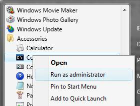
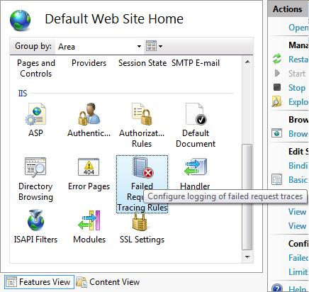
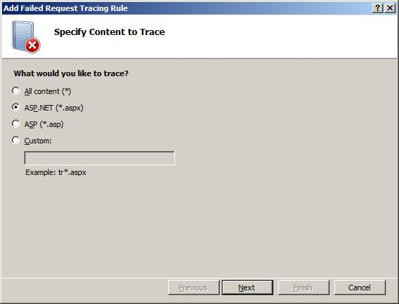
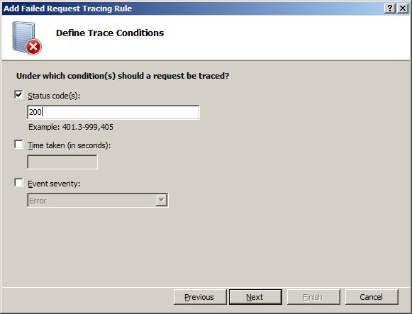
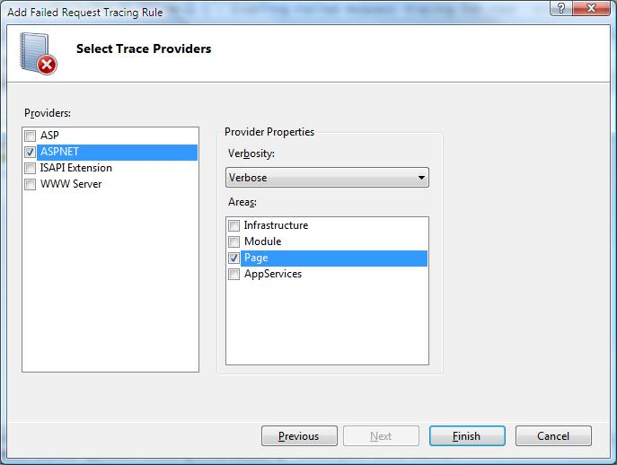
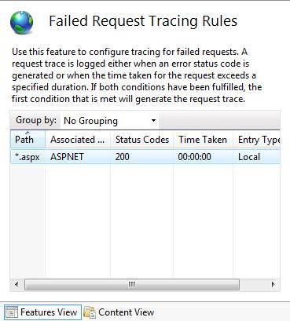
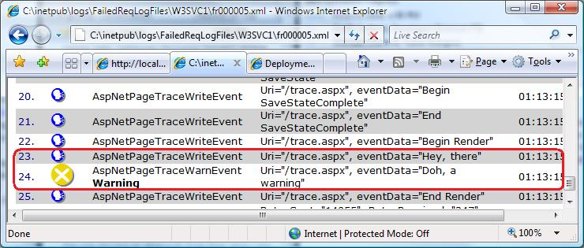

How to Capture ASP.NET Page Trace Events in IIS 7.0 Tracing
====================
by [IIS Team](https://twitter.com/inetsrv)

## Introduction

In ASP.Net today, developers can add trace events to ASPX pages using *Trace.Write()*&amp; *Trace.Warn()* calls in the script sections of their page. Typically, you use these traces to debug an application that does not work as expected.

These events appear when you enable tracing for the page (set &lt;%@ Page Trace="True" %&gt;). You can only view these events by default when browsing the application from the server (i.e. Localhost), or when you enable Application Tracing to keep the last given number of sessions.

However, the problems with this process are:

- These traces are not persisted, so if the process goes away, so do your traces
- These traces are collected regardless of the status code for the request – i.e. if it succeeds or fails, you get traces
- These traces are viewed completely separately from any other infrastructure traces provided by IIS 7.0 and above or ASP.net

In IIS 7.0 and above, you can collect these traces in Failed Request Tracing or ETW tracing in addition to viewing them normally. And, you can view these traces in conjunction with IIS and ASP.net infrastructure traces.

Tasks illustrated in this walkthrough include:

- Configuring failed-request tracing to capture ASP.net Page Trace.Write and Warn calls
- Generating the failure condition and viewing the resulting trace capture, finding the Trace.Write and Trace.Warn calls

## Prerequisites

The following steps include the prerequisites necessary for completing the tasks in this article.

### Step 1 : Installing IIS 7.0 or Above

IIS 7.0 or above must first be installed. To check if IIS is installed, browse to [http://localhost](http://localhost/ "blocked::http://localhost/"). If you see the "under construction" page, then IIS is installed. If IIS is not installed, refer to the "Installing IIS 7.0 and Above" guide for installation instructions.

Make sure to install the following IIS Components:

- ASP (under World Wide Web Services =&gt; Application Development Features =&gt; ASP)
- Tracing (under World Wide Web Services =&gt; Health &amp; Diagnostics =&gt; Tracing)

### Step 2 : Log In as Administrator

Make sure to login to the administrator account or in the Administrators group.

> [!NOTE]
> Being in the Administrators group does not grant you complete administrator privileges by default. You must run many applications as Administrator. Right-click the application icon and choose "Run as Administrator".

### Step 3 : Make a Backup

You must make a backup of the configuration before executing tasks in this article. Run the following:

1. Click the Start button -&gt; All Programs -&gt; Accessories -&gt; (r-click)Command Prompt -&gt; Run as Administrator.

  
  

2. Execute the following command in that command prompt:

[!code-console[Main](how-to-capture-aspnet-page-trace-events-in-iis-tracing/samples/sample1.cmd)]

## Adding a New Trace.Write() &amp; Trace.Warn() Call to a Sample ASPX Page

In this task, you add Trace.Write() &amp; Warn() calls to a sample aspx page and view the resulting traces in your browser.

1. Use the Administrator command prompt and navigate to your %systemdrive%\inetpub\wwwroot directory.
2. Use your editor of choice and create an aspx page called trace.aspx, putting the following code in the page:

[!code-aspx[Main](how-to-capture-aspnet-page-trace-events-in-iis-tracing/samples/sample2.aspx)]

3. Browse to [http://localhost/trace.aspx](http://localhost/trace.aspx). You see the following:

Notice the events above: "Hey, there" and "Doh, a warning".

We have just added a new event to our page. Now see if we can get Failed Request Tracing to capture it.

## Adding a New Trace.Write() &amp; Trace.Warn() call to a Sample ASPX Page

The page is now instrumented with Trace.Write &amp; Trace.Warn calls. Configure Failed Request Tracing to capture the ASPX page Trace.Write() &amp; Warn() calls.

For this scenario, we must use the ASP.Net provider's Page area, with Trace.Write calls corresponding to the Verbose verbosity level, and Trace.Warn() calls corresponding to the Warning verbosity level. Setting the verbosity level to Verbose gets both.

### Step 1 : Enabling Failed Request Tracing for Your Site

Failure Request Tracing first must be enabled for the site. Steps to enable are found in the **HOWTO-FailureRequestTracing** Walk Through, **Task 1**.

### Step 2 : Creating a Failed Request Tracing Rule to Capture the Trace.Write() &amp; Warn() Events

1. From the Administrator command prompt, type **start inetmgr**. In the **Connections** panel, expand the machine name, then Sites folder, then click the **Default Web Site**. Under **IIS**, double-click **Failed Request Tracing Rules.**

2. In the **Actions** pane, click Add…. to launch the **Add Failed Request Tracing Rule** wizard. On the **Specify Content to Trace** page, click the **ASP.NET (\*.aspx)** option for what to trace and click **Next**.

3. In the **Define Trace Conditions** screen, check the **Status Codes** check box and enter "200" as the status code to trace.

4. Click **Next**. The **Select Trace Providers** page appears. Select the **ASPNET** check box and the **Page** check box under "Areas" (uncheck all other areas that are checked except **Page**) Under Verbosity, select **Verbose**.

5. Click **Finish**. You see the following definition for the Default Web Site:

## Step 3 : Test and View

In this step, we generate a request for [http://localhost/trace.aspx](http://localhost/trace.aspx) and then check the Failed Request Tracing log file to see the trace events.

To verify that it worked:

1. Open an Administrator-elevated new Internet Explorer window.
2. Type in the address [http://localhost/trace.aspx](http://localhost/trace.aspx).
3. We generated the traced request, so open an Administrator-elevated Internet Explorer window, enter **CTRL-O** to open a file, and navigate to inetpub\logs\FailedReqLogFiles\W3SVC1 folder. In the **HTML Files** dropdown list, select **All Files**.
4. Select the most recent FR######.xml file. You see the following:

The events display above in the trace log. Notice that the event "Doh, a warning"'s SubType Name is "***AspNetPageTraceWarnEvent***" - that is the Trace.Warn() event.

All Trace.Write() calls are very high verbosity (*verbosity* = "Verbose"); hence, the reason for the &lt;Level&gt;5&lt;/Level&gt;, while all Trace.Warn() calls are logged as Warnings.

> [!NOTE]
> There are many other "***AspNetPageTraceWriteEvent***" events logged. This is because all the other entries in the trace table, like *Begin PreInit*, etc., are all logged through the same infrastructure as well.

## Summary

We finished adding trace messages to the ASPX page. We configured IIS to capture those traces, when enabled, in the Failed Request Trace Logfile. Remember that these trace entries are only logged to the trace logs if the page's trace="true" directive is set, and the ASP.NET provider with the "Page" area is defined when tracing (either using ETW or Failed Request Tracing).