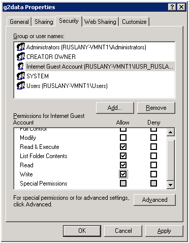
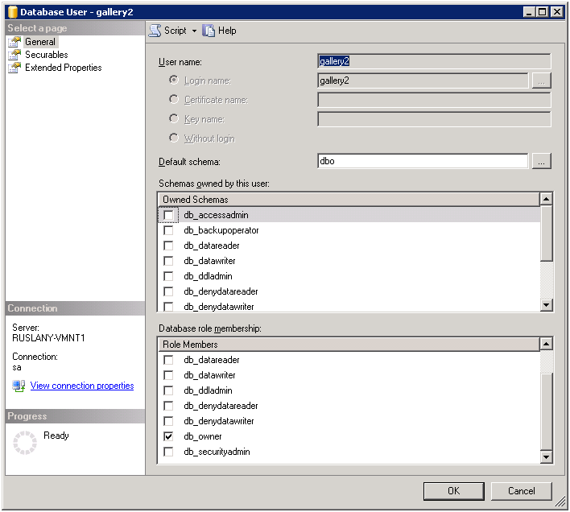
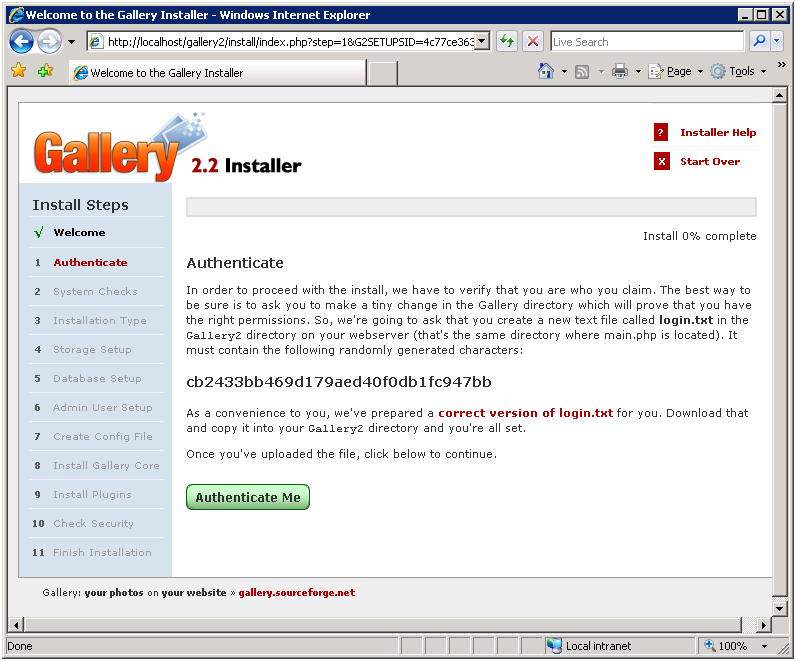
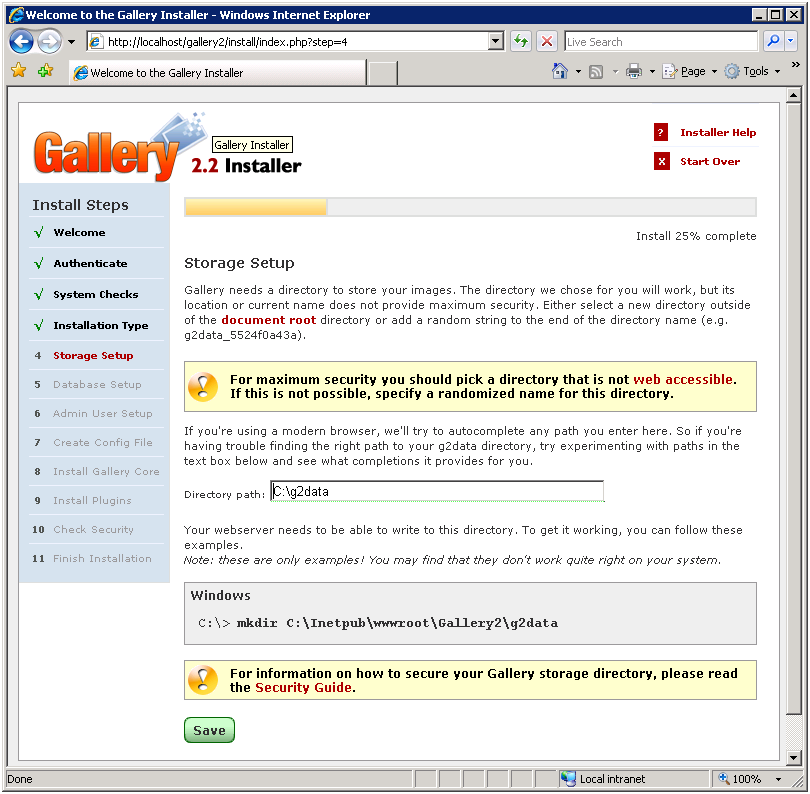
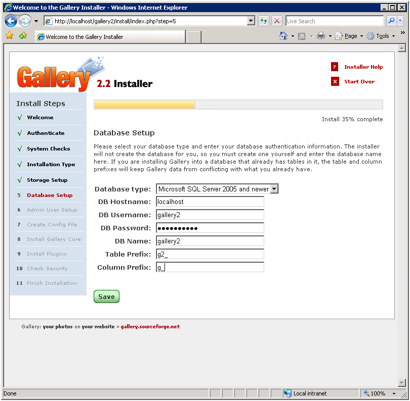
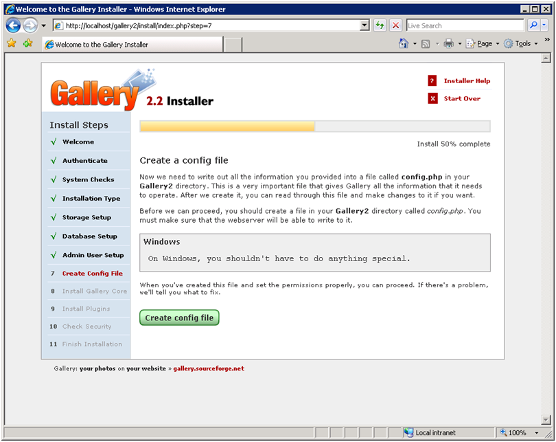
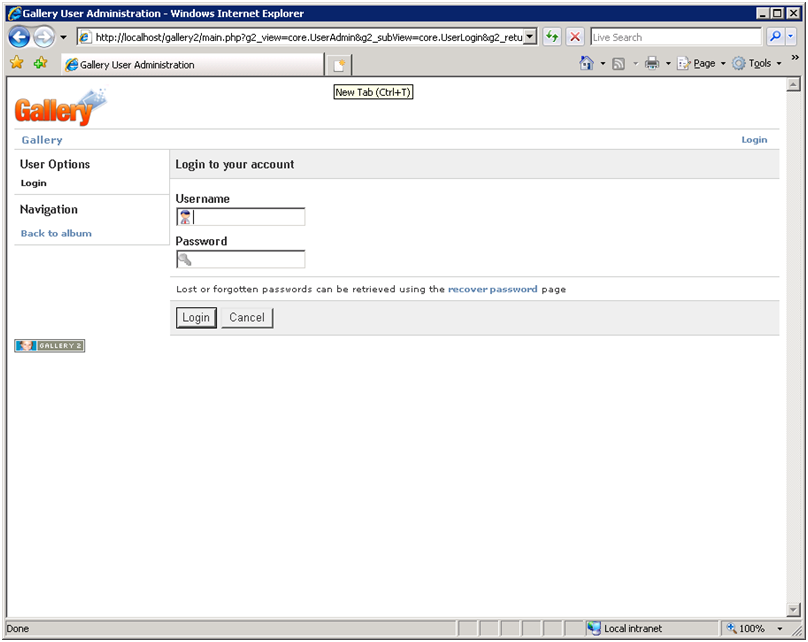

Gallery2 on IIS
====================
by Eric Woersching

## Introduction

Gallery is a web application that lets you manage your photos on your own website. With Gallery, you can easily create and maintain photo albums via an intuitive interface. Photo management includes automatic thumbnail creation, image resizing, rotation, ordering, captioning, searching and more. Albums and photos can have view, edit, delete and other permissions per an individual authenticated user for an additional level of privacy.

For more information about Gallery, refer to [http://gallery.menalto.com/](http://gallery.menalto.com/).

The following sections describe how to install and configure Gallery for use with FastCGI on IIS 6.0. This document assumes that you have completed the setup and configuration of the FastCGI extension and PHP libraries as described here in [https://www.iis.net/fastcgi/phpon60](using-fastcgi-to-host-php-applications-on-iis-60.md).

The instructions have been tested and work in the following configurations:

- Windows Server® 2003 operating system
- IIS 6.0
- PHP 5.2.4
- MySQL 5.0.45
- Gallery 2.2.3 – typical install

## Notes on PHP Setup

Gallery does not need many modifications beyond the default configuration provided by PHP **.** From the base configuration file provided by PHP, you only need to modify the following lines in your php.ini configuration file to get Gallery working:

- Define 'extension\_dir' as 'c:\php\ext' (i.e., the location of your PHP extensions directory)
- Uncomment 'extension=php\_mysql.dll' in the extensions list to enable MySQL support
- Uncomment 'extension=php\_gd2.dll' in the extension list to enable graphics toolkit

## Download and Unpack the Application

The latest releases of Gallery are found at [http://codex.gallery2.org/Gallery2:Download](http://codex.gallery2.org/Gallery2:Download). The instructions in this document are based on version 2.2.3, but future versions will likely be very similar as far as installation is concerned.

After downloading the zip package, extract its contents to C:\Inetpub\wwwroot\Gallery2 or another directory of your choosing. You do not need to modify the permissions on the Gallery web directory, as the default permissions suffice.

## Set Up Storage Directory

Gallery requires a separate directory for storing all photos and related data, such as thumbnails. For security reasons, we recommend that you create this directory outside of the web root.

For this walkthrough, we created a directory called g2data on C: drive (C:\g2data). You must grant web server write permissions to this directory. Since FastCGI impersonates the requests from all users, make sure that the user account used for impersonation has write access to this directory. For example, if your web site or virtual directory is configured for Anonymous authentication, then you must grant "Internet Guest Account" write access to C:\g2data.

## Set Up the Database

In order to use Gallery, you must have access to some kind of a database. For this walkthrough, we use MS SQL Server® 2005. You can also use MySQL, MS SQL Server Express or others.

Before starting the install, create a database on your server. Also create a database user and grant this user db ownership permission to the database.

> 1. If you are using MS SQL Server 2005, then open Microsoft SQL Server Management Studio and click the "New Query" button.   
> 2. Enter the following script into the query window (this script creates the database and user that are necessary for the Gallery application).

[!code-sql[Main](gallery2-on-iis/samples/sample1.sql)]

> 3. Grant the newly created user the db\_owner permissions to Gallery2 database:

## Set Up and Configure the Application

Open your web browser and browse to [http://localhost/gallery2/install/index.php](http://localhost/gallery2/install/index.php).

> 1. Click "Begin installation" to go to the authenticate page.

> 2. Follow the instructions and save the login.txt file into the Gallery2 directory.   
> 3. Click "Authenticate Me".   
> 4. Proceed to the next steps to perform a system check and choose the installation type. For this walkthrough, we use "Standard Installation" option.  
> 5. Specify the path to the data directory that you have created earlier. If you have configured permissions for g2data correctly, you can proceed to the next step after clicking "Save".

In Step 5 in the "Install Steps" pane, enter the required database information. If you have setup the database and user correctly, clicking "Save" takes you to the subsequent installation steps.

In Step 7 in the "Install Steps" pane, you are asked to create an empty config.php file in Gallery2 folder:

Make sure that the web server has write permissions to this file. For this walkthrough, we allowed write permissions to this file for "Internet Guest Account".

After that, proceed through the remaining installation steps. Once you have completed the installation, you can login to the newly created Gallery using the administrator user name and password which you specified during installation.

## Getting More Information

To discuss the FastCGI Extension for IIS 6.0, or file bug reports, use the FastCGI forums:   
• [IIS.NET / IIS 6.0 FastCGI forums](https://forums.iis.net/1103.aspx).   
  
To get more information regarding running various PHP applications on IIS, refer to:   
• [PHP on IIS portal](https://php.iis.net/)  
• [PHP community forum](https://forums.iis.net/1102.aspx).