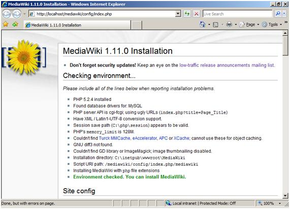
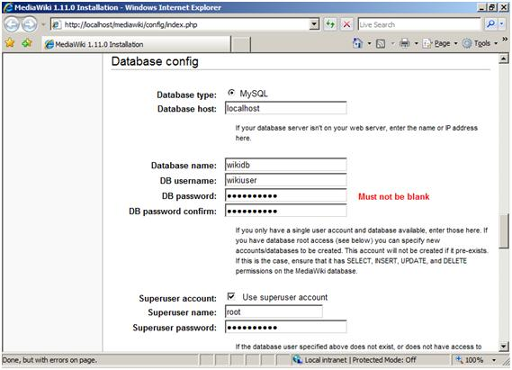
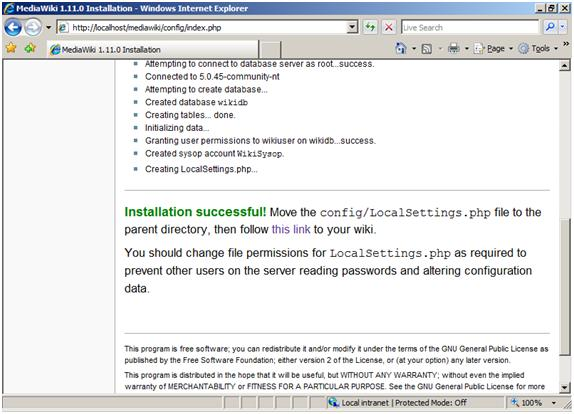
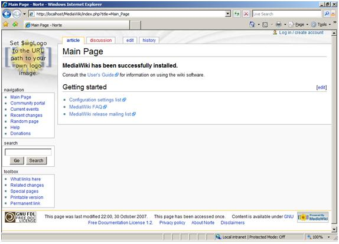
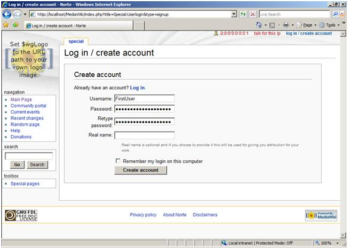
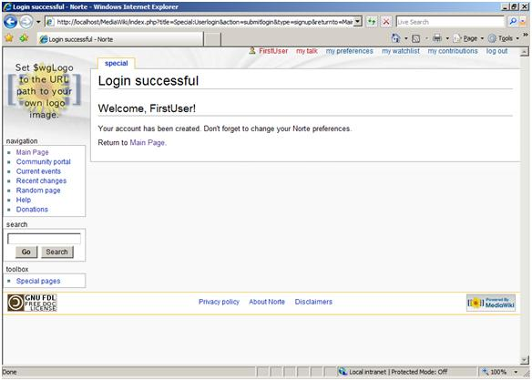
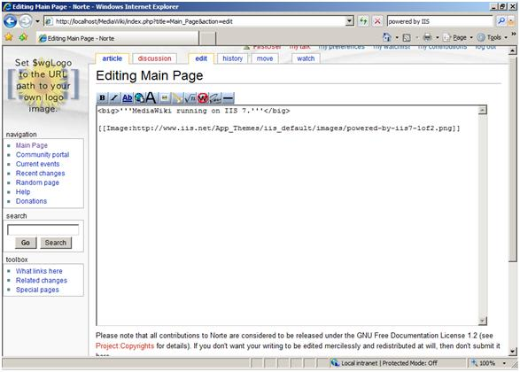
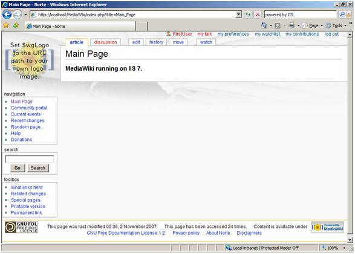

MediaWiki on IIS
====================
by Eric Woersching

## Introduction

The following sections describe how to install and configure [MediaWiki](http://www.mediawiki.org/wiki/MediaWiki) for use with FastCGI on Windows Server® 2008. This document assumes that you have completed the setup and configuration of the FastCGI extension and PHP libraries as described [here](using-fastcgi-to-host-php-applications-on-iis.md).

The instructions have been tested and found to work in the following configuration:

- Windows Server 2008 RC0
- IIS 7.0
- PHP 5.2.4 Non-thread-safe Win32 binaries (RC2-dev)
- MySQL 5.0
- Wikimedia 1.11.0

## Notes on PHP Setup

1. Change the default session, upload folders and grant access to the built-in IIS\_IUSRS group.
2. Open a Command Prompt window with administrator privileges and run the following commands:  

    [!code-console[Main](mediawiki-on-iis/samples/sample1.cmd)]

    [!code-unknown[Main](mediawiki-on-iis/samples/sample-127110-2.unknown)]

    [!code-unknown[Main](mediawiki-on-iis/samples/sample-127110-3.unknown)]

    From the base configuration file provided by PHP, you will need to modify your php.ini to have the following definitions:

    [!code-unknown[Main](mediawiki-on-iis/samples/sample-127110-4.unknown)]

    [!code-unknown[Main](mediawiki-on-iis/samples/sample-127110-5.unknown)]
3. Enable PHP support for MySQL. Modify your php.ini to define the extensions directory and uncomment the PHP MySQL extension definition:  

    [!code-unknown[Main](mediawiki-on-iis/samples/sample-127110-6.unknown)]

## Download and Unpack MediaWiki

The latest release of MediaWiki is found at [http://www.mediawiki.org/wiki/Download/](http://www.mediawiki.org/wiki/Download/). The instructions in this document are based on version 1.11.0, but future versions are likely to be very similar as far as installation is concerned.

1. After downloading the GNU zip package, extract its contents to %SystemDrive%\Inetpub\wwwroot\MediaWiki or another directory of your choosing.
2. Modify the permissions for the MediaWiki config folder and grant Write permissions for the built-in IIS\_IUSRS group.
3. Open a Command Prompt window with administrator privileges and run the following command:  

    [!code-unknown[Main](mediawiki-on-iis/samples/sample-127110-7.unknown)]

## Configure MediaWiki

1. Begin the graphical MediaWiki installation procedure by pointing your browser at [http://localhost/mediawiki/config/index.php](http://localhost/mediawiki/config/index.php). You see the following screen.  

    
2. Scroll down the window and configure your Wiki name and all the required fields. In the Database config section, enable the 'Use superuser account' checkbox and enter the database superuser password.  

    
3. Once you enter all the required information, click "Install MediaWiki!". The configuration page creates the database wikidb and saves your settings in the %SystemDrive%\Inetpub\wwwroot\MediaWiki\config\LocalSettings.php file.  

    
4. Move the LocalSetting.php file to the %SystemDrive%\Inetpub\wwwroot\MediaWiki\ folder and delete the folder %SystemDrive%\Inetpub\wwwroot\MediaWiki\config from your system.
5. LocalSetting.php contains sensitive information, so secure it by revoking access to unnecessary identities. Open a Command Prompt window with administrator privileges and run the following command:  

    [!code-unknown[Main](mediawiki-on-iis/samples/sample-127110-8.unknown)]

 The previous command grants access only to the following identities:  

    - SYSTEM
    - BUILTIN\Administrators group
    - Network Service
6. The installation is complete. Point your browser to [http://localhost/mediawiki/config/index.php](http://localhost/mediawiki/config/index.php).  

    

## Testing the Application

For testing MediaWiki, create a user and modify the Main Page content.

1. Navigate to [http://localhost/MediaWiki/index.php](http://localhost/MediaWiki/index.php).
2. Click the Log in / create account link in the top right corner.
3. Click the "Create an account" link.
4. Enter the username and password and click "Create account".  

    

    
5. Go to the main page and click the Edit link. An Editor displays in which you can make your changes. When done with changes, click "Save Page".  

    

Here is the modified page.

## Enabling clean URLs with URL Rewrite Module

When hosting MediaWiki on IIS 7.0, it is possible to configure MediaWiki to use URLs without query string by following these steps:

1. Install [Microsoft URL Rewrite Module for IIS 7.0](https://www.iis.net/downloads?tabid=34&g=6&i=1691 "URL rewrite module")
2. Create a web.config file in the same folder where MediaWiki files were installed and paste into it the following   

    [!code-xml[Main](mediawiki-on-iis/samples/sample9.xml)]
3. Update the LocalSettings.php file as follows:  

    [!code-unknown[Main](mediawiki-on-iis/samples/sample-127110-10.unknown)]

## Getting More Information

To discuss the FastCGI support in IIS, or file bug reports, use the FastCGI forums:

- [IIS.NET / IIS 6.0 FastCGI forums](https://forums.iis.net/1103.aspx)
- [IIS 7.0 FastCGI forums](https://forums.iis.net/1104.aspx)

To get more information regarding running various PHP applications on IIS, refer to:

- [PHP on IIS portal](https://php.iis.net/)
- [PHP community forum](https://forums.iis.net/1102.aspx)