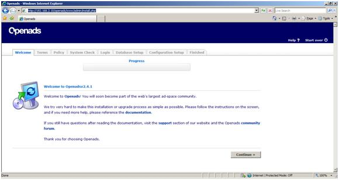
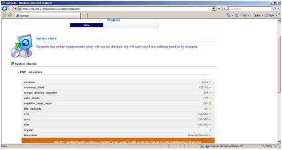
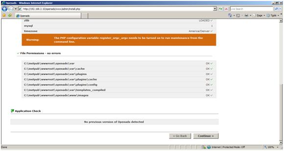
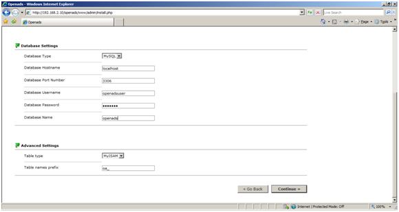
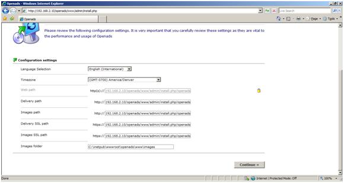
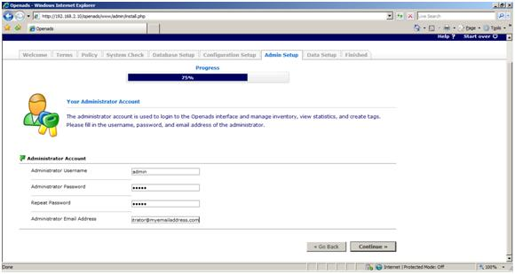
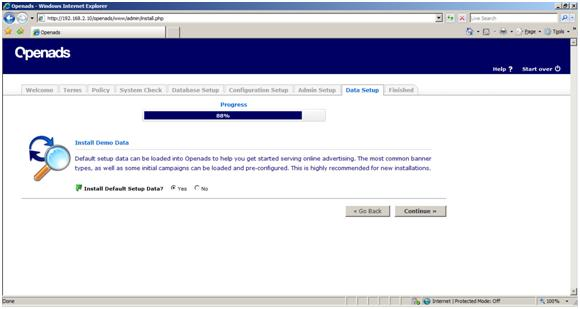
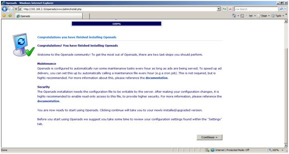

OpenAds on IIS
====================
by Eric Woersching

## Introduction

OpenAds 2.0 is an ad server written in PHP that allows you to place banners on your website and manage your banners in a professional way. OpenAds is open source, which means you have access to the source code, licensed under the General Public License. OpenAds is the latest version of PHPAds.

For more information about OpenAds, see [http://www.openads.org/](http://www.openads.org/).

In this section, we go through the steps required to install OpenAds to work with FastCGI extension on IIS 6.0 and IIS 7.0 and above. To find out more about FastCGI support in IIS, see [https://www.iis.net/fastcgi](https://www.iis.net/downloads/microsoft/fastcgi-for-iis).

The following steps assume that you have completed the setup and configuration of FastCGI extension and PHP libraries as described in [https://www.iis.net/fastcgi/phpon60](using-fastcgi-to-host-php-applications-on-iis-60.md).

## Download and Unpack OpenAds

First, download the latest stable release of the OpenAds application. For this article, we use openads-2.4.1 downloaded from the mirror [http://www.openads.org/products/openads/download?ext=zip&amp;utm\_source=openads&amp;utm\_medium=f&amp;utm\_campaign=upgrade241](http://www.openads.org/products/openads/download?ext=zip&amp;utm_source=openads&amp;utm_medium=f&amp;utm_campaign=upgrade241).

Once you download the package, uncompress it and copy all the files and folders to C:\Inetpub\wwwroot\openads.

## Set Up the Database

Before starting the installation procedure for osCommerce, create a database on your server. Also create a user and grant this user db ownership permission to the database. Follow the instructions in the [Setting Up a Database for a PHP Application on IIS](../install-and-configure-php-on-iis/setting-up-a-database-for-a-php-application-on-iis.md) article for a MySQL database. This walkthrough uses the following database information:

- Database Name: 'openads'
- Database User: 'openadsuser'
- Account Password: 'openads'

## PHP Configuration for OpenAds

OpenAds requires the following PHP configuration settings in the php.ini file. Refer to the PHP configuration settings document for more information. 

- file\_uploads must be turned on
- register\_long\_arrays must be turned on
- Register\_globals setting must be turned off
- MySql extension must be enabled

## Running the Installation

After placing the files on the Web server, make sure the Web server can change the file config.inc.php which holds the basic configuration settings. Check the properties of the file and make sure the read-only flag is not set.

OpenAds 2.0 contains an automatic installer which does most of the work for you. Do not manually edit the configuration files, because that could cause problems in the future. Follow the guidance given below.

1. To start the installer, open a Web browser and point it to the directory in which [http://localhost/openads](http://localhost/openads). This starts the installer automatically. If it does not start automatically, use [http://192.168.2.10/openads/www/admin/install.php](http://192.168.2.10/openads/www/admin/install.php).  

    
2. Click Continue to start the configuration and read the license agreement. Click I agree. The installer verifies the configuration required for OpenAds.  

    

    
3. Click Continue to go to the database setup.  

    
4. Provide the necessary database information and click Continue. The installer checks for the information provided and confirms it in order to continue.  

    
5. Provide the necessary information related to the server. Click Continue.  

    
6. Provide the administrator account details. Click Continue.  

    
7. Select the default setup data. Click Continue to finish the installation with the default information.  

    

## Getting More Information

To discuss the FastCGI Extension for IIS 6.0, or file bug reports, use the FastCGI forums: 

- [IIS.NET / IIS 6.0 FastCGI forums](https://forums.iis.net/1103.aspx).

To get more information regarding running various PHP applications on IIS, refer to:

- [PHP on IIS portal](https://php.iis.net/)
- [PHP community forum](https://forums.iis.net/1102.aspx).