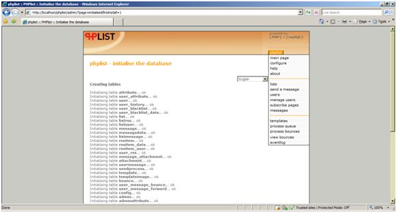
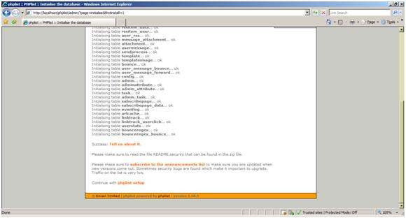
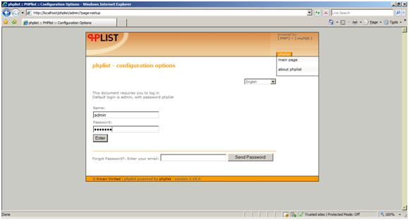
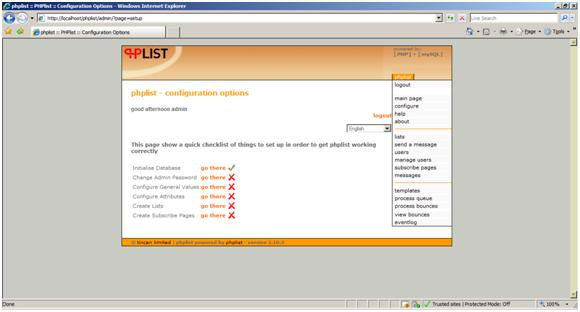
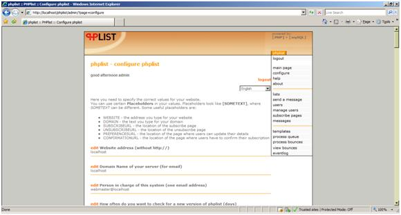
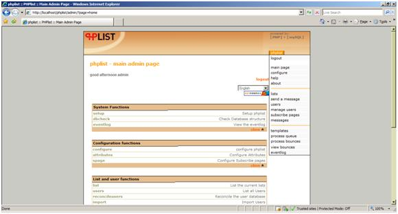
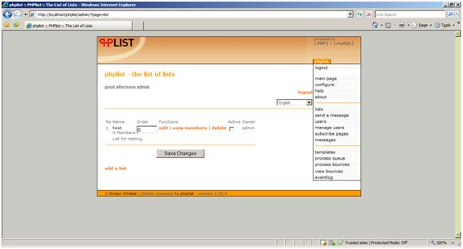
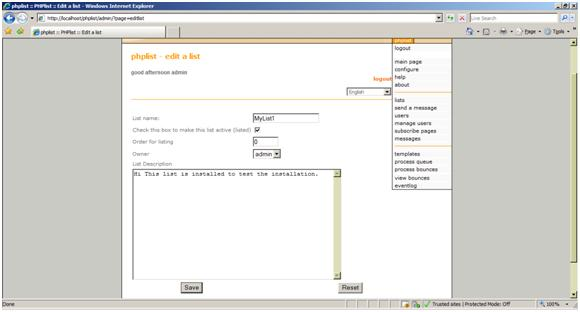
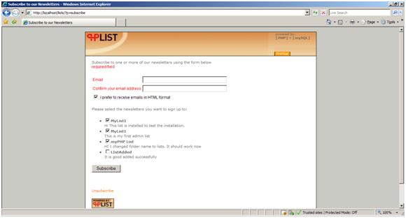

PHPList on IIS
====================
by Eric Woersching

## Introduction

PHPList is an open-source newsletter manager and one-way email announcement delivery system. It is effective for newsletters, publicity lists, notifications, and many other uses. It contains several features, such as tracking delivery status, tracking links and URLS, multiple templates for different subscribers, etc.

For more information and features about PHPList, see [http://www.phplist.com/](http://www.phplist.com/).  
  
In this section, we go through the steps that would be required to install PHPList to work with FastCGI extension on IIS 7.0 and above, and Windows Server® 2008. To find out more about FastCGI support in IIS, see [https://www.iis.net/fastcgi](https://www.iis.net/downloads/microsoft/fastcgi-for-iis).

The following steps assume that you have completed the setup and configuration of FastCGI extension and PHP libraries as described in [https://www.iis.net/fastcgi/phpon60](using-fastcgi-to-host-php-applications-on-iis-60.md).

## Download and Unpack PHPList

First, download the latest stable release of the PHPList application. For this article, we use phplist-2.10.5.zip. Download the full package from the mirror [http://sourceforge.net/projects/phplist/](http://sourceforge.net/projects/phplist/).

Once you download the package, uncompress it and copy the files and folders to a local folder. In this directory there is a directory public\_html which contains the directory "lists". Upload the "lists" directory into a directory you can access via the web. The rest of the files are for reference only and are not required for PHPList to work.

> [!NOTE]
> The folder name for the PHPList application should be "lists," as it is hardcoded in some screens. If the folder name is not given as "lists," some of the admin screens may not work after the installation. The folder name can be changed if required in the configuration file. The folder structure we use for our application is C:\Inetpub\wwwroot\lists.

## Set Up the Database

Before starting the installation procedure for PHPList, create a database on your server. Also create a user and grant this user db ownership permission to the database. Follow the instructions in the [Setting Up a Database for a PHP Application on IIS](../install-and-configure-php-on-iis/setting-up-a-database-for-a-php-application-on-iis.md) article for a MySQL database. This walkthrough uses the following database information:

- Database Name: 'phplistdb'
- Database User: 'phplist'
- Account Password: 'phplist'

## Set Up and Configure PHPList

Some of PHPList source files use only "&lt;?" tag instead of "&lt;?php" script tag.

1. Configure the PHP to allow the "&lt;?" tag. Set short\_open\_tag tag to on.
2. Set magic quotes to on by setting the magic\_quotes\_gpc on in the PHP.ini file.
3. Open the configuration file \lists\config\config.php in your editor and edit for the required database fields and folder details. We use the default details to create the folders like default folders.

### Running the Installation Script

1. After editing the configuration file, run the installation file by browsing to the index page located in the admin folder.
2. Open [http://localhost/lists/admin/index.php](http://localhost/lists/admin/index.php) in the browser. The system informs about database availability based on the configuration file and prompts for the table creation for the new installation.  

    

    
3. Click Continue with PHPList setup after creating the default tables.  

    
4. Login using the default user id "admin" and password "phplist".  

    
5. Change administration password and configure the general values by clicking on the specified links.  

    
6. There several configuration parameters. Edit those parameters according to the application requirements. We use the default setup for testing.  
  
 7. Click the "main page" link shown on the right side menu to access the admin main page.  

    
7. Access the PHPLists administration page by clicking on the "lists" link shown on the right side menu. Here you can add, delete, or edit the list.  

    
8. Click "add a list" as shown below to add a new list.  

    
9. Access the user admin index page by browsing to the application default folder [http://localhost/lists/index.php](http://localhost/lists/index.php) . The installation is finished and you can access the application based on the settings provided by the admin user.  

    

## Getting More Information

To discuss the FastCGI Extension for IIS 6.0, or file bug reports, use the FastCGI forums:

- [IIS.NET / IIS 6.0 FastCGI forums](https://forums.iis.net/1103.aspx)

To get more information regarding running various PHP applications on IIS, refer to:

- [PHP on IIS portal](https://php.iis.net/)
- [PHP community forum](https://forums.iis.net/1102.aspx)