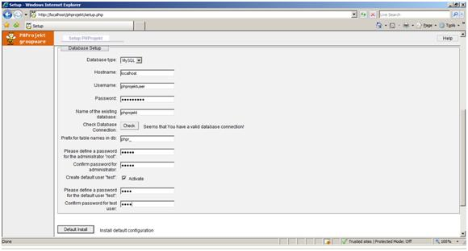
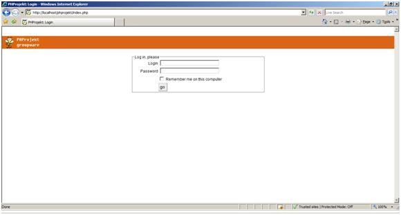
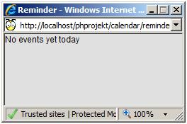
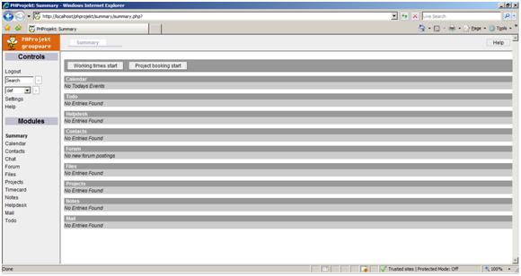

PHProjekt on IIS
====================
by Eric Woersching

## Introduction

PHProjekt is a modular application for coordinating group activities and sharing information and documents via the web. Components of PHProjekt include group calendar, project management, time card system, file management, contact manager, mail client and many other modules.

For more information about PHProjekt, see [http://www.phprojekt.com/](http://www.phprojekt.com/).  
  
In this section, we go through the steps required to install PHProjekt to work with the FastCGI extension on IIS 7.0 and above. To find out more about FastCGI support in IIS, see [https://www.iis.net/fastcgi](https://www.iis.net/downloads/microsoft/fastcgi-for-iis).

The following steps assume that you have completed the setup and configuration of FastCGI extension and PHP libraries as described here [https://www.iis.net/fastcgi/phpon60](using-fastcgi-to-host-php-applications-on-iis-60.md).

## Download and Unpack PHProjekt

First, download the latest stable release of the PHProjekt application. For this article, we use the PHProjekt 5.2 Full Package downloaded from the mirror [http://www.phprojekt.com/index.php?name=Downloads&amp;req=viewdownload&amp;cid=1](http://www.phprojekt.com/index.php?name=Downloads&amp;req=viewdownload&amp;cid=1).

Once you download the package, uncompress it and copy files and folders to C:\Inetpub\wwwroot\phprojekt.

## Set Up the Database

Before starting the installation procedure for PHProjekt, create a database on your server. Also create a user and grant this user db ownership permission to the database. Follow the instructions in the [Setting Up a Database for a PHP Application on IIS](../install-and-configure-php-on-iis/setting-up-a-database-for-a-php-application-on-iis.md) article for a MySQL database. This walkthrough uses the following database information:

- Database Name: 'phprojekt'
- Database User: 'phprojektuser'
- Account Password: 'phprojekt'

## Set Up and Configure the Application

Test the environment setup by browsing the env\_test.php file, which is located in the root directory. The server environment meets the requirements; or, confirm by clicking different buttons shown in the system.

## Run Configuration Script

> 1. Call the setup.php script to start the PHProjekt setup after creating the database for the project.

> 2. Provide the created database details and click Continue. We use the following details for our application.  
> • Database Type: MySql  
> • Host Name: localhost  
> • Username: phprojektuser  
> • Password: phprojekt  
> • Database: phprojekt  
> • Table prefix: phpr\_  
> • Administrator root password: admin  
> • User test: activate  
> • Test user password: testpwd

> 3. After providing details, click the "Default Install" button. The Default installation completes and accesses the application by browsing the index.php file using the path [http://localhost/phprojekt/index.php](http://localhost/phprojekt/index.php).

> 4. Login using the admin test user login details. It displays the events for the day as the system starts. It does not display any events for the default installation.

## Getting More Information

To discuss the FastCGI Extension for IIS 6.0, or file bug reports, use the FastCGI forums:   
• [IIS.NET / IIS 6.0 FastCGI forums](https://forums.iis.net/1103.aspx).   
   
To get more information regarding running various PHP applications on IIS, refer to:   
• [PHP on IIS portal](https://php.iis.net/)  
• [PHP community forum](https://forums.iis.net/1102.aspx)