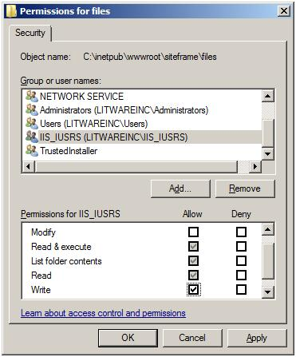
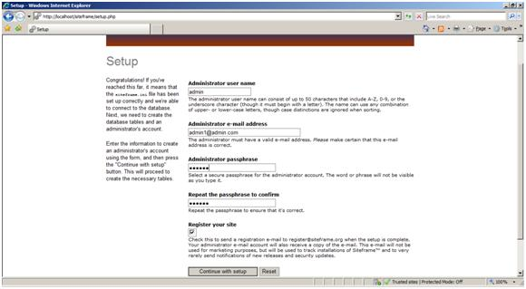
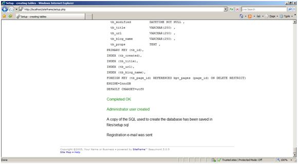
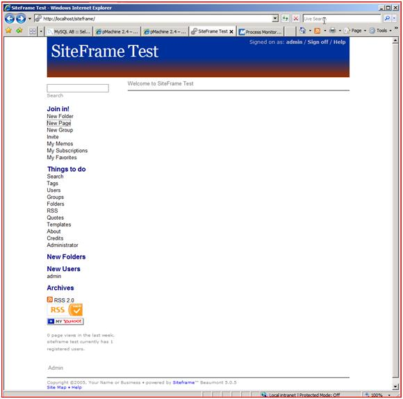
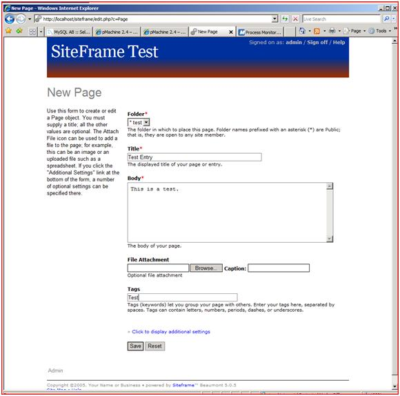

Siteframe on IIS
====================
by Eric Woersching

## Introduction

Siteframe™ is a lightweight content-management system designed for the rapid deployment of community-based websites. With Siteframe, a group of users can share stories and photographs, create blogs, send email to one another, and participate in group activities. Siteframe enables this by providing Web-based content management so that anyone can create content without learning HTML.

For more information about Siteframe, see [http://siteframe.org/](http://siteframe.org/).

In this section, we go through the steps that required to install Siteframe to work with the FastCGI extension on IIS 6.0 and IIS 7.0 and above. To find out more about FastCGI support in IIS, see [https://www.iis.net/fastcgi](https://www.iis.net/downloads/microsoft/fastcgi-for-iis).

The following steps assume that you have completed the setup and configuration of the FastCGI extension and PHP libraries as described in [https://www.iis.net/fastcgi/phpon60](using-fastcgi-to-host-php-applications-on-iis-60.md).

## Download and Unpack Siteframe

First, download the latest stable release of the Siteframe application. For this article, we use siteframe-5.0.5-783 downloaded from the mirror [http://siteframe.org/p/siteframe-5-0-5](http://siteframe.org/p/siteframe-5-0-5).

Once you download the package, uncompress it and copy all the files and folders to C:\Inetpub\wwwroot\siteframe.

## Set Up the Database

Before starting the installation procedure for Siteframe, create a database on your server. Also create a user and grant this user db ownership permission to the database. Follow the instructions in the [Setting Up a Database for a PHP Application on IIS](../install-and-configure-php-on-iis/setting-up-a-database-for-a-php-application-on-iis.md) article for a MySQL database. This walkthrough uses the following database information:

- Database Name: 'siteframe'
- Database User: 'siteframeuser'
- Account Password: 'Siteframe'

## PHP Configuration

SiteFrame requires the following PHP extensions:

- The "ext/mysqli" extension
- The "ext/gd" extension - to use images on your site
- The "ext/curl" extension - for outbound Trackback pings
- The PEAR XML-RPC module - to use the "ping" plugin
- The PHP5-exif module - if available, to retrieve EXIF information from photographs
- Allow\_url\_fopen - this setting must be set to on to permit access to RSS feeds

Enable all these extensions by un-commenting the lines below in the PHP.ini file, located in the PHP installation folder.

extension\_dir = "./ext  
extension=php\_mysqli.dll  
extension=php\_gd2.dll  
extension=php\_curl.dll  
extension=php\_xmlrpc.dll  
extension=php\_exif.dll  
allow\_url\_fopen=on

## Set Up and Configure Siteframe

1. Open the Siteframe application folder and copy the siteframe.ini-dist to siteframe.ini; edit it to suit your settings. For this installation, the following parameters below were edited.  

    - site\_url = [http://localhost/siteframe](http://localhost/siteframe)
    - ite\_path = C:\Inetpub\wwwroot\siteframe
    - db\_type = mysql
    - db\_host = localhost
    - db\_user = siteframeuser
    - db\_password = siteframe
    - db\_database = siteframe
2. To ensure that the installation process can complete without errors, follow the instructions to set the file and directory permissions. For this walkthrough, we provide modify permissions to the local machine "IUSER" account for the following directories and files:  

    - /siteframe

    
3. Copy \_htaccess file to .htaccess. Windows may not allow naming the file with only the extension (.htaccess). Open the file in the editor (notepad) and save as ".htaccess".
4. Siteframe requires the Smarty templates. Download and install Smarty templates from   
    [http://smarty.php.net/](http://smarty.php.net/) and copy to the local folder.   

    > [!NOTE]
    > Smarty templates are available only in the .tar format and these .tar files must be extracted using gzip or other tools. We use the "izarc" tool downloaded from [http://www.izarc.org/download.html](http://www.izarc.org/download.html).
5. After installing the extract tool, right click the filename and extract .tar to the folder c:\smarty. To avoid the security issues, keep this folder outside of the web root directory. There could be one other Smarty-2.6.18.tar file located inside the extracted files; if so, extract that file into the same folder as well.
6. Edit PHP configuration file php.ini to add the installed Smarty include path.  
 Include\_path = ".;c:\smarty\libs". Restart IIS to affect the changes.
7. Set up these two folders inside your www root:  

    - (wwwroot)/smarty/templates (This is where your templates will go.)
    - (wwwroot)/smarty/configs
8. Set up these two folders OUTSIDE of your www root:  

    - c:/smarty/templates\_c
    - c:/smarty/cache
9. Set up security settings for the Web server to write to these four folders. For more information on installing smarty templates, see [http://news.php.net/php.smarty.dev/2703](http://news.php.net/php.smarty.dev/2703).

## Run the Setup

1. After installing the Smarty templates, creating the siteframe database and providing the configuration, run the installation script by calling [http://localhost/setup.php](http://localhost/setup.php).  

    
2. Provide the details to create the admin user. Click "Continue with setup" to: go to register admin user, confirm the database setup and create the required tables. Creating the tables is the end of the Siteframe installation.  

    

## Test the SiteFrame Application

To test that SiteFrame has been installed successfully, create a blog postings and view it as a site visitor would. Follow these steps:

1. Navigate to [http://localhost/siteframe/index.php](http://localhost/siteframe/index.php).
2. Enter the administrator username and password created in the last installation step.  

    
3. Once logged in, click New Page to create an entry.  

    
4. Click Save to publish the content.

## Getting More Information

To discuss the FastCGI Extension for IIS 6.0, or file bug reports, please use the FastCGI forums:

- [IIS.NET / IIS 6 FastCGI forums](https://forums.iis.net/1103.aspx).

To get more information regarding running various PHP applications on IIS, refer to:

- [PHP on IIS portal](https://php.iis.net/)
- [PHP community forum](https://forums.iis.net/1102.aspx)