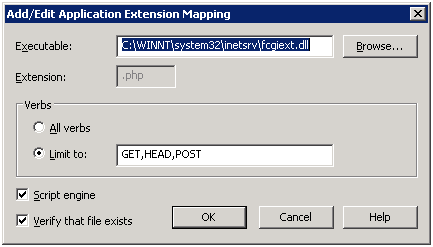
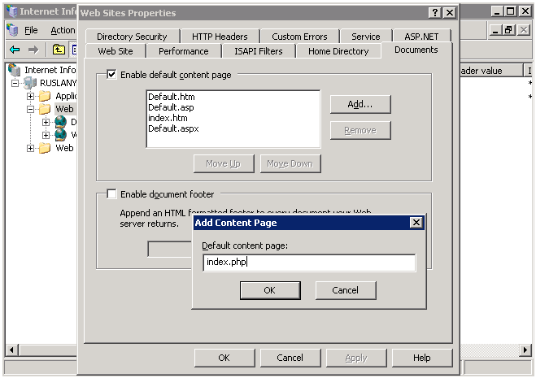
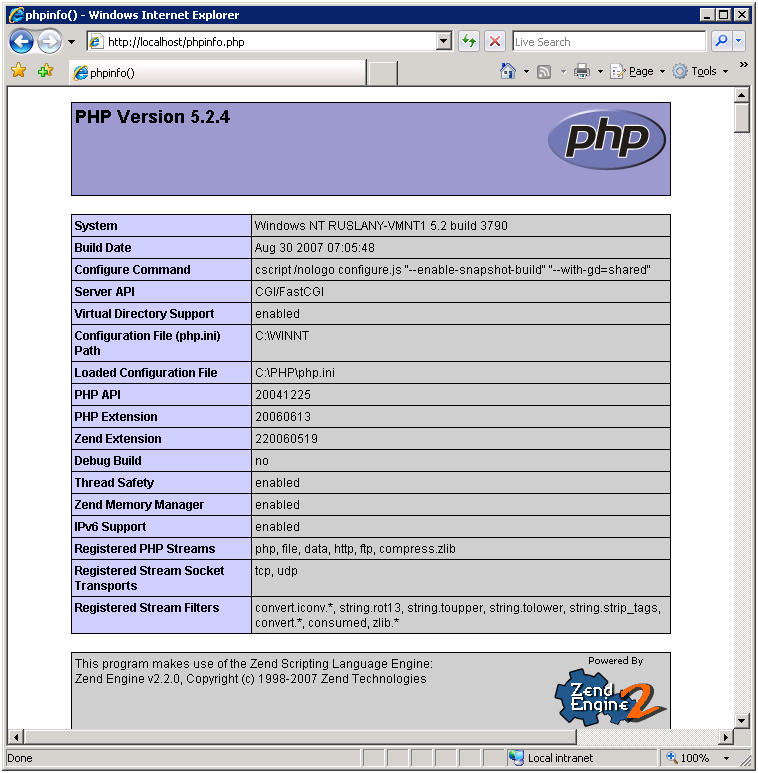

Using FastCGI to Host PHP Applications on IIS 6.0
====================
by Ruslan Yakushev

## Introduction

The PHP programming language has been an important player in the Web Application space for many years. Even though PHP was not developed by Microsoft, supporting this technology is very important to us and so you can install it on any stand-alone IIS Server, and it's also built-in to our cloud-based [Windows Azure Web Sites (WAWS)](https://www.windowsazure.com/en-us/documentation/services/web-sites/) platform. This article explains how to use the Microsoft IIS FastCGI extension to set up and run PHP applications on Windows XP and Windows Server® 2003 operating systems.

## What is FastCGI?

FastCGI is a standard protocol that allows the CGI executable files for application frameworks to interface with the Web server. It differs from the standard CGI protocol in that FastCGI reuses CGI processes for multiple requests, which provides a significant performance boost as compared to CGI. Support for IIS FastCGI enables IIS to host normal CGI programs like PHP or Ruby on Rails by using the FastCGI protocol, and to offer high performance and stability for production deployment of such application frameworks.

Using the IIS FastCGI support includes the following:

- IIS Web server
- IIS FastCGI extension
- CGI program (such as php-cgi.exe)

The Web server dispatches HTTP requests to your application to the FastCGI component, which in turn launches the CGI program executable, and forwards the request for processing. Once the request is finished and the response is returned back to the server and sent to the client, the CGI process is reused for a subsequent request. This helps to avoid the high performance penalty of starting a new process for each request, which results in better performance and scalability in a production environment.

To learn more about the FastCGI protocol, see [http://www.fastcgi.com/devkit/doc/fcgi-spec.html](http://www.fastcgi.com/devkit/doc/fcgi-spec.html).

## Install the FastCGI Extension for IIS 6.0 and IIS 5.1

You can download the FastCGI extension for 32-bit and 64-bit Windows XP and Windows Server 2003 here:

[https://www.iis.net/extensions/fastcgi](../../../downloads/microsoft/fastcgi-for-iis.md)

When you run the FastCGI installer, it copies FastCGI-specific files to the "%*windir*%\system32\inetsrv" folder, and then registers and enables the FastCGI Web server extension. Of the files that the installer copies, note the following:

- **fcgiext.dll** – This is the actual FastCGI handler that communicates with FastCGI-enabled processes for processing requests.
- **fcgiext.ini** – This is the configuration file that contains the mapping of file extensions to FastCGI processes. It also contains the configuration of FastCGI process pools.
- **fcgiconfig.js** – This configures the FastCGI extension. The script updates the fcgiext.ini file, modifies the IIS metabase and recycles the Web service application pools if necessary.

## Download and Install PHP

The FastCGI extension is fully compatible with the current official PHP 4.4.x and PHP 5.x distribution for Windows, available from [http://windows.php.net/download](http://windows.php.net/download). Since the FastCGI extension hosts and executes php processes in a single threaded manner, it is recommended that you download and install the non-thread-safe PHP build that is available for Windows. The non-thread-safe PHP build provides a performance boost from a lack of thread safety that is acceptable for a single-concurrency environment like FastCGI.

## Configure the FastCGI Extension to Work with PHP

Once PHP is installed on Windows, you have two options to configure FastCGI: use the configuration script that is provided with the installation of the FastCGI extension, or perform all the configuration tasks manually by modifying IIS configuration settings and the fcgiext.ini file.

### Configure the FastCGI Extension to Work with PHP by Using the Configuration Script

The configuration script with the name fcgconfig.js is provided with the installation of the FastCGI extension. It is located in %*windir*%\system32\inetsrv.

**To configure the FastCGI extension to work with PHP:** 

1. Open a command prompt.
2. Change the current directory to %*windir*%\system32\inetsrv.
3. Register the PHP CGI program as the one that will be processing .php extensions by running the following configuration script:

[!code-console[Main](using-fastcgi-to-host-php-applications-on-iis-60/samples/sample1.cmd)]

Replace C:\PHP\php-cgi.exe with the path to php-cgi.exe if you installed to a directory other than C:\PHP.

> [!NOTE]
> If you do not want to register the PHP extension to be processed by the FastCGI component on your entire server, and only want to register it for a specific Web site, add a "–site:[siteId]" argument, for example:

[!code-console[Main](using-fastcgi-to-host-php-applications-on-iis-60/samples/sample2.cmd)]

> [!NOTE]
> For a complete list of configuration parameters that are supported by the FastCGI extension, see the FastCGI extension documentation.

### Manually Configure the FastCGI Extension to Work with PHP

To manually configure the IIS and FastCGI extension, you must create script mappings for the PHP extension in the IIS metabase, and modify the fcgiext.ini file that is located in %*windir*%\system32\inetsrv.

**To create script mapping:** 

1. Launch inetmgr.exe.
2. Double-click the machine icon for the local computer.
3. Right-click **Web Sites** and click **Properties**.
4. Click the **Home Directory** tab.
5. Click the **Configuration…** button.
6. Click the **Add…** button.
7. In the **Add/Edit Application Extension Mapping** dialog box, click **Browse...**. Navigate to the fcgiext.dll file that is located in %*windir*%\system32\inetsrv.

> [!NOTE]
> If you need to use FastCGI in 32-bit mode on a 64-bit machine, navigate to %*windir*%\SysWOW64\inetsrv.

8. In the **Extension** text box, enter **.php**.

9. Under **Verbs**, in the **Limit to** text box, enter **GET,HEAD,POST**.

10. Ensure that the **Script engine** and **Verify that file exists** check boxes are selected.

## 

11. Click **OK**.

**To modify the fcigext.ini file:** 

Once the script mapping has been added, modify the fcgiext.ini file.

1. Add an extension to **application mapping (php=PHP)** to the **[Types]** section.
2. Add a **[PHP]** section with **ExePath=c:\php\php-cgi.exe** (assuming you installed PHP files to the C:\PHP folder).

[!code-unknown[Main](using-fastcgi-to-host-php-applications-on-iis-60/samples/sample-127405-3.unknown)]

3. After you save the changes to the fcgiext.ini file, restart the application pool that is associated with the Web site that hosts your PHP applications.

**To configure a default document in IIS:** 

Most PHP applications use a file named index.php as the default application document. Configure IIS to treat this file as the default content page.

1. Launch inetmgr.exe.
2. Double-click the machine icon for the local computer.
3. Right-click **Web Sites** and click **Properties**.
4. Click the **Documents** tab.
5. Click the **Add…** button.
6. In the **Add Content Page** dialog box, in the **Default content page** text box, enter **index.php**.
7. Click **OK**.

 

## Set the FastCGI Configuration for Optimal Functionality, Security, and Performance with PHP

IIS focuses on full PHP functionality support and performance of PHP applications that are running on the FastCGI extension. In collaboration with Zend Technologies, IIS identified the set of configuration settings for the FastCGI extension and PHP that would provide optimal functionality and performance for PHP applications when running on Windows by using the FastCGI extension.

To obtain optimal functionality and performance, configure your server as follows:

1. Modify the **php.ini** file as follows:

- Set **fastcgi.impersonate = 1**. FastCGI under IIS supports the ability to impersonate the security tokens of the calling client. This allows IIS to define the security context under which the request runs.
- Set **cgi.fix\_pathinfo=1**. cgi.fix\_pathinfo provides \*real\* PATH\_INFO/PATH\_TRANSLATED support for CGI. Previously, PHP behavior was to set PATH\_TRANSLATED to SCRIPT\_FILENAME, and to not define PATH\_INFO. For more information about PATH\_INFO, see the cgi specifications. Setting this value to 1 will cause PHP CGI to fix its paths to conform to the specification.
- Set **cgi.force\_redirect = 0**.

2. Set the FastCGI configuration settings for the PHP section by running fcgiconfig.js as follows:

- Set the FastCGI process pool property **InstanceMaxRequests** to **10000**. This setting specifies that the FastCGI extension will recycle php-cgi.exe after it has processed 10000 requests successfully.

[!code-unknown[Main](using-fastcgi-to-host-php-applications-on-iis-60/samples/sample-127405-4.unknown)]

3. Configure the FastCGI extension to set the **PHP\_FCGI\_MAX\_REQUESTS** environment variables for the PHP process to **10000**.This setting instructs php-cgi.exe to recycle itself after it has processed 10000 requests successfully.

[!code-unknown[Main](using-fastcgi-to-host-php-applications-on-iis-60/samples/sample-127405-5.unknown)]

> [!NOTE]
> You can configure **InstanceMaxRequests** and **PHP\_FCGI\_MAX\_REQUESTS** to use numbers other than 10000. As a general rule, ensure that the value of **InstanceMaxRequests** is less than or equal to the value of **PHP\_FCGI\_MAX\_REQUESTS**.

## Test PHP CGI

After installing the FastCGI extension and registering and configuring the PHP CGI, you can request your PHP application and use it normally.

To test the PHP application, create and request a **phpinfo.php** page in your site that contains the following:

[!code-unknown[Main](using-fastcgi-to-host-php-applications-on-iis-60/samples/sample-127405-6.unknown)]

You should see something like the following:

Note that the **Server API** field indicates that PHP is hosted in **FastCGI** mode.

## Get More Information

Use the FastCGI forums to discuss the usage of the FastCGI extension or to file bug reports:

- [IIS.NET FastCGI forums](https://forums.iis.net/1103.aspx)

For more information about how to run various PHP applications on IIS, see:

- [PHP on IIS portal](https://php.iis.net/)
- [PHP community forum](https://forums.iis.net/1102.aspx)

[Discuss in IIS Forums](https://forums.iis.net/1102.aspx)