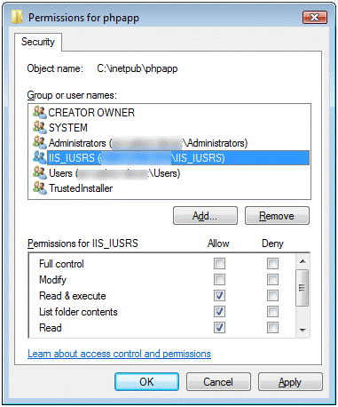
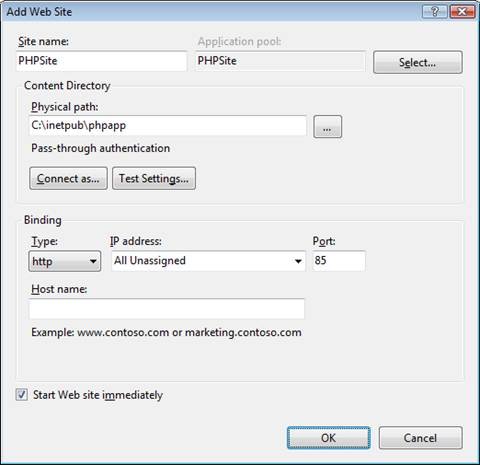
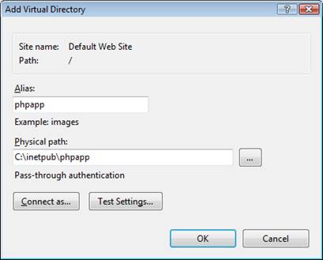
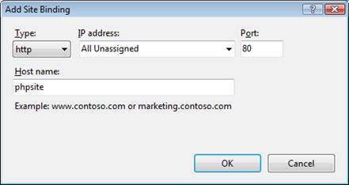
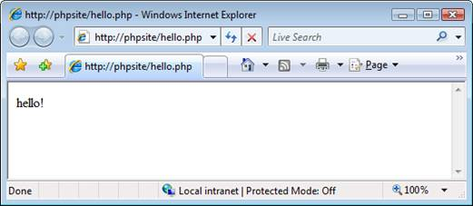

Create a Separate Site or Virtual Directory for PHP Content
====================
by Tali Smith

## Introduction

PHP hosters generally set up an environment, and provide a separate domain for each customer to host their applications.

Self-hosters or very small hosters, however, may need create a separate site or virtual directory to host their PHP content on a system that is also used for other workloads when:

- Application contents are located in a separate physical directory on disk.
- Mixing other application contents with the PHP application is not desired.
- Different permission settings are desired.
- You would like to host the PHP application at a different port or domain.

In these cases, you can add a separate virtual directory to host the PHP content; the directory is still accessible as part of the default Web site's URL hierarchy. You must also set the permissions necessary to enable PHP content to be served.

## Create a Virtual Directory to Host PHP Content

1. Using **Windows® Explorer**, browse to the **C:\inetpub** directory.

2. Create a subdirectory named **phpapp** directory.

3. Right-click on the **C:\inetpub\phpapp** directory, and then click **Properties**.

4. On the **Security** tab, click **Edit**.

5. Click **Add**, and then type **IIS\_IUSRS** in the **Enter the object names to select** box.

6. Click **OK**.

###### Figure 1: Permissions for phpapp folder

7. Click **OK** to accept the default permissions (read and execute).

8. Click **OK** to close the phpapp Permissions window.

## Set Permissions

Any directory containing PHP content must grant the following permissions:

- Grant IIS\_IUSRS read permission. This allows the Php-cgi.exe process to access the PHP content, if PHP is not configured to impersonate the authenticated user (fastcgi.impersonate = 0). This allows PHP in any Internet Information Services (IIS) application pool to access the content.
- OPTIONAL: If using impersonation, the directory must grant read access to all possible authenticated users that use the application by granting access to the individual user or a group to which all such users belong.
- If using anonymous authentication, the directory must grant access to the anonymous user configured in IIS (IIS\_IUSR by default).
- If using Windows®-based authentication methods, access must be granted to all possible authenticated users or group to which they all belong.
- It is strongly recommended not to grant write access or full access to IIS\_IUSRS or any account under which PHP executes. However, sometimes write access may be necessary if the application writes to its own files. In that case, grant write access only to the files or subdirectory that requires it. It is preferred however to configure all write access to be outside of the Web-accessible directory structure.
- OPTIONAL: If using application pool isolation to isolate applications, the directory should instead grant access to the custom account assigned to the corresponding application pool.
- ADVANCED: Alternatively, when using application pool isolation, access may be granted to the application pool security identifier (SID).

1. From the **Start** menu, open **Internet Information Services (IIS) Manager**.

2. Expand the server node, and then expand **Sites**.

3. In the tree view on the left, right-click the **Default Web Site**.

4. Click **Add Virtual Directory**.

5. In the **Alias** box, type **phpapp**.

6. In the **Physical path** box, type **c:\inetpub\phpapp**

###### Figure 2: Adding a virtual directory for php applications

7. Click **OK**.

8. Using Windows Explorer, browse to the **C:\inetpub\phpapp** directory.

9. Create a file named **Hello.php**.

10. Paste the following into the file:

[!code-unknown[Main](create-a-separate-site-or-virtual-directory-for-php-content/samples/sample-127401-1.unknown)]

11. Save and close the file.

12. Test the page.

13. Start **Windows® Internet Explorer®**, and then enter: **localhost/phpapp/hello.php** in the **Address** bar.

###### Figure 3: "Hello" page

14. Close all open windows.

## Create a Separate Site to Host PHP Content

It is possible to create a separate site with the desired port and domain name to host the PHP application.

1. Open **Internet Information Services (IIS) Manager** (Inetmgr.exe).

2. Expand the server node.

3. In the tree view on the left, right-click the **Sites** node, and then click **Add Web Site**.

4. Enter **PHPSite** for the **Site name**.

5. Enter **c:\inetpub\phpapp** for **Physical path**.

6. Enter **85** for **Port**.

###### Figure 4: Add Web Site dialog

1. Click **OK**.

2. Open **Internet Explorer**, and request `http://localhost:85/hello.php`.

###### Figure 5: "Hello" page running on a Web Site

3. Return to **IIS Manager** (Inetmgr.exe).

4. In the tree view on the left, right-click the **PHPSite**.

5. Click **Edit Bindings**.

6. Click **Add**.

7. Enter **phpsite** for the Host name.

###### Figure 6: Adding a site binding

8. Click **OK** and close Site Bindings dialog.

9. Edit **C:\Windows\system32\drivers\etc\hosts** file in Notepad as administrator and add the following DNS entry:

[!code-unknown[Main](create-a-separate-site-or-virtual-directory-for-php-content/samples/sample-127401-2.unknown)]

10. Save and close the hosts file.

11. Open **Internet Explorer**, and go to `http://phpsite/hello.php`.

###### Figure 7: "Hello" page running on a Web Site

12. Close all open windows.

Note that you can add any number of bindings to a site, to expose it on any combination of available IP addresses, ports, and domain names.

You can also use this process to create SSL site bindings (although this also requires a valid server certificate, and may involve additional IIS configuration to properly secure an SSL site).

*Note: This article uses material from the [PHP on Windows Training Kit](https://www.microsoft.com/downloads/details.aspx?FamilyID=c8498c9b-a85a-4afa-90c0-593d0e4850cb&amp;DisplayLang=en), published on August 25, 2009.*

## 
  
  
[Discuss in IIS Forums](https://forums.iis.net/1102.aspx)