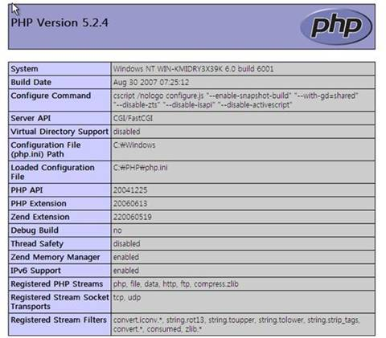

Install PHP and FastCGI Support on Server Core
====================
by IIS Team

## Introduction

FastCGI is a language-independent, scalable, open extension to Common Gateway Interface (CGI) that improves performance. The FastCGI extension is installable onto Server Core and enables application frameworks such as PHP to achieve improved performance and stability on Internet Information Services 7 (IIS 7) and above. Installing FastCGI when hosting PHP applications is very strongly recommended. In this example, we install FastCGI support to prepare the server to host our PHP application.

## Install FastCGI Support

1. To install FastCGI and Static Content Web Server support, type the following text into the Server Core system's command line, and then press ENTER:  

    [!code-console[Main](install-php-and-fastcgi-support-on-server-core/samples/sample1.cmd)]
2. Type the following text into the Server Core system's command line and press ENTER:  

    [!code-console[Main](install-php-and-fastcgi-support-on-server-core/samples/sample2.cmd)]
3. AppCmd.exe is the command-line tool included with IIS. AppCmd.exe can be found in the `%WinDir%\System32\InetSrv` directory. Use AppCmd.exe commands to create the PHP/FastCGI handler mapping from the Server Core's command line (note that this is case sensitive):  

    [!code-console[Main](install-php-and-fastcgi-support-on-server-core/samples/sample3.cmd)]
4. Depending on the PHP installation location, paths to executables on the hard disk may require updates. Note that the AppCmd.exe example commands above assume that PHP installation is in the D:\PHP directory.

## Install PHP on IIS 7 and Above

1. Download the latest [PHP release](http://www.php.net/downloads.php).  
- In the section titled "Windows Binaries," select the archive with the **.zip** file extension. Note that the Server Core lacks a graphical user interface (GUI), and has no Web browser.
- Uncompress the archive's contents to a location accessible by the Server Core system, which is likely to be a network file share.
- Create a directory in which to copy the uncompressed files, for example:  

    [!code-console[Main](install-php-and-fastcgi-support-on-server-core/samples/sample4.cmd)]
- Copy the entire contents of the PHP archive you uncompressed previously into the `%SystemDrive%\PHP` directory.
- Execute the following command:  

    [!code-console[Main](install-php-and-fastcgi-support-on-server-core/samples/sample5.cmd)]

## Test the PHP Configuration

1. From the command line, start **Notepad.exe**. In the empty file, type or paste the following text:  

    [!code-xml[Main](install-php-and-fastcgi-support-on-server-core/samples/sample6.xml)]
2. Save the file as **phpinfo.php** to **c:\inetpub\wwwroot\**.
3. From a connected computer, open a browser window, and go to `http://%systemhost%/phpinfo.php`.
4. A page appears showing the PHP configuration.  

      
*Figure 1: PHP page*

> [!NOTE]
> *This article updates [IIS 7.0 and Above on Server Core](../../manage/working-with-server-core/iis-70-on-server-core.md) by Tobin Titus, published on September 11, 2009.*

## Links for Further Information

[Setting Up FastCGI for PHP](../running-php-applications-on-iis/set-up-fastcgi-for-php.md)

[Videocast: Using IIS 7 and Above with Windows Server Core](../../manage/working-with-server-core/using-iis-with-windows-server-core.md)

[Installing PHP on Windows Vista® with FastCGI](installing-php-on-windows-vista-with-fastcgi.md)

[Using FastCGI to Host PHP Applications on IIS 6.0](../install-and-configure-php-applications-on-iis/using-fastcgi-to-host-php-applications-on-iis-60.md)

[Configuring FastCGI Extension for IIS 6.0](configuring-the-fastcgi-extension-for-iis-60.md)