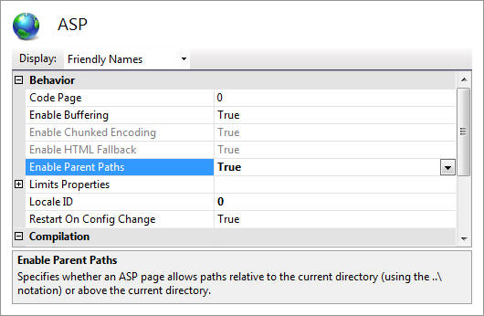

Classic ASP parent paths are disabled by default
====================
by [Robert McMurray](https://github.com/rmcmurray)

Classic ASP Parent Paths let developers use relative addresses that contain ".." in the paths to files or folders. For example, the following code excerpt illustrates an ASP page that maps a parent path:

[!code-xml[Main](classic-asp-parent-paths-are-disabled-by-default/samples/sample1.xml)]

In addition, the following code except illustrates an ASP page that references an included file in a folder that uses a parent path:

[!code-xml[Main](classic-asp-parent-paths-are-disabled-by-default/samples/sample2.xml)]

In several earlier versions of IIS, parent paths were enabled by default. In IIS 6.0 the default behavior changed to disable parent paths, and this was done for security and design reasons: by preventing the execution of parent paths, you are preventing the inclusion of content across security or application boundaries. By default, class ASP script error messages are not sent to the Web browser, and any attempts to use parent paths will return the following error message to a Web browser:

[!code-console[Main](classic-asp-parent-paths-are-disabled-by-default/samples/sample3.cmd)]

If you enable sending ASP script error messages and your classic ASP scripts attempt to map a path in a parent folder, you receive the following error message in your Web browser:

[!code-console[Main](classic-asp-parent-paths-are-disabled-by-default/samples/sample4.cmd)]

When your classic ASP scripts attempt to include a page that uses parent paths in IIS, you receive the following error message in your Web browser:

[!code-console[Main](classic-asp-parent-paths-are-disabled-by-default/samples/sample5.cmd)]

#### Working with User Access Control

You need to make sure that you follow the steps in this document by using an account that has full administrative permissions. This is best accomplished by using one of two methods:

- Log in to your computer by using the local administrator account.
- If you are logged in using an account that has administrative permissions but that is not the local administrator account, open all applications and all command prompt sessions by using the "Run as Administrator" option.

These above conditions are required because the User Account Control (UAC) security component in Windows Vista and Windows Server 2008 will prevent administrative access to the IIS configuration settings. For more information about UAC, see the following documentation:

- [User Account Control](https://go.microsoft.com/fwlink/?LinkId=113664)

## Resolving Parent Paths Issues

### Using Virtual Paths

As an alternative to using parent paths in your ASP code, you can use virtual paths. Virtual paths require that you enter the full folder path from the URL root of your Web site. For example:

**Mapping paths**:

[!code-xml[Main](classic-asp-parent-paths-are-disabled-by-default/samples/sample6.xml)]

**Including paths**:

[!code-xml[Main](classic-asp-parent-paths-are-disabled-by-default/samples/sample7.xml)]

### Enabling ASP Parent Paths

You can enable or disable parent paths by using IIS Manager. To do so, open IIS Manager and navigate to the site or application where you want to configure parent paths, and then-double click the **ASP** feature.

In the list of ASP features, configure the **Enable Parent Paths** option.

You can also configure this setting by using the command-line tool AppCmd.exe with the following syntax:

[!code-console[Main](classic-asp-parent-paths-are-disabled-by-default/samples/sample8.cmd)]

## More Information

For additional information about the options that are available for classic ASP, see the following page in the IIS configuration reference on the Microsoft [IIS.net](https://www.iis.net/) Web site:

> [https://www.iis.net/ConfigReference/system.webServer/asp](https://www.iis.net/configreference/system.webserver/asp)

For additional detail on parent paths in IIS, see the following page in the Microsoft Knowledge Base:

> **Enable Parent Paths Is Disabled by Default in IIS 6.0**  
> [https://support.microsoft.com/kb/332117](https://support.microsoft.com/kb/332117)