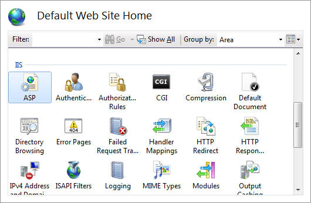
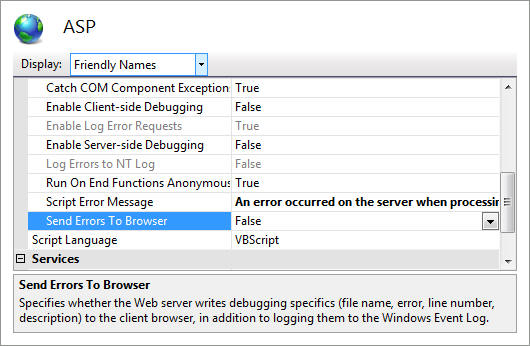

Classic ASP Script Error Messages No Longer Shown in Web Browser by Default
====================
by [Robert McMurray](https://github.com/rmcmurray)

In earlier versions of IIS, error messages from classic ASP scripts were sent to a Web browser, by default. Because these error messages might reveal sensitive information to malicious users, IIS 7 and above disables this feature by default. When your classic ASP scripts encounter an error in IIS, you receive the following error message by default:

[!code-console[Main](classic-asp-script-error-messages-no-longer-shown-in-web-browser-by-default/samples/sample1.cmd)]

You can customize the ASP script error message, and also determine whether to return the script errors to a Web browser. > [!NOTE]
 > As a best practice for security, you should only enable sending ASP script error messages to a Web browser on a development or test computer; returning script error messages to a Web browser can unintentionally expose more information than you intended to show.

#### Working with User Access Control

You need to make sure that you follow the steps in this document by using an account that has full administrative permissions. This is best accomplished by using one of two methods:

- Log in to your computer by using the local administrator account.
- If you are logged in using an account with administrative permissions but that is not the local administrator account, open all applications and all command prompt sessions by using the "Run as Administrator" option.

These above conditions are required because the User Account Control (UAC) security component in Windows Vista and Windows Server 2008 will prevent administrative access to the IIS configuration settings. For more information about UAC, see the following documentation:

- [User Account Control](https://go.microsoft.com/fwlink/?LinkId=113664)

## Customizing Classic ASP Error Messages

The configuration settings that you use to customize these settings are in the following list:

- **scriptErrorMessage**: This is an optional string attribute that specifies the error message that will be sent to the browser when specific debugging errors are not sent to the client.
- **scriptErrorSentToBrowser**: This is an optional Boolean attribute that specifies whether the writing of debugging specifics to the client browser is enabled.

You can configure these settings by using IIS Manager. To do so, open IIS Manager and navigate to the site or application where you want to enable or disable script messages, and then double-click the **ASP** feature.

> 

In the list of ASP features, configure the **Script Error Message** and **Send Errors To Browser** options.

> 

You can also configure these settings by using the command-line tool AppCmd.exe with the following syntax:

[!code-console[Main](classic-asp-script-error-messages-no-longer-shown-in-web-browser-by-default/samples/sample2.cmd)]

## More Information

For additional information about the options that are available for classic ASP debugging, see the following page in the IIS configuration reference on the Microsoft [IIS.net](https://www.iis.net/) Web site:

> [https://www.iis.net/ConfigReference/system.webServer/asp](https://www.iis.net/configreference/system.webserver/asp)

As an alternative to returning ASP script error messages to a Web browser, you can enable [Failed Request Tracing](using-failed-request-tracing-to-troubleshoot-classic-asp-errors.md) on your server. For example, you could add a rule to trace HTTP 500 errors automatically, which the ASP engine generates when an error occurs. By analyzing the output in the Failed Request Tracing logs on your server, you can pinpoint the source of classic ASP errors. As an additional security note, Failed Request Tracing logs are not available to Web browsers, so the troubleshooting information is only available on your server. If you use Failed Request Tracing, it will also let you troubleshoot unmonitored classic ASP errors in detail without having to reproduce the errors.
  
  
[Discuss in IIS Forums](https://forums.iis.net/1044.aspx)