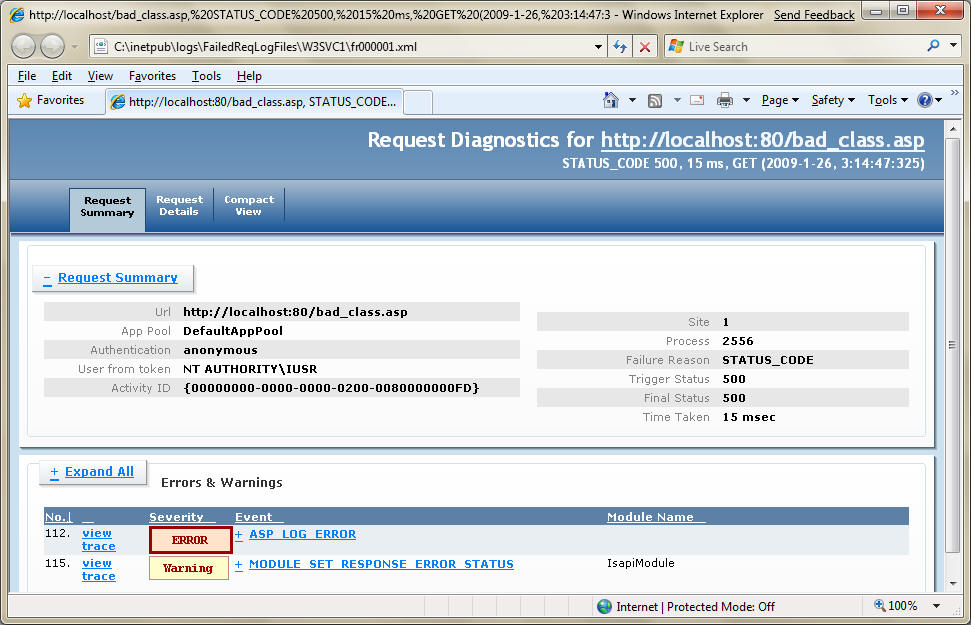
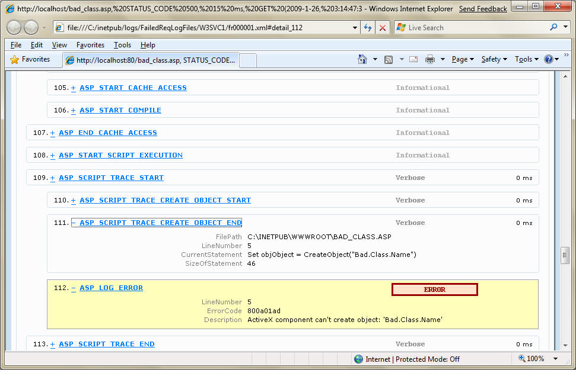
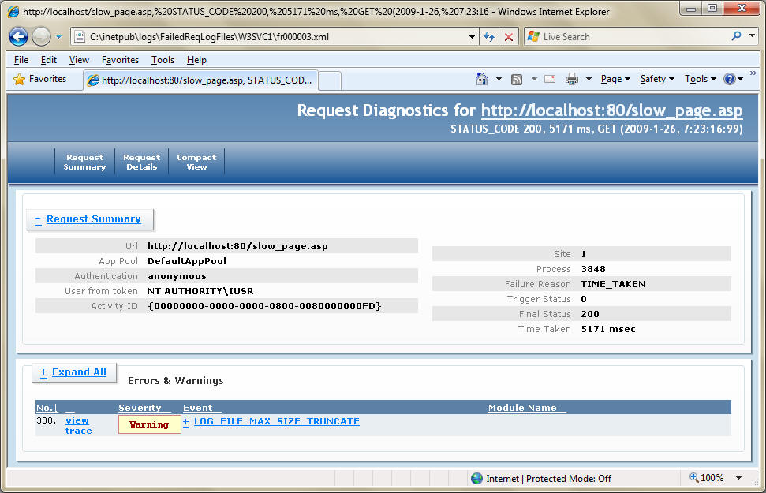
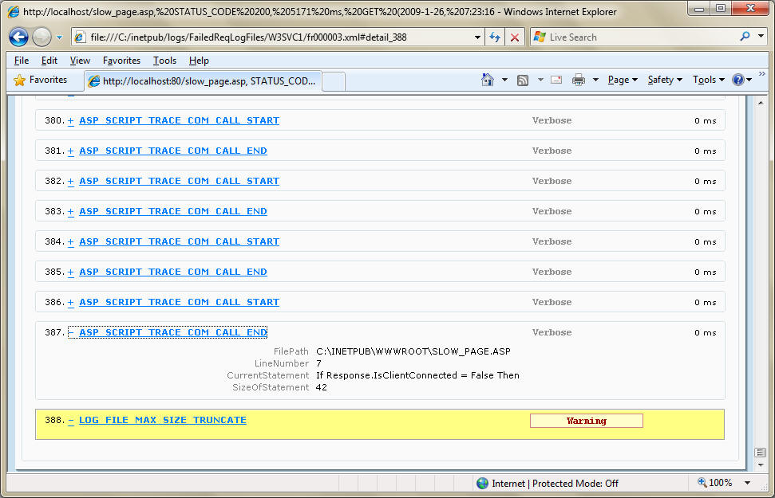

Using Failed Request Tracing to troubleshoot Classic ASP errors
====================
by [Robert McMurray](https://github.com/rmcmurray)

One of the great troubleshooting features that is built in to IIS 7.0 and above is Failed Request Tracing, which lets you configure tracing rules on your server that will create detailed troubleshooting log files for custom failure conditions that you define. For example, you can capture the details for authentication failures by creating tracing rules that create log files for HTTP 401 errors.

Failed Request Tracing in IIS can be configured to passively trace failures. This means that you can add tracing rules to IIS that will create log files when errors occur, even if you are not actively monitoring your server. For example, the steps in this walkthrough will show you how to create a tracing rule that will create trace logs whenever an HTTP 500 error occurs. This method of passive tracing is known as "no-repro" tracing, which means that you can periodically examine your server's logs to check if any failures have occurred, and then take action only when IIS has created logs.

#### Working with User Access Control

You need to make sure that you follow the steps in this document by using an account that has full administrative permissions. This is best accomplished by using one of two methods:

- Log in to your computer by using the local administrator account.
- If you are logged in using an account with administrative permissions but that is not the local administrator account, open all applications and all command prompt sessions by using the "Run as Administrator" option.

These above conditions are required because the User Account Control (UAC) security component in Windows Vista and Windows Server 2008 will prevent administrative access to the IIS configuration settings. For more information about UAC, see the following documentation:

- [User Account Control](https://go.microsoft.com/fwlink/?LinkId=113664)

## Installing Failed Request Tracing

Failed Request Tracing is not installed by default on IIS. To install Failed Request Tracing, use the following steps for your version of Windows:

### Windows VistaorWindows 7Client

1. Click **Start**, and then click **Control Panel**.
2. In **Control Panel**, click **Programs and Features**, and then click **Turn Windows Features on or off**.
3. Expand **Internet Information Services**, then **World Wide Web Services**, then **Health and Diagnostics**.
4. Select **Tracing**, and then click **OK**.

### Windows Server 2008orWindows Server 2008 R2

1. Click **Start**, point to **Administrative Tools**, and then click **Server Manager**.
2. In the **Server Manager** hierarchy pane, expand **Roles**, and then click **Web Server (IIS)**.
3. In the **Web Server (IIS)** pane, scroll to the **Role Services** section, and then click **Add Role Services**.
4. On the **Select Role Services** page of the **Add Role Services Wizard**, select **Tracing**, and then click **Next**.
5. On the **Confirm Installation Selections** page, click **Install**.
6. On the **Results** page, click **Close**.

For additional information about installing Failed Request Tracing for IIS, see the following topic on the Microsoft [IIS.net](https://www.iis.net/) Web site:

- [https://www.iis.net/ConfigReference/system.webServer/tracing](https://www.iis.net/configreference/system.webserver/tracing)

## How to enable failed request tracing

1. Click **Start**, point to **Administrative Tools**, and then click **Internet Information Services (IIS) Manager**.
2. In the **Connections** pane, select the server connection, site, application, or directory for which you want to configure failed request tracing.
3. In the **Actions** pane, click **Failed Request Tracing...**
4. Configure the following options In the **Edit Web Site Failed Request Tracing Settings** dialog box: 

    - Select the **Enable** check box to enable tracing.
    - Leave the default value or type a new directory where you want to store failed request log files in the **Directory** box.
    - Type the number of failed request trace files you want to store in the **Maximum number of trace files** box
5. Click **OK**.

> [!NOTE]
> You could customize the setting for classic ASP, ASP.NET, or for other specific conditions, but a generic rule for HTTP 500 errors is useful for discovering a variety of error conditions on your Web server.

You can also enable failed request tracing from a command prompt by using the AppCmd.exe utility with the following syntax:

> [!code-console[Main](using-failed-request-tracing-to-troubleshoot-classic-asp-errors/samples/sample1.cmd)]

## Troubleshooting classic ASP errors

In this section, we will generate a few errors using classic ASP in order to examine how failed request tracing will help identify potential problems. Even though these examples will target specific circumstances where you know the cause of the failure, you can use the techniques that will be presented to troubleshoot situations where the cause of the failure is unknown.

### Troubleshooting HTTP 500 errors

IIS returns HTTP 500 errors when ASP pages fail to execute, and without the Failed Request Tracing feature of IIS these HTTP 500 errors can be very difficult to troubleshoot. This is because the ASP errors typically occur when you are not actively troubleshooting your system, so that sometimes your only option is to search your IIS activity logs and hope that the ASP module returns additional information in the log entries for failed requests. In the following example that uses Failed Request Tracing, you have a detailed record of the failure that you can use to troubleshoot the situation.

#### How to add a tracing rule for HTTP 500 errors

The following steps will configure a failed request tracing rule for HTTP 500 errors, which you will use later to troubleshoot classic ASP error messages.

1. Click **Start**, point to **Administrative Tools**, and then click **Internet Information Services (IIS) Manager**.
2. In the **Connections** pane, go to the connection, site, application, or directory for which you want to configure failed request tracing.
3. In the **Home** pane, double-click **Failed Request Tracing Rules**.
4. In the **Actions** pane, click **Add...**
5. On the **Specify Content to Trace** page of the **Add Failed Request Tracing Rule** Wizard, you would ordinarily select the content type you want to trace. In this case, accept the default for all content, and then click **Next**.
6. On the **Define Trace Conditions** page, enter 500 in the **Status code(s)** text box in order to trace HTTP 500 errors, and then click **Next**.
7. On the **Select Trace Providers** page, accept the defaults, and then click **Finish**.

#### Creating a page that invokes an invalid COM class

In this error condition, you will examine an ASP page that attempts to create an instance of an invalid COM class, and this situation is most often produced by misspelling a valid COM class. To test this issue, save the following ASP code as Bad\_class.asp in the wwwroot folder of a Web site where you have enabled failed request tracing for HTTP 500 errors:

> [!code-html[Main](using-failed-request-tracing-to-troubleshoot-classic-asp-errors/samples/sample2.html)]

When you use a Web browser to browse to this file, IIS should return an HTTP 500 error message, and IIS will create a failed request trace log that is created in your %*SystemDrive*%\Inetpub\FailedRequestLogFiles\W3SVCnnn folder by default, where W3SVCnnn contains the unique identified for your Web site that is listed in IIS Manager. Failed request trace logs are XML files, and IIS creates an XSL file that transforms the XML into a presentation format that you can open in Internet Explorer.

#### Reading the trace log in Internet Explorer

When you use Internet Explorer to open a failed request tracing log file, a variety of information is displayed in a **Request Summary**. This summary contains the general environment information for the failure condition such as the executing URL, the application pool, the authentication type and user name, and other information. You will notice that the reason for the failure is the status code, and that the status was an HTTP 500 error.

In the **Errors and Warning** section of summary, you will see a **view trace** link, as shown in the following illustration:

> 

When you click the **view trace** link, Internet Explorer will jump to the section of the trace where the ASP script failure occurred. If you expand the individual trace events, you can view the specific details for the event, such as the physical file path, the line number, the ASP error code and description, and the ASP code excerpt that caused the failure, which in this case was the attempt to instantiate an invalid COM class.

An example is shown in the following illustration:

> 

### Troubleshooting slow pages

You can configure Failed Request Tracing to generate log files for pages that exceed a time interval that you specify, not just for HTTP errors. In a practical example, if your Web users are complaining that parts of the Web site seem slow sometimes but they don't know which pages seem to be affected, you can create a tracing rule for a time interval to create a log file when any pages exceed that interval. This lets you narrow your troubleshooting scope down to any affected pages by waiting for IIS to create log files that list the page. Without Failed Request Tracing, you could query your IIS activity logs for pages that take a long time to execute, but that only narrows your scope to the list of pages where a problem is occurring, not to the problem itself. In the following example, you will locate the source of the failure in the slow page.

#### How to add a tracing rule for slow content

The following steps will configure a failed request tracing rule for requests that exceed a specific period of time, which you will use later to troubleshoot slow ASP pages.

1. Click **Start**, point to **Administrative Tools**, and then click **Internet Information Services (IIS) Manager**.
2. In the **Connections** pane, go to the connection, site, application, or directory for which you want to configure failed request tracing.
3. In the **Home** pane, double-click **Failed Request Tracing Rules**.
4. Highlight the rule that you created in the previous example, and then click **Remove** in the **Actions** pane.
5. In the **Actions** pane, click **Add...**
6. On the **Specify Content to Trace** page of the **Add Failed Request Tracing Rule** Wizard, you would ordinarily select the content type you want to trace. In this case, accept the default for all content, and then click **Next**.
7. On the **Define Trace Conditions** page: 

    - Clear the box for **Status code(s)**.
    - Check the box for **Time taken (in seconds)**.
    - Enter 5 for the number of seconds.
    - Click **Next**.
8. On the **Select Trace Providers** page, accept the defaults, and then click **Finish**.

#### Creating a page that loops endlessly

In this error condition, you will examine a page that loops endlessly. This problem is frequently caused when a user session fails to exit a loop correctly, such as when your code is looping through the list records in a database table. To test this issue, save the following ASP code as Slow\_page.asp in the wwwroot folder of a Web site where you have enabled failed request tracing:

> [!code-html[Main](using-failed-request-tracing-to-troubleshoot-classic-asp-errors/samples/sample3.html)]

When you use a Web browser to browse to this file, you should see no error in your Web browser, but your browser may never return a page and will eventually time out. (> [!NOTE]
> This page is written to exit the loop after you close your Web browser. If you want to exit the loop before the script timeout is reached, you should manually close your browser after ten seconds.)

After five seconds, IIS will create a failed request trace log in your %*SystemDrive*%\Inetpub\FailedRequestLogFiles\W3SVCnnn folder by default, where W3SVCnnn contains the unique identifier, as listed in IIS Manager, for your Web site.

#### Reading the trace log in Internet Explorer

As shown in the previous example, when you use Internet Explorer to open a failed request tracing log file, important information is displayed in a **Request Summary**. This summary contains the general environment information for the failure condition such as the executing URL, the application pool, the authentication type and user name, and other information. Notice that the reason for the failure was the amount of time taken, and that the time was slightly over five seconds, which was the time that you entered in the failed request tracing rule. > [!NOTE]
 > You will also notice that the HTTP status code for the response was HTTP 200, which is a successful response. This is one of the factors that often makes it more difficult to diagnose slow pages—the responses succeed, which make them more difficult to locate.

In the **Errors and Warning** section of summary, you will see a **view trace** link, as shown in the following illustration:

> 

When you click the view **trace link**, Internet Explorer will go to the section of the trace where the ASP script failure occurred. If you expand the individual trace events, you can view the specific details for the event, such as the physical file path, the line number, the ASP error code and description, and the ASP code excerpt that was executing when the log file was creating. By using this information, you could examine your ASP page and locate the line of code that was executing inside a never-ending loop.

An example is shown in the following illustration:

> 

## More Information

For additional information about Failed Request Tracing in IIS, see the following pages on the Microsoft [IIS.net](https://www.iis.net/) Web site:

- [Walkthrough: Troubleshooting Failed Requests Using Tracing in IIS 7.0 and Above](../../troubleshoot/using-failed-request-tracing/troubleshooting-failed-requests-using-tracing-in-iis.md)
- [Configuration Reference: Trace Failed Requests](https://www.iis.net/configreference/system.webserver/tracing/tracefailedrequests)