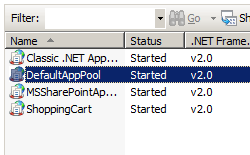
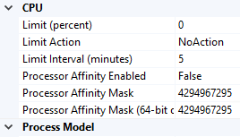
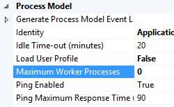

CPU Settings for an Application Pool <cpu>
====================

## Overview

The `<cpu>` element of the `<add>` element in the `<applicationPools>` collection configures values for CPU usage parameters and CPU actions that will be used in application pools.

### NUMA Support

Non-Uniform Memory Access (NUMA) is a hardware-based method of associating processors to their own dedicated memory. NUMA is used to increase processor speed as an alternative to the traditional symmetric multiprocessor (SMP) model for multiprocessor support. You can set up IIS 8 and later to distribute and affinitize its processes on NUMA. The use of NUMA is configured in the CPU element by the numaNodeAssignment attribute that enables IIS to identify the most optimal NUMA node when the IIS worker process is about to start, and the numaNodeAffinityMode attribute that determines how the threads from an IIS worker process are affinitized to a NUMA node. NUMA is also configured using the MaxProcesses attribute of the processModel element, which when set to `0` specifies that IIS automatically runs the same number of worker processes as there are NUMA nodes. For more information, see [IIS 8.0 Multicore Scaling on NUMA Hardware.](https://docs.microsoft.com/en-us/iis/get-started/whats-new-in-iis-8/iis-80-multicore-scaling-on-numa-hardware)

The NUMA selection logic and affinity type can be set in the **Advanced Settings** dialog box only if IIS is running on NUMA hardware.

## Compatibility

| Version | Notes |
| --- | --- |
| IIS 10.0 | The `<cpu>` element was not modified in IIS 10.0. |
| IIS 8.5 | The `<cpu>` element was not modified in IIS 8.5. |
| IIS 8.0 | Two enum values were added to the `action` attribute to define throttling behavior. The `processorGroup` attribute was added to define the number of processor groups used. The `numaNodeAssignment` and `numaNodeAffinityMode` attributes were added to specify the behavior of NUMA nodes. |
| IIS 7.5 | The `<cpu>` element was not modified in IIS 7.5. |
| IIS 7.0 | The `<cpu>` element was introduced in IIS 7.0. |
| IIS 6.0 | The `<cpu>` element replaces portions of the IIS 6.0 **IIsApplicationPools** metabase property. |

## Setup

The `<applicationPools>` collection is included in the default installation of IIS 7 and later.

## How To

### How to edit CPU configuration settings

1. Open **Internet Information Services (IIS) Manager**: 

    - If you are using Windows Server 2012 or Windows Server 2012 R2: 

        - On the taskbar, click **Server Manager**, click **Tools**, and then click **Internet Information Services (IIS) Manager**.
    - If you are using Windows 8 or Windows 8.1: 

        - Hold down the **Windows** key, press the letter **X**, and then click **Control Panel**.
        - Click **Administrative Tools**, and then double-click **Internet Information Services (IIS) Manager**.
    - If you are using Windows Server 2008 or Windows Server 2008 R2: 

        - On the taskbar, click **Start**, point to **Administrative Tools**, and then click **Internet Information Services (IIS) Manager**.
    - If you are using Windows Vista or Windows 7: 

        - On the taskbar, click **Start**, and then click **Control Panel**.
        - Double-click **Administrative Tools**, and then double-click **Internet Information Services (IIS) Manager**.
2. In the **Connections** pane, expand the server name, click **Application Pools**, and then click the application pool that you want to edit.  
    
3. In the **Actions** pane, click **Advanced Settings...**
4. In the **Advanced Settings** dialog box, click the CPU property that you want to edit, then edit the value in the property value section of the dialog box, and then click **OK**. For example, you could change the **Limit Action** to **NoAction**, **KillW3wp**, **Throttle**, or **ThrottleUnderLoad**.  
    

### How to configure IIS for use with Non-Uniform Memory Access (NUMA) hardware

1. On the task bar, click **Server Manager**, click **Tools**, and then click **Internet Information Services (IIS) Manager**.
2. In the **Connections** pane, expand the server name, and then click **Application Pools**.
3. In the **Application Pools** pane, select the pool that you want to configure for NUMA.
4. In the **Actions** pane, select **Advanced Settings**.
5. Under **Process Model**, set **Maximum Worker Processes** to `0`.  
  
    
6. Under **CPU**, set **processorGroup**, **numaNodeAffinityMode**, and **numaNodeAssignment**.
7. Click **OK**.

## Configuration

### Attributes

| Attribute | Description |
| --- | --- |
| `action` | Optional enum attribute. Configures the action that IIS takes when a worker process exceeds its configured CPU limit. The action attribute is configured on a per-application pool basis. The action attribute can be one of the following possible values. The default value is `NoAction`. | Value | Description | | --- | --- | | `NoAction` | No action is taken when the CPU limit is exceeded. A warning is written to the event log. The numeric value is `0`. | | `KillW3wp` | Application pool worker processes that exceed their CPU limit will be forced to shut down. The numeric value is `1`. | | `Throttle` | The CPU consumption is limited to the value set in Limit. The Limit interval is not used and an event log entry is generated. The numeric value is `2`. | | `ThrottleUnderLoad` | The CPU consumption is limited only when there is contention on the CPU. The Limit interval is not used and an event log entry is generated. The numeric value is `3`. | |
| `limit` | Optional uint attribute. Configures the maximum percentage of CPU time (in 1/1000ths of one percent) that the worker processes in an application pool are allowed to consume over a period of time as indicated by the resetInterval attribute. If the limit set by the limit attribute is exceeded, an event is written to the event log and an optional set of events can be triggered. These optional events are determined by the action attribute. The default value is `0`, which disables CPU limiting. |
| `numaNodeAffinityMode` | Optional enum attribute. Specifies how the threads of a process that is affinitized to a NUMA node will be scheduled on the node's cores. The numaNodeAffinityMode attribute can be one of the following possible values. The default value is `Soft`. | Value | Description | | --- | --- | | `Soft` | As long as the cores in a NUMA node to which a process is affinitized are available, all threads of the process will be scheduled on those cores. However, if the scheduler cannot schedule the process on the cores of the node that it is affinitized to, it can schedule the process on cores in another NUMA node. The numeric value is `0`. | | `Hard` | Any thread of a process that is affinitized to a NUMA node will be scheduled on the node's cores and only those cores. No threads of that process will be scheduled on cores in another NUMA node. The numeric value is `1`. | |
| `numaNodeAssignment` | Optional enum attribute. Specifies how IIS will determine which NUMA (non-uniform memory access) node to affinitize a process to. A NUMA node contains clusters of cores that share a single memory bank. This attribute is available in the CPU Advanced Settings only if NUMA nodes are available. The numaNodeAssignment attribute can be one of the following possible values. The default value is `Most Available Memory`. | Value | Description | | --- | --- | | `Most Available Memory` | The process will be assigned to the NUMA node that has the most memory free. The numeric value is `0`. | | `Windows Scheduling` | Windows scheduling will determine which NUMA node the process is assigned to. The numeric value is `1`. | |
| `processorGroup` | Optional int attribute. The number of processor groups used (zero-based). A processor group contains multiple cores. The Processor Group attribute is available in the CPU Advanced Settings only if the server has multiple processor groups. The default value is `0`, which means that a single processor group is used. |
| `resetInterval` | Optional timeSpan attribute. Specifies the reset period (in minutes) for CPU monitoring and throttling limits on an application pool. When the number of minutes elapsed since the last process accounting reset equals the number specified by this property, IIS resets the CPU timers for both the logging and limit intervals. **Important**: The **resetInterval** value must be greater than the time between logging operations, otherwise IIS will reset counters before logging has occurred, and process accounting will not occur. > [!NOTE]
 > Because process accounting in IIS uses Windows job objects to monitor CPU times for the whole process, process accounting will only log and throttle applications that are isolated in a separate process from IIS. The default value is `00:05:00`. |
| `smpAffinitized` | Optional Boolean attribute. Specifies whether a particular worker process assigned to an application pool should also be assigned to a given CPU. This property is used together with the **smpProcessorAffinityMask** and **smpProcessorAffinityMask2** attributes. The default value is `false`. |
| `smpProcessorAffinityMask` | Optional uint attribute. Specifies the hexadecimal processor mask for multi-processor computers, which indicates to which CPU the worker processes in an application pool should be bound. Before this property takes effect, the **smpAffinitized** attribute must be set to **true** for the application pool. > [!NOTE]
 > On 64-bit computers, the **smpProcessorAffinityMask** attribute contains the low-order DWORD for the processor mask, and the **smpProcessorAffinityMask2** attribute contains the high-order DWORD for the processor mask. On 32-bit computers, the **smpProcessorAffinityMask2** attribute has no effect. If you set the value to 1 (which corresponds to 00000000000000001 in binary), the worker processes in an application pool run on only the first processor. If you set the value to 2 (which corresponds to 0000000000000010 in binary), the worker processes run on only the second processor. If you set the value to 3 (which corresponds to 0000000000000011 in binary) the worker processes run on both the first and second processors. > [!NOTE]
 > Do not set this property to 0. Doing so disables symmetric multiprocessing (SMP) affinity and creates an error condition. This means that processes running on one CPU will not remain affiliated with that CPU throughout their lifetime. The default value is `4294967295`. |
| `smpProcessorAffinityMask2` | Optional uint attribute. Specifies the high-order DWORD hexadecimal processor mask for 64-bit multi-processor computers, which indicates to which CPU the worker processes in an application pool should be bound. Before this property takes effect, the **smpAffinitized** attribute must be set to **true** for the application pool. > [!NOTE]
 > On 64-bit computers, the **smpProcessorAffinityMask** attribute contains the low-order DWORD for the processor mask, and the **smpProcessorAffinityMask2** attribute contains the high-order DWORD for the processor mask. On 32-bit computers, the **smpProcessorAffinityMask2** attribute has no effect. The default value is `4294967295`. |

### Child Elements

None.

### Configuration Sample

The following configuration sample configures a single application pool named DefaultAppPool and sets the CPU to 50%, with an action to kill the worker process with a reset interval of 10 minutes.

[!code-xml[Main](cpu/samples/sample1.xml)]

## Sample Code

The following code samples configure the default application pool to kill the worker process when it exceeds the CPU limit, and configure the reset interval to four minutes.

### AppCmd.exe

[!code-csharp[Main](cpu/samples/sample2.cs)]

> [!NOTE]
> You must be sure to set the **commit** parameter to `apphost` when you use AppCmd.exe to configure these settings. This commits the configuration settings to the appropriate location section in the ApplicationHost.config file.

### C#

[!code-csharp[Main](cpu/samples/sample3.cs)]

### VB.NET

[!code-vb[Main](cpu/samples/sample4.vb)]

### JavaScript

[!code-javascript[Main](cpu/samples/sample5.js)]

### VBScript

[!code-vb[Main](cpu/samples/sample6.vb)]