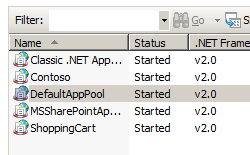
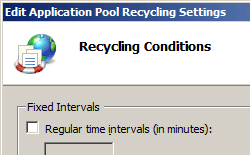
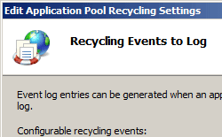

Adding Periodic Restart Schedules &lt;add&gt;
====================

## Overview

The `<add>` element of the `<schedule>` collection specifies a time to initiate a scheduled periodic restart of an application pool.

## Compatibility

| Version | Notes |
| --- | --- |
| IIS 10.0 | The `<add>` element was not modified in IIS 10.0. |
| IIS 8.5 | The `<add>` element was not modified in IIS 8.5. |
| IIS 8.0 | The `<add>` element was not modified in IIS 8.0. |
| IIS 7.5 | The `<add>` element was not modified in IIS 7.5. |
| IIS 7.0 | The `<add>` element of the `<schedule>` collection was introduced in IIS 7.0. |
| IIS 6.0 | The `<add>` element replaces portions of the IIS 6.0 **IIsApplicationPools** metabase property. |

## Setup

The `<applicationPools>` collection is included in the default installation of IIS 7.

## How To

### How to set up periodic recycling for an application pool

1. Open **Internet Information Services (IIS) Manager**: 

    - If you are using Windows Server 2012 or Windows Server 2012 R2: 

        - On the taskbar, click **Server Manager**, click **Tools**, and then click **Internet Information Services (IIS) Manager**.
    - If you are using Windows 8 or Windows 8.1: 

        - Hold down the **Windows** key, press the letter **X**, and then click **Control Panel**.
        - Click **Administrative Tools**, and then double-click **Internet Information Services (IIS) Manager**.
    - If you are using Windows Server 2008 or Windows Server 2008 R2: 

        - On the taskbar, click **Start**, point to **Administrative Tools**, and then click **Internet Information Services (IIS) Manager**.
    - If you are using Windows Vista or Windows 7: 

        - On the taskbar, click **Start**, and then click **Control Panel**.
        - Double-click **Administrative Tools**, and then double-click **Internet Information Services (IIS) Manager**.
2. In the **Connections** pane, expand the server name, and then click **Application Pools**.
3. In the **Application Pools** pane, select the application pool you want edit.
4. In the **Actions** pane, click **Recycling...**   
    
5. On the Recycling Conditions page of the Edit Application Pool Recycling Settings Wizard, select at least one of the options in the **Fixed Intervals** section, type values into the appropriate text boxes, and then click **Next**.  
    
6. (Optional) On the Recycling Events to Log page of the Edit Application Pool Recycling Settings Wizard, select the configurable recycling events and run-time recycling events that you want IIS to send to the event log when they occur, and then click **Finish**.  
    
 

## Configuration

You configure the `<add>` element at the server level in the ApplicationHost.config file.

### Attributes

| Attribute | Description |
| --- | --- |
| `Value` | Required timeSpan attribute. Specifies a unique local time, on a 24-hour clock, to begin a scheduled periodic restart of an application pool. |

### Child Elements

None.

### Configuration Sample

The following configuration sample uses the application pool `<add>` element to create a new application pool named Contoso. The `<recycling>` element configures logging for application pool restarts, the `<periodicRestart>` element configures when the application pool restarts, and the `<processModel>` element configures the **shutdownTimeLimit** and **startupTimeLimit** attributes for shutting down and starting the worker processes in the application pool for 30 seconds each. If these time limits are exceeded, IIS terminates the worker process.

[!code-xml[Main](add/samples/sample1.xml)]

## Sample Code

The following code examples add an application pool named Contoso to your IIS 7 server, then set the application pool to daily recycle at 3:00 A.M.

### AppCmd.exe

[!code-console[Main](add/samples/sample2.cmd)]

You can also use the following syntax:

[!code-console[Main](add/samples/sample3.cmd)]

> [!NOTE]
> You must be sure to set the **commit** parameter to `apphost` when you use AppCmd.exe to configure these settings. This commits the configuration settings to the appropriate location section in the ApplicationHost.config file.

### C#

[!code-csharp[Main](add/samples/sample4.cs)]

### VB.NET

[!code-vb[Main](add/samples/sample5.vb)]

### JavaScript

[!code-javascript[Main](add/samples/sample6.js)]

### VBScript

[!code-vb[Main](add/samples/sample7.vb)]