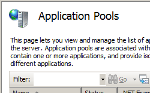
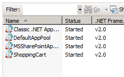

Application Pool Defaults &lt;applicationPoolDefaults&gt;
====================

## Overview

The `<applicationPoolDefaults>` collection of the `<applicationPools>` collection configures default values for all application pools on a Web server.

> [!NOTE]
> Any default values that are not explicitly defined in the `<applicationPoolDefaults>` collection will still inherit the default values in the IIS 7 and later schema, and individual application pool settings override any default values.

## Compatibility

| Version | Notes |
| --- | --- |
| IIS 10.0 | The `<applicationInitialization>` element was not modified in IIS 10.0. |
| IIS 8.5 | The `<applicationInitialization>` element was not modified in IIS 8.5. |
| IIS 8.0 | Another value ("v4.0") was added to the `managedRuntimeVersion` attribute in IIS 8.0, and its default value was changed to "" instead of "v2.0". |
| IIS 7.5 | The `<applicationPoolDefaults>` element was not modified in IIS 7.5. |
| IIS 7.0 | The `<applicationPoolDefaults>` element was introduced in IIS 7.0. |
| IIS 6.0 | The `<applicationPoolDefaults>` element replaces portions of the IIS 6.0 **IIsApplicationPools** metabase property. |

## Setup

The `<applicationPools>` collection is included in the default installation of IIS 7 and later.

## How To

### How to set up application pool defaults

1. Open **Internet Information Services (IIS) Manager**: 

    - If you are using Windows Server 2012 or Windows Server 2012 R2: 

        - On the taskbar, click **Server Manager**, click **Tools**, and then click **Internet Information Services (IIS) Manager**.
    - If you are using Windows 8 or Windows 8.1: 

        - Hold down the **Windows** key, press the letter **X**, and then click **Control Panel**.
        - Click **Administrative Tools**, and then double-click **Internet Information Services (IIS) Manager**.
    - If you are using Windows Server 2008 or Windows Server 2008 R2: 

        - On the taskbar, click **Start**, point to **Administrative Tools**, and then click **Internet Information Services (IIS) Manager**.
    - If you are using Windows Vista or Windows 7: 

        - On the taskbar, click **Start**, and then click **Control Panel**.
        - Double-click **Administrative Tools**, and then double-click **Internet Information Services (IIS) Manager**.
2. In the **Connections** pane, expand the server name, and then click **Application Pools**.
3. In the **Actions** pane, click **Set Application Pool Defaults...**  
    
4. On the **Application Pool Defaults** dialog box, specify your desired options.  
    
5. When you have finished specifying your settings, click **OK**.

## Configuration

### Attributes

| Attribute | Description |
| --- | --- |
| `autoStart` | Optional Boolean attribute. When **true**, indicates to the World Wide Web Publishing Service (W3SVC) that the application pool should be automatically started when it is created or when IIS is started. The default value is `true`. |
| `CLRConfigFile` | Optional string value. Specifies the .NET configuration file for the application pool.   **Note:** This attribute was added in IIS 7.5. There is no default value. |
| `enable32BitAppOnWin64` | Optional Boolean attribute. When **true**, enables a 32-bit application to run on a computer that runs a 64-bit version of Windows. The default value is `false`. |
| `managedPipelineMode` | Optional enum attribute. Specifies the request-processing mode that is used to process requests for managed content. The **managedPipelineMode** attribute can be one of the following possible values; the default is `Integrated`. | Value | Description | | --- | --- | | `Classic` | Specifies that the application pool use separate IIS and ASP.NET request-processing pipelines, which works with ASP.NET 1.1 applications, and ASP.NET 2.0 applications that do not work in Integrated mode. The numeric value is `1`. | | `Integrated` | Specifies that the application pool use the integrated IIS and ASP.NET request-processing pipeline, which works with only ASP.NET 2.0 or later applications. The numeric value is `0`. | |
| `managedRuntimeLoader` | Optional string attribute. Specifies the managed loader to use for pre-loading the the application pool.   **Note:** This attribute was added in IIS 7.5. The default value is **webengine4.dll**. |
| `managedRuntimeVersion` | Optional string attribute. Specifies the .NET Framework version to be used by the application pool. The **managedRuntimeVersion** attribute can be one of the following possible values; the default value is `""`. | Value | Description | | --- | --- | | `v1.1` | Specifies that the application pool use the .NET Framework version 1.1. | | `v2.0` | Specifies that the application pool use the .NET Framework version 2.0. | | `v4.0` | Specifies that the application pool use the .NET Framework version 4.0. | |
| `name` | Required string attribute. Specifies a unique name for an application pool on the server. |
| `queueLength` | Optional uint attribute. Indicates to HTTP.sys how many requests to queue for an application pool before rejecting future requests. When the value set for this property is exceeded, IIS rejects subsequent requests with a 503 error. If the **loadBalancerCapabilities** setting is **true**, the connection is closed instead of rejecting requests with a 503. For more information about **loadBalancerCapabilities**, see [Failure Settings for an Application Pool](add/failure.md). The default value is `1000`. |
| `startMode` | Optional enum value. Specifies the startup type for the application pool.   **Note:** This attribute was added in IIS 7.5. The **startMode** attribute can be one of the following possible values; the default value is `OnDemand`. | Value | Description | | --- | --- | | `AlwaysRunning` | Specifies that the Windows Process Activation Service (WAS) will always start the application pool. This behavior allows an application to load the operating environment before any serving any HTTP requests, which reduces the start-up processing for initial HTTP requests for the application. The numeric value is `1`. | | `OnDemand` | Specifies that the Windows Process Activation Service (WAS) will start the application pool when an HTTP request is made for an application that is hosted in the application pool. This behavior resembles the WAS behavior in previous versions of IIS. The numeric value is `0`. | |

### Child Elements

| Element | Description |
| --- | --- |
| [`cpu`](add/cpu.md) | Configures CPU affinity and CPU actions. |
| [`environmentVariables`](environmentvariables/index.md) | Configures a collection of environment variables to pass to worker processes. |
| [`failure`](add/failure.md) | Configures actions to take when an application pool fails. |
| [`processModel`](add/processmodel.md) | Configures process management attributes for an application pool. |
| [`recycling`](add/recycling/index.md) | Configures application pool recycling. |

### Configuration Sample

The following configuration sample specifies the default identity for all application pools to be the built-in application pool identity, and specifies 200 as the default number of requests after which application pools are recycled.

[!code-xml[Main](index/samples/sample1.xml)]

## Sample Code

The following examples configure the application pools to start automatically, to use version 2.0 of the .NET environment, and to use the integrated pipeline by default.

### AppCmd.exe

[!code-csharp[Main](index/samples/sample2.cs)]

> [!NOTE]
> You must be sure to set the **commit** parameter to `apphost` when you use AppCmd.exe to configure these settings. This commits the configuration settings to the appropriate location section in the ApplicationHost.config file.

### C#

[!code-csharp[Main](index/samples/sample3.cs)]

### VB.NET

[!code-vb[Main](index/samples/sample4.vb)]

### JavaScript

[!code-javascript[Main](index/samples/sample5.js)]

### VBScript

[!code-vb[Main](index/samples/sample6.vb)]