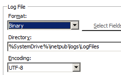

Central Binary Log File &lt;centralBinaryLogFile&gt;
====================

## Overview

The `<centralBinaryLogFile>` element specifies the central binary log settings for all sites on a server.

> [!NOTE]
> You need to set the **centralLogFileMode** attribute of the parent `<log>` element to **CentralBinary** in order for the attributes on the `<centralW3CLogFile>` element to have effect. If the **centralLogFileMode** attribute of the `<log>` element is set to **CentralW3C** or **Site**, the attributes on the `<centralW3CLogFile>` element will be ignored.

> [!NOTE]
> Log files in W3C format are text-based files that most log-parsing utilities can process. Binary log files use a proprietary storage format that requires the use of an application that can process log files in that format, such as [Microsoft's LogParser](https://www.microsoft.com/en-us/download/details.aspx?id=24659) utility.

## Compatibility

| Version | Notes |
| --- | --- |
| IIS 10.0 | The `<centralBinaryLogFile>` element was not modified in IIS 10.0. |
| IIS 8.5 | The `<centralBinaryLogFile>` element was not modified in IIS 8.5. |
| IIS 8.0 | The `<centralBinaryLogFile>` element was not modified in IIS 8.0. |
| IIS 7.5 | The `<centralBinaryLogFile>` element was not modified in IIS 7.5. |
| IIS 7.0 | The `<centralBinaryLogFile>` element of the `<log>` element was introduced in IIS 7.0. |
| IIS 6.0 | The `<log>` element replaces the IIS 6.0 **CentralBinaryLoggingEnabled** flag. |

## Setup

The `<centralBinaryLogFile>` element of the `<log>` element is included in the default installation of IIS 7.

## How To

### How to enable central binary logging for a server

1. Open **Internet Information Services (IIS) Manager**: 

    - If you are using Windows Server 2012 or Windows Server 2012 R2: 

        - On the taskbar, click **Server Manager**, click **Tools**, and then click **Internet Information Services (IIS) Manager**.
    - If you are using Windows 8 or Windows 8.1: 

        - Hold down the **Windows** key, press the letter **X**, and then click **Control Panel**.
        - Click **Administrative Tools**, and then double-click **Internet Information Services (IIS) Manager**.
    - If you are using Windows Server 2008 or Windows Server 2008 R2: 

        - On the taskbar, click **Start**, point to **Administrative Tools**, and then click **Internet Information Services (IIS) Manager**.
    - If you are using Windows Vista or Windows 7: 

        - On the taskbar, click **Start**, and then click **Control Panel**.
        - Double-click **Administrative Tools**, and then double-click **Internet Information Services (IIS) Manager**.
2. In the **Connections** pane, click the server name.
3. In the server's **Home** pane, double-click **Logging**.  
    
4. On the **Logging** page, under **One log file per**, select **Server** from the drop-down list, then choose **Binary** from the **Format** drop-down list.  
    
5. Click **Apply** in the **Actions** pane.

## Configuration

### Attributes

| Attribute | Description |
| --- | --- |
| `directory` | Optional string attribute. Specifies the directory where log entries are written. |
| `enabled` | Optional Boolean attribute. Specifies whether central binary logging is enabled. Additionally, **centralLogFileMode** must be set to **CentralBinary** in order to fully enable central binary logging. The default value is `false`. |
| `localTimeRollover` | Optional Boolean attribute. Specifies whether a new log file is created based on local time or Coordinated Universal Time (UTC). A value of **true** means the new log file is based on local time; **false** means it is based on UTC. The default value is `false`. |
| `period` | Optional enum attribute. Specifies how frequently the log file contents should be cleared. The period attribute can be one of the following possible values. The default value is `Daily`. | Value | Description | | --- | --- | | `MaxSize` | Log files are cleared whenever the log file reaches the size specified by the **truncateSize** attribute. The numeric value is `0`. | | `Daily` | Log files are cleared every day. The numeric value is `1`. | | `Weekly` | Log files are cleared once a week. The numeric value is `2`. | | `Monthly` | Log files are cleared once a month. The numeric value is `3`. | | `Hourly` | Log files are cleared every hour. The numeric value is `4`. | |
| `truncateSize` | Optional int64 attribute. Specifies the size at which the log file contents should be truncated. This attribute must be set when the value of the period attribute is **maxSize**. The size must be between 1048576 (1 megabyte) and 4294967295 (4 gigabytes). The default value is `20971520` (20 megabytes). |

### Child Elements

None.

### Configuration Sample

The following configuration sample specifies that IIS will use central binary logging, and configures binary log file rotation on a daily basis.

[!code-xml[Main](centralBinaryLogFile/samples/sample1.xml)]

## Sample Code

The following code samples specify that IIS will use central binary logging, and configure binary log file rotation on a daily basis.

### AppCmd.exe

[!code-console[Main](centralBinaryLogFile/samples/sample2.cmd)]

> [!NOTE]
> You must be sure to set the **commit** parameter to `apphost` when you use AppCmd.exe to configure these settings. This commits the configuration settings to the appropriate location section in the ApplicationHost.config file.

### C#

[!code-csharp[Main](centralBinaryLogFile/samples/sample3.cs)]

### VB.NET

[!code-vb[Main](centralBinaryLogFile/samples/sample4.vb)]

### JavaScript

[!code-javascript[Main](centralBinaryLogFile/samples/sample5.js)]

### VBScript

[!code-vb[Main](centralBinaryLogFile/samples/sample6.vb)]