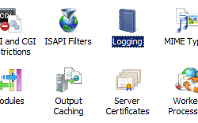
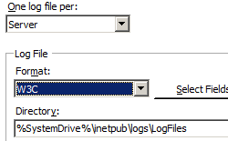

Central W3C Log File &lt;centralW3CLogFile&gt;
====================

## Overview

The `<centralW3CLogFile>` element specifies the central W3C log settings for all sites on a server.

> [!NOTE]
> You need to set the **centralLogFileMode** attribute of the parent `<log>` element to **CentralW3C** in order for the attributes on the `<centralW3CLogFile>` element to have effect. If the **centralLogFileMode** attribute of the `<log>` element is set to **CentralBinary** or **Site**, the attributes on the `<centralW3CLogFile>` element will be ignored.

> [!NOTE]
> Log files in W3C format are text-based files that most log-parsing utilities can process. Binary log files use a proprietary storage format that requires the use of an application that can process log files in that format, such as [Microsoft's LogParser](https://www.microsoft.com/en-us/download/details.aspx?id=24659) utility.

## Compatibility

| Version | Notes |
| --- | --- |
| IIS 10.0 | The `<centralW3CLogFile>` element was not modified in IIS 10.0. |
| IIS 8.5 | The `<centralW3CLogFile>` element was not modified in IIS 8.5. |
| IIS 8.0 | The `<centralW3CLogFile>` element was not modified in IIS 8.0. |
| IIS 7.5 | The `<centralW3CLogFile>` element was not modified in IIS 7.5. |
| IIS 7.0 | The `<centralW3CLogFile>` element of the `<log>` element was introduced in IIS 7.0. |
| IIS 6.0 | The `<log>` element replaces the IIS 6.0 **CentralW3CLoggingEnabled** flag. |

## Setup

The `<centralW3CLogFile>` element of the `<log>` element is included in the default installation of IIS 7.

## How To

### How to enable central W3C logging for a server

1. Open **Internet Information Services (IIS) Manager**: 

    - If you are using Windows Server 2012 or Windows Server 2012 R2: 

        - On the taskbar, click **Server Manager**, click **Tools**, and then click **Internet Information Services (IIS) Manager**.
    - If you are using Windows 8 or Windows 8.1: 

        - Hold down the **Windows** key, press the letter **X**, and then click **Control Panel**.
        - Click **Administrative Tools**, and then double-click **Internet Information Services (IIS) Manager**.
    - If you are using Windows Server 2008 or Windows Server 2008 R2: 

        - On the taskbar, click **Start**, point to **Administrative Tools**, and then click **Internet Information Services (IIS) Manager**.
    - If you are using Windows Vista or Windows 7: 

        - On the taskbar, click **Start**, and then click **Control Panel**.
        - Double-click **Administrative Tools**, and then double-click **Internet Information Services (IIS) Manager**.
2. In the **Connections** pane, click the server name.
3. In the server's **Home** pane, double-click **Logging**.  
    
4. On the **Logging** page, under **One log file per**, select **Server** from the drop-down list, then choose **W3C** from the **Format** drop-down list.  
    
5. Click **Apply** in the **Actions** pane.

## Configuration

### Attributes

| Attribute | Description |
| --- | --- |
| `directory` | Optional string attribute. Specifies the directory where log entries are written. The default value is `%SystemDrive%\inetpub\logs\LogFiles`. |
| `enabled` | Optional Boolean attribute. Specifies whether central W3C logging is enabled. The default value is `true`. |
| `localTimeRollover` | Optional Boolean attribute. Specifies whether a new log file is created based on local time or Coordinated Universal Time (UTC). A value of **true** means the new log file is based on local time; **false** means it is based on UTC. The default value is `false`. |
| `logExtFileFlags` | Optional flags attribute. Specifies which fields to log. The **logExtFileFlags** attribute can have one of the following values or a list of these values. The default is a list of these values: `Date`, `Time`, `ClientIP`, `UserName`, `SiteName`, `ServerIP`, `Method`, `UriStem`, `UriQuery`, `HttpStatus`, `TimeTaken`,`Win32Status`, `ServerPort`, `UserAgent`, `HttpSubStatus`. | Value | Description | | --- | --- | | `Date` | The date on which the activity occurred. The numeric value is `1`. | | `Time` | The time, in Coordinated Universal Time (UTC), at which the activity occurred. The numeric value is `2`. | | `ClientIP` | The IP address of the client that made the request. The numeric value is `4`. | | `UserName` | The name of the authenticated user who accessed your server. Anonymous users are indicated by a hyphen. The numeric value is `8`. | | `SiteName` | The name of the server on which the log file entry was generated. The numeric value is `16`. | | `ComputerName` | The name of the computer from which the request was made. The numeric value is `32`. | | `ServerIP` | The IP address of the server on which the log file entry was generated. The numeric value is `64`. | | `Method` | The requested action, for example, a **GET** method. The numeric value is `128`. | | `UriStem` | The target of the action, for example, Default.htm. The numeric value is `256`. | | `UriQuery` | The query, if any, that the client was trying to perform. A Universal Resource Identifier (URI) query is necessary only for dynamic pages. The numeric value is `512`. | | `HttpStatus` | The HTTP status code. The numeric value is `1024`. | | `Win32Status` | The Windows status code. The numeric value is `2048`. | | `BytesSent` | The number of bytes that the server sent. The numeric value is `4096`. | | `BytesRecv` | The number of bytes that the server received. The numeric value is `8192`. | | `TimeTaken` | The time that the action took, in milliseconds. The numeric value is `16384`. | | `ServerPort` | The server port number that is configured for the service. The numeric value is `32768`. | | `UserAgent` | The browser type that the client used. The numeric value is `65536`. | | `Cookie` | The content of the cookie sent or received, if a cookie was sent or received. The numeric value is `131072`. | | `Referer` | The site that the user last visited. This site provided a link to the current site. The numeric value is `262144`. | | `ProtocolVersion` | The protocol version that the client used. The numeric value is `524288`. | | `Host` | The host header name, if there is a host header. The numeric value is `1048576`. | | `HttpSubStatus` | The substatus error code. The numeric value is `2097152`. | |
| `period` | Optional enum attribute. Specifies how frequently the current log file is closed and a new log file is started. The period attribute can be one of the following possible values. The default is `Daily`. | Value | Description | | --- | --- | | `MaxSize` | Start new log files whenever the log file reaches the size specified by the **truncateSize** attribute. The numeric value is `0`. | | `Daily` | Start new log files every day. The numeric value is `1`. | | `Weekly` | Start new log files once a week. The numeric value is `2`. | | `Monthly` | Start new log files once a month. The numeric value is `3`. | | `Hourly` | Start new log files every hour. The numeric value is `4`. | |
| `truncateSize` | Optional int64 attribute. Specifies the size, in bytes, at which the log file contents will be truncated. This attribute must be set when the value of the period attribute is **maxSize**. The size must be between 1048576 (1 megabyte) and 4294967295 (4 gigabytes). The default value is `20971520` (20 megabytes). |

### Child Elements

None.

### Configuration Sample

The following configuration sample specifies that IIS will use central W3C logging, and configures W3C log file rotation on a daily basis.

[!code-xml[Main](centralW3CLogFile/samples/sample1.xml)]

## Sample Code

The following code samples specify that IIS will use central W3C logging, and configure W3C log file rotation on a daily basis.

### AppCmd.exe

[!code-console[Main](centralW3CLogFile/samples/sample2.cmd)]

> [!NOTE]
> You must be sure to set the **commit** parameter to `apphost` when you use AppCmd.exe to configure these settings. This commits the configuration settings to the appropriate location section in the ApplicationHost.config file.

### C#

[!code-csharp[Main](centralW3CLogFile/samples/sample3.cs)]

### VB.NET

[!code-vb[Main](centralW3CLogFile/samples/sample4.vb)]

### JavaScript

[!code-javascript[Main](centralW3CLogFile/samples/sample5.js)]

### VBScript

[!code-vb[Main](centralW3CLogFile/samples/sample6.vb)]