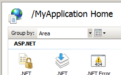
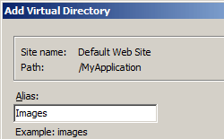

Virtual Directory &lt;virtualDirectory&gt;
====================

## Overview

The `<virtualDirectory>` element is a child of the `<application>` element and controls the configuration settings for a specific virtual directory. A virtual directory is a directory name (also referred to as path) that you specify in Internet Information Services (IIS) 7 and map to a physical directory on a local or remote server. The virtual directory name becomes part of the application's URL, and users can request the URL from a browser to access content in the physical directory, such as a Web page or a list of additional directories and files. If you specify a different name than the physical directory for the virtual directory, it is more difficult for users to discover the actual physical file structure on your server because the URL does not map directly to the root of the site.

In IIS 7, each application must have a virtual directory, known as the root virtual directory, and maps the application to the physical directory that contains the application's content. However, an application can have more than one virtual directory. For example, you might use a virtual directory when you want your application to include images from another location in the file system, but you do not want to move the image files into the physical directory that is mapped to the application's root virtual directory.

## Compatibility

| Version | Notes |
| --- | --- |
| IIS 10.0 | The `<virtualDirectory>` element was not modified in IIS 10.0. |
| IIS 8.5 | The `<virtualDirectory>` element was not modified in IIS 8.5. |
| IIS 8.0 | The `<virtualDirectory>` element was not modified in IIS 8.0. |
| IIS 7.5 | The `<virtualDirectory>` element was not modified in IIS 7.5. |
| IIS 7.0 | The `<virtualDirectory>` element was introduced in IIS 7.0. |
| IIS 6.0 | The `<virtualDirectory>` element replaces the IIS 6.0 **IIsWebVirtualDir** and **IIsWebDirectory** metabase objects. |

## Setup

The `<virtualDirectory>` element is included in the default installation of IIS 7.

## How To

### How to create a new Virtual Directory

1. Open **Internet Information Services (IIS) Manager**: 

    - If you are using Windows Server 2012 or Windows Server 2012 R2: 

        - On the taskbar, click **Server Manager**, click **Tools**, and then click **Internet Information Services (IIS) Manager**.
    - If you are using Windows 8 or Windows 8.1: 

        - Hold down the **Windows** key, press the letter **X**, and then click **Control Panel**.
        - Click **Administrative Tools**, and then double-click **Internet Information Services (IIS) Manager**.
    - If you are using Windows Server 2008 or Windows Server 2008 R2: 

        - On the taskbar, click **Start**, point to **Administrative Tools**, and then click **Internet Information Services (IIS) Manager**.
    - If you are using Windows Vista or Windows 7: 

        - On the taskbar, click **Start**, and then click **Control Panel**.
        - Double-click **Administrative Tools**, and then double-click **Internet Information Services (IIS) Manager**.
2. In the **Connections** pane, expand the server name, expand **Sites**, expand the Web site to which you want to add the virtual directory, and then click the application to which you want to add the virtual directory.  
    
3. In the **Actions** pane, click **View Virtual Directories**, and then click **Add Virtual Directory...**
4. In the **Add Virtual Directory** dialog box, at a minimum enter information in the **Alias:** and **Physical path:** text boxes, and then click **OK**.  
    

    > [!NOTE]
    > You can click **Connect as...** to configure the server to use the specified credentials when it accesses content in the virtual directory, and click **Test Settings...** to test authentication and authorization settings for the virtual directory.

## Configuration

The `<virtualDirectory>` element is configurable at the server, site, and application level in the ApplicationHost.config file.

### Attributes

| Attribute | Description |
| --- | --- |
| `allowSubDirConfig` | Optional Boolean attribute.  Specifies whether IIS looks for Web.config files in content directories lower than the current level (**true**) or does not look for Web.config files in content directories lower than the current level (**false**).  The default value is `true`. |
| `logonMethod` | Optional enum attribute.  Specifies the logon method for the virtual directory.  The **logonMethod** attribute can be one of the following possible values. The default is `ClearText`. <table> <tbody> <tr> <th>Value</th> <th>Description</th></tr> <tr> <th><code>Batch</code></th> <td>This logon type is intended for batch servers, where processes may be executing on behalf of a user without the user's direct intervention.  The numeric value is <code>1</code>.</td></tr> <tr> <th><code>ClearText</code></th> <td>This logon type preserves the name and password in the authentication package, which allows the server to make connections to other network servers while impersonating the client.  The numeric value is <code>3</code>.</td></tr> <tr> <th><code>Interactive</code></th> <td>This logon type is intended for users who will be using the computer interactively.  The numeric value is <code>0</code>.</td></tr> <tr> <th><code>Network</code></th> <td>This logon type is intended for high performance servers that authenticate plaintext passwords. Credentials are not cached for this logon type.  The numeric value is <code>2</code>.</td></tr></tbody></table> |
| `password` | Optional string attribute.  Specifies the password associated with the user name.  Note: To avoid storing unencrypted password strings in configuration files, always use AppCmd.exe or IIS Manager to enter passwords. If you use these management tools, password strings will be encrypted automatically before they are written to the XML configuration files. This provides better password security than storing unencrypted passwords. |
| `path` | Optional string attribute.  Specifies the virtual path of the virtual directory. |
| `physicalPath` | Optional string attribute.  Specifies the physical path of the virtual directory. |
| `userName` | Optional string attribute.  Specifies the user name of an account that can access configuration files and content for this virtual directory. |

### Child Elements

None.

### Configuration Sample

The following configuration example displays a `<site>` element that contains two applications. The first `<application>` element defines the root application for the site, along with the root virtual directory for the application. The second `<application>` element contains the configuration settings for a CRM application on the Web site. The path attribute defines the path for the application. This `<application>` element contains two `<virtualDirectory>` elements. The first defines the root virtual directory for the application, and the second defines an Images virtual directory for the application.

[!code-xml[Main](virtualDirectory/samples/sample1.xml)]

## Sample Code

The following examples create a new application named ShoppingCart with a virtual directory root of C:\Inetpub\Contoso\ShoppingCart for a site that is named Contoso.

> [!NOTE]
> When you create an application from the command prompt or from a script, you must explicitly create a root virtual directory for the application.

### AppCmd.exe

[!code-console[Main](virtualDirectory/samples/sample2.cmd)]

> [!NOTE]
> You must be sure to set the **commit** parameter to `apphost` when you use AppCmd.exe to configure these settings. This commits the configuration settings to the appropriate location section in the ApplicationHost.config file.

### C#

[!code-csharp[Main](virtualDirectory/samples/sample3.cs)]

### VB.NET

[!code-vb[Main](virtualDirectory/samples/sample4.vb)]

### JavaScript

[!code-javascript[Main](virtualDirectory/samples/sample5.js)]

### VBScript

[!code-vb[Main](virtualDirectory/samples/sample6.vb)]