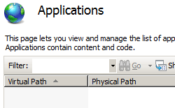

Application Defaults &lt;applicationDefaults&gt;
====================

## Overview

The `<applicationDefaults>` element of the `<site>` element specifies the default application settings for all applications in the parent site.

> [!NOTE]
> If the same attribute or child element is configured in both the `<applicationDefaults>` section and in the `<application>` section for a specific application, the configuration in the `<application>` section is used for that application.

## Compatibility

| Version | Notes |
| --- | --- |
| IIS 10.0 | The `<applicationDefaults>` element was not modified in IIS 10.0. |
| IIS 8.5 | The `<applicationDefaults>` element was not modified in IIS 8.5. |
| IIS 8.0 | The `preLoadEnabled` attribute was added in IIS 8.0. |
| IIS 7.5 | The `<applicationDefaults>` element was updated to include the `serviceAutoStartEnabled` and `serviceAutoStartProvider` attributes. |
| IIS 7.0 | The `<applicationDefaults>` element of the `<site>` collection was introduced in IIS 7.0. |
| IIS 6.0 | The `<applicationDefaults>` element is analogous to setting application options at the site level in the IIS 6.0 metabase. |

## Setup

The `<applicationDefaults>` element of the `<site>` element is included in the default installation of IIS 7 and later.

## How To

### How to configure the default application settings for a site

1. Open **Internet Information Services (IIS) Manager**: 

    - If you are using Windows Server 2012 or Windows Server 2012 R2: 

        - On the taskbar, click **Server Manager**, click **Tools**, and then click **Internet Information Services (IIS) Manager**.
    - If you are using Windows 8 or Windows 8.1: 

        - Hold down the **Windows** key, press the letter **X**, and then click **Control Panel**.
        - Click **Administrative Tools**, and then double-click **Internet Information Services (IIS) Manager**.
    - If you are using Windows Server 2008 or Windows Server 2008 R2: 

        - On the taskbar, click **Start**, point to **Administrative Tools**, and then click **Internet Information Services (IIS) Manager**.
    - If you are using Windows Vista or Windows 7: 

        - On the taskbar, click **Start**, and then click **Control Panel**.
        - Double-click **Administrative Tools**, and then double-click **Internet Information Services (IIS) Manager**.
2. In the **Connections** pane, expand the server name, expand the **Sites** node, then click the name of the site.
3. In the site's **Home** pane, click **View Applications** in the **Actions** pane.  
    
4. In the site's **Application** pane, click **Set Application Defaults...** in the **Actions** pane.  
    
5. In the **Application Defaults** dialog box, specify your default application settings for the site, and then click **OK**.  
    

## Configuration

### Attributes

| Attribute | Description |
| --- | --- |
| `applicationPool` | Optional string attribute.  Specifies the default application pool to which all applications in the parent site are assigned. |
| `enabledProtocols` | Optional string attribute.  Specifies the protocols to use to communicate with all applications in the parent site. |
| `path` | Optional string attribute.  Specifies the default virtual path of all applications in the parent site. |
| `preLoadEnabled` | Optional Boolean attribute.  Specifies that IIS simulates a user request to the default page of an application or virtual directory so that it is initialized. In effect IIS starts the application when the application pool is started without having received a request. This increases performance by performing initialization tasks such as loading managed modules and compiling managed code. No log is generated in the IIS logs. The application pool's startMode setting must be set to `AlwaysRunning`.  The default value is `False`. |
| `serviceAutoStartEnabled` | Optional Boolean attribute.  **true** if the autostart is enabled for this application; otherwise, **false**.  The default value is `false`. |
| `serviceAutoStartProvider` | Optional string attribute.  Specifies the name of the autostart provider that the Windows Process Activation Service (WAS) will use if `serviceAutoStartEnabled` is set to **true**.  There is no default value. |

### Child Elements

None.

### Configuration Sample

The following configuration sample sets the default application pool for the Default Web Site to "DefaultAppPool."

[!code-xml[Main](applicationDefaults/samples/sample1.xml)]

## Sample Code

The following code samples set the default application pool for the Default Web Site to "DefaultAppPool."

### AppCmd.exe

[!code-console[Main](applicationDefaults/samples/sample2.cmd)]

> [!NOTE]
> You must be sure to set the **commit** parameter to `apphost` when you use AppCmd.exe to configure these settings. This commits the configuration settings to the appropriate location section in the ApplicationHost.config file.

### C\#

[!code-csharp[Main](applicationDefaults/samples/sample3.cs)]

### VB.NET

[!code-vb[Main](applicationDefaults/samples/sample4.vb)]

### JavaScript

[!code-javascript[Main](applicationDefaults/samples/sample5.js)]

### VBScript

[!code-vb[Main](applicationDefaults/samples/sample6.vb)]
