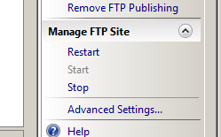
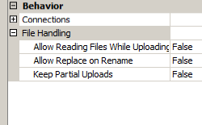

FTP File Handling &lt;fileHandling&gt;
====================

## Overview

The `<fileHandling>` element is used to specify the way that the FTP service handles file operations. For example, the `keepPartialUploads` attribute configures whether the FTP service should keep files that were partially transferred, such as when a file transfer ends prematurely.

## Compatibility

| Version | Notes |
| --- | --- |
| IIS 10.0 | The `<fileHandling>` element was not modified in IIS 10.0. |
| IIS 8.5 | The `<fileHandling>` element was not modified in IIS 8.5. |
| IIS 8.0 | The `<fileHandling>` element was not modified in IIS 8.0. |
| IIS 7.5 | The `<fileHandling>` element of the `<ftpServer>` element ships as a feature of IIS 7.5. |
| IIS 7.0 | The `<fileHandling>` element of the `<ftpServer>` element was introduced in FTP 7.0, which was a separate download for IIS 7.0. |
| IIS 6.0 | N/A |

> [!NOTE]
> The FTP 7.0 and FTP 7.5 services shipped out-of-band for IIS 7.0, which required downloading and installing the modules from the following URL:

> [https://www.iis.net/expand/FTP](https://www.iis.net/downloads/microsoft/ftp)

With Windows 7 and Windows Server 2008 R2, the FTP 7.5 service ships as a feature for IIS 7.5, so downloading the FTP service is no longer necessary.

## Setup

To support FTP publishing for your Web server, you must install the FTP service. To do so, use the following steps.

### Windows Server 2012 or Windows Server 2012 R2

1. On the taskbar, click **Server Manager**.
2. In **Server Manager**, click the **Manage** menu, and then click **Add Roles and Features**.
3. In the **Add Roles and Features** wizard, click **Next**. Select the installation type and click **Next**. Select the destination server and click **Next**.
4. On the **Server Roles** page, expand **Web Server (IIS)**, and then select **FTP Server**.  
  
    > [!NOTE]
    > To support ASP.Membership authentication or IIS Manager authentication for the FTP service, you will need to select     **FTP Extensibility** , in addition to     **FTP Service** .  
     .
5. Click **Next**, and then on the **Select features** page, click **Next** again.
6. On the **Confirm installation selections** page, click **Install**.
7. On the **Results** page, click **Close**.

### Windows 8 or Windows 8.1

1. On the **Start** screen, move the pointer all the way to the lower left corner, right-click the **Start** button, and then click **Control Panel**.
2. In **Control Panel**, click **Programs and Features**, and then click **Turn Windows features on or off**.
3. Expand **Internet Information Services**, and then select **FTP Server**.   
  
    > [!NOTE]
    > To support ASP.Membership authentication or IIS Manager authentication for the FTP service, you will also need to select     **FTP Extensibility** .   
    
4. Click **OK**.
5. Click **Close**.

### Windows Server 2008 R2

1. On the taskbar, click **Start**, point to **Administrative Tools**, and then click **Server Manager**.
2. In the **Server Manager** hierarchy pane, expand **Roles**, and then click **Web Server (IIS)**.
3. In the **Web Server (IIS)** pane, scroll to the **Role Services** section, and then click **Add Role Services**.
4. On the **Select Role Services** page of the **Add Role Services Wizard**, expand **FTP Server**.
5. Select **FTP Service**.  
  
    > [!NOTE]
    > To support ASP.Membership authentication or IIS Manager authentication for the FTP service, you will also need to select     **FTP Extensibility** .  
    
6. Click **Next**.
7. On the **Confirm Installation Selections** page, click **Install**.
8. On the **Results** page, click **Close**.

### Windows 7

1. On the taskbar, click **Start**, and then click **Control Panel**.
2. In **Control Panel**, click **Programs and Features**, and then click **Turn Windows Features on or off**.
3. Expand **Internet Information Services**, and then **FTP Server**.
4. Select **FTP Service**.  
  
    > [!NOTE]
    > To support ASP.Membership authentication or IIS Manager authentication for the FTP service, you will also need to select     **FTP Extensibility** .   
    
5. Click **OK**.

### Windows Server 2008 or Windows Vista

1. Download the installation package from the following URL: 

    - [https://www.iis.net/expand/FTP](https://www.iis.net/downloads/microsoft/ftp)
- Follow the instructions in the following walkthrough to install the FTP service: 

    - [Installing and Troubleshooting FTP 7](https://go.microsoft.com/fwlink/?LinkId=88547)

## How To

### How to configure the file handling options for an FTP site

1. Open **Internet Information Services (IIS) Manager**: 

    - If you are using Windows Server 2012 or Windows Server 2012 R2: 

        - On the taskbar, click **Server Manager**, click **Tools**, and then click **Internet Information Services (IIS) Manager**.
    - If you are using Windows 8 or Windows 8.1: 

        - Hold down the **Windows** key, press the letter **X**, and then click **Control Panel**.
        - Click **Administrative Tools**, and then double-click **Internet Information Services (IIS) Manager**.
    - If you are using Windows Server 2008 or Windows Server 2008 R2: 

        - On the taskbar, click **Start**, point to **Administrative Tools**, and then click **Internet Information Services (IIS) Manager**.
    - If you are using Windows Vista or Windows 7: 

        - On the taskbar, click **Start**, and then click **Control Panel**.
        - Double-click **Administrative Tools**, and then double-click **Internet Information Services (IIS) Manager**.
2. In the **Connections** pane, expand the server name, expand the **Sites** node, and then click the name of the site.
3. In the site's **Home** pane, click **Advanced Settings...** in the **Manage FTP Site** section of the **Actions** pane.  
    
4. In the **Advanced Settings** dialog box, expand **File Handling**, and specify the following options: 

    - Specify **True** for **Allow Reading Files While Uploading** if the FTP service should allow read access to files that are currently being uploaded; otherwise, specify **False**.
    - Specify **True** for **Allow Replace on Rename** if the FTP service should allow files that are being renamed to overwrite existing files; otherwise, specify **False**.
    - Specify **True** for **Keep Partial Uploads** if the FTP service should keep files that have been partially uploaded; otherwise, specify **False**. (> [!NOTE]
> Keeping partially-uploaded files allows FTP clients to reconnect and resume uploading.)  
        
5. Click **OK**.

## Configuration

The `<fileHandling>` element is configured at the site level.

### Attributes

| Attribute | Description |
| --- | --- |
| `allowReadUploadsInProgress` | Optional **Boolean** attribute. **true** if the FTP service should allow read access to files that are currently being uploaded; otherwise, **false**. The default value is `false`. |
| `allowReplaceOnRename` | Optional **Boolean** attribute. **true** if the FTP service should allow files that are being renamed to overwrite existing files; otherwise, **false**. The default value is `false`. |
| `keepPartialUploads` | Optional **Boolean** attribute. **true** if the FTP service should keep files that have been partially uploaded; otherwise, **false**. The default value is `false`. |

### Child Elements

None.

### Configuration Sample

The following sample displays a `<fileHandling>` element for an FTP site that configures the FTP service to keep partial uploads, to allow replacing existing files when renaming files, and to deny reading files that are currently being uploaded.

[!code-xml[Main](fileHandling/samples/sample1.xml)]

## Sample Code

The following examples configure an FTP site so that it keeps partial uploads, allows replacing existing files when renaming files, and denies reading files that are currently being uploaded.

### AppCmd.exe

[!code-console[Main](fileHandling/samples/sample2.cmd)]

> [!NOTE]
> You must be sure to set the **commit** parameter to `apphost` when you use AppCmd.exe to configure these settings. This commits the configuration settings to the appropriate location section in the ApplicationHost.config file.

### C#

[!code-csharp[Main](fileHandling/samples/sample3.cs)]

### VB.NET

[!code-vb[Main](fileHandling/samples/sample4.vb)]

### JavaScript

[!code-javascript[Main](fileHandling/samples/sample5.js)]

### VBScript

[!code-vb[Main](fileHandling/samples/sample6.vb)]