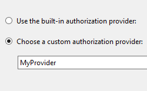

FTP Custom Authorization &lt;customAuthorization&gt;
====================

## Overview

The `<customAuthorization>` element specifies the settings for custom authorization of an FTP site. This form of authorization uses custom authorization providers to validate user access.

If you enable a custom authorization provider, the built-in authorization provider will not be used, and you will not be able to manually add an allow rule or a deny rule to the configuration.

For information about how to create a custom provider, see [How to Use Managed Code (C#) to Create a Simple FTP Home Directory Provider](https://docs.microsoft.com/en-us/iis/develop/developing-for-ftp/how-to-use-managed-code-c-to-create-a-simple-ftp-home-directory-provider).

## Compatibility

| Version | Notes |
| --- | --- |
| IIS 10.0 | The `<customAuthorization>` element was not modified in IIS 10.0. |
| IIS 8.5 | The `<customAuthorization>` element was not modified in IIS 8.5. |
| IIS 8.0 | The `<customAuthorization>` element was introduced in IIS 8.0. |
| IIS 7.5 | N/A |
| IIS 7.0 | N/A |
| IIS 6.0 | N/A |

## Setup

To support FTP authorization using a custom provider on your FTP site, you must install the **FTP Service** with **FTP Extensibity**.

### Windows Server 2012

1. Press the **Windows logo key**, and then click **Server Manager**.
2. In **Server Manager**, click **Manage** and then click **Add Roles and Features**.
3. In the **Add Roles and Features** wizard: 

    - On the **Before You Begin** page, click **Next**.
    - On the **Installation Type** page, select the installation type, and then click **Next**.
    - On the **Server Selection** page, select the appropriate server, and then click **Next**.
    - On the **Server Roles** page, ensure that **Web Server (IIS)** is selected, and then expand it.
    - Expand **FTP Server**, then select both **FTP Service** and **FTP Extensibility**, and then click **Next**.
    - On the **Features** page, click **Next**.
    - On the **Confirm Installation Selections** page, click **Install**.
    - On the **Results** page, click **Close**.

### Windows 8

1. Open the Windows Control Panel.
2. In the Windows Control Panel, open **Programs and Features**.
3. In **Programs and Features**, click **Turn Windows features on or off**.
4. In the **Windows Features** dialog box, expand **Internet Information Services**, and then expand **FTP Server**.
5. Under **FTP Server**, select **FTP Service** and **FTP Extensibility**, and then click **OK**.

## How To

### How to configure FTP authorization based upon a custom provider

1. Open **Internet Information Services (IIS) Manager**: 

    - If you are using Windows Server 2012 or later: 

        - On the taskbar, click **Server Manager**, click **Tools**, and then click **Internet Information Services (IIS) Manager**.
    - If you are using Windows 8 or later: 

        - Hold down the **Windows** key, press the letter **X**, and then click **Control Panel**.
        - Click **Administrative Tools**, and then double-click **Internet Information Services (IIS) Manager**.
2. In the **Connections** pane, select the server name, expand **Sites**, and then select an FTP site.
3. In the **Home** pane, double-click the **FTP Authorization Rules** feature.
4. In the **Actions** pane, click **Edit Feature settings**.
5. In the **Authorization Feature Settings** dialog box, select **Choose a custom authorization provider** to enable FTP authorization by a custom provider. In the associated drop-down list, select a custom provider from the list.   
  
      
  
    > [!NOTE]
    > When a custom FTP authorization provider has been enabled, the     **FTP Authorization Rules** feature is disabled.
6. Click **OK**.

## Configuration

### Attributes

None.

### Child Elements

| Element | Description |
| --- | --- |
| [`provider`](provider.md) | Optional element. Specifies the custom authorization provider. |

### Configuration Sample

The following sample displays a `<customAuthorization>` element:

[!code-xml[Main](index/samples/sample1.xml)]

The following sample displays a &lt;[providerDefinitions](../../../../../../system.ftpserver/providerdefinitions/index.md)&gt; element for the custom authorization provider in the preceding example:

[!code-xml[Main](index/samples/sample2.xml)]

## Sample Code

The following code samples configure a custom authorization provider.

### AppCmd.exe

[!code-console[Main](index/samples/sample3.cmd)]

> [!NOTE]
> You must be sure to set the **commit** parameter to `apphost` when using AppCmd.exe to configure these settings. This commits the configuration settings to the appropriate location section in the ApplicationHost.config file.
  

### C#

[!code-csharp[Main](index/samples/sample4.cs)]
  

### VB.NET

[!code-vb[Main](index/samples/sample5.vb)]
  

### JavaScript

[!code-javascript[Main](index/samples/sample6.js)]
  

### VBScript

[!code-vb[Main](index/samples/sample7.vb)]
  

### PowerShell

[!code-powershell[Main](index/samples/sample8.ps1)]