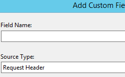
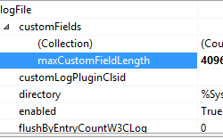

Custom Fields in a Log File for a Site &lt;customFields&gt;
====================

## Overview

The `<customFields>` element of the `<logFile>` element specifies the configuration settings for a collection of custom fields in a W3C log.

IIS 8.5 enables you to log custom fields in addition to the standard logged set. These custom fields can include data from request headers, response headers, or server variables. To log these fields, you can simply set configuration properties rather than creating a custom logging module. This feature is available only at the site level. The log file format must be W3C to add custom fields.

When a custom field has been added to the standard set, "\_x" will be appended to the file name to show that the log file contains a custom field. The total amount of data added in custom fields cannot exceed 65,536 bytes. IIS will truncate the data if the custom logged data exceeds that amount. The maximum amount of data that can be added to a log file in any one custom field is specified by the maxCustomFieldLength attribute.

To configure a custom field, specify the field name, the source name, and the source type. You can put custom information into a server variable, and log the server variable. Once you have selected the source type, you can either select an existing source name or enter a new source name.

Custom fields enable you to collect useful data about the process and aggregate it to the IIS logs. In a system containing a load balancer, you might see the load balancer's IP address in the log, but you could log the X-Forwarded-For header in a custom field, so you can know the original requester. You could log process uptime to see how many times the process restarted during the day. If memory starts being used excessively, you can determine at which time it started to consume memory, which page was requested, and what was the ID of the client (which would be especially useful if they were doing something malicious).

## Compatibility

| Version | Notes |
| --- | --- |
| IIS 10.0 | The `<customFields>` element was not modified in IIS 10.0. |
| IIS 8.5 | The `<customFields>` element was introduced in IIS 8.5. |
| IIS 8.0 | N/A |
| IIS 7.5 | N/A |
| IIS 7.0 | N/A |
| IIS 6.0 | N/A |

## Setup

The `<customFields>` element is included in the default installation of IIS 8.5 and later.

## How To

### How to add custom fields

1. Open **Internet Information Services (IIS) Manager**: 

    - If you are using Windows Server 2012 R2: 

        - On the taskbar, click **Server Manager**, click **Tools**, and then click **Internet Information Services (IIS) Manager**.
    - If you are using Windows 8.1: 

        - Hold down the **Windows** key, press the letter **X**, and then click **Control Panel**.
        - Click **Administrative Tools**, and then double-click **Internet Information Services (IIS) Manager**.
2. In the **Connections** pane, expand the server, expand **Sites**, and then select a site.
3. Double-click **Logging**.
4. In the **Logging** home page, for **Format**, select **W3C**.
5. Click **Select Fields**.
6. In the **W3C Logging Fields** dialog box, click **Add Field**.
7. In the **Add Custom Field** dialog box, enter a name in **Field name**, and select one of the following for the **Source Type**: **Request Header**, **Response Header**, or **Server Variable**.
8. In **Source**, select a source from the list, or enter the name of a custom source.
9. Click **OK**, then click **OK** again.
10. In the **Action** pane, click **Apply**.  
  
    

### How to configure the maximum custom field length

1. Open **Internet Information Services (IIS) Manager**: 

    - If you are using Windows Server 2012 R2: 

        - On the taskbar, click **Server Manager**, click **Tools**, and then click **Internet Information Services (IIS) Manager**.
    - If you are using Windows 8.1: 

        - Hold down the **Windows** key, press the letter **X**, and then click **Control Panel**.
        - Click **Administrative Tools**, and then double-click **Internet Information Services (IIS) Manager**.
2. In the **Connections** pane, select the server, and then in the **Management** area, double-click **Configuration Editor**.
3. In the **Configuration Editor**, for the **section**, select **system.applicationHost**, and then select **sites**.
4. Click **(Collection)**, and then click the ellipsis.
5. Select the site, expand **logFile**, expand **customFields**, and then click **maxCustomFieldLength**.
6. For **maxCustomFieldLength**, enter the maximum amount of data that can be added to a log file in any one custom field, in bytes.
7. Close the **Collection Editor**, and then in the **Action** pane, click **Apply**.  
  
    

## Configuration

The `<customFields>` element is configured at the site level.

### Attributes

| Attribute | Description |
| --- | --- |
| `maxCustomFieldLength` | Optional uint attribute. The maximum amount of data, in bytes, that can be added to a log file in any one custom field. The range is 2 to 65,536. The default value is `4096`. |

### Child Elements

| Element | Description |
| --- | --- |
| `[add](https://www.iis.net/configreference/system.applicationhost/sites/site/logfile/customfields/add)` | Optional element. Specifies the configuration settings for a custom field added to a W3C log. |

### Configuration Sample

The following configuration example uses the `customFields` element and its `add` child element to specify the log custom field settings for the Default Web Site.

[!code-xml[Main](index/samples/sample1.xml)]

## Sample Code

The following examples configure custom fields for a W3C log for a site.

### AppCmd.exe

[!code-csharp[Main](index/samples/sample2.cs)]

> [!NOTE]
> You must be sure to set the **commit** parameter to `apphost` when you use AppCmd.exe to configure these settings. This commits the configuration settings to the appropriate location section in the ApplicationHost.config file.

### C#

[!code-csharp[Main](index/samples/sample3.cs)]

### VB.NET

[!code-vb[Main](index/samples/sample4.vb)]

### JavaScript

[!code-javascript[Main](index/samples/sample5.js)]

### VBScript

[!code-vb[Main](index/samples/sample6.vb)]

### PowerShell

[!code-ps[Main](index/samples/sample-0-7.unknown)]