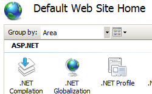
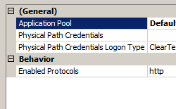

Virtual Directory Defaults for a Site &lt;virtualDirectoryDefaults&gt;
====================

## Overview

The `<virtualDirectoryDefaults>` element of the `<site>` element specifies the default settings for all virtual directories in the parent site. The `<virtualDirectoryDefaults>` element is useful for defining the common attributes that you want all virtual directories in the parent site to implicitly share when they do not have explicitly-defined attributes.

> [!NOTE]
> If the same attribute or child element is configured in both the `<virtualDirectoryDefaults>` section and in the `<virtualDirectory>` section for a specific virtual directory, the configuration in the `<virtualDirectory>` section is used for that virtual directory.

## Compatibility

| Version | Notes |
| --- | --- |
| IIS 10.0 | The `<virtualDirectoryDefaults>` element was not modified in IIS 10.0. |
| IIS 8.5 | The `<virtualDirectoryDefaults>` element was not modified in IIS 8.5. |
| IIS 8.0 | The `<virtualDirectoryDefaults>` element was not modified in IIS 8.0. |
| IIS 7.5 | The `<virtualDirectoryDefaults>` element was not modified in IIS 7.5. |
| IIS 7.0 | The `<virtualDirectoryDefaults>` element of the `<site>` element was introduced in IIS 7.0. |
| IIS 6.0 | N/A |

## Setup

The `<virtualDirectoryDefaults>` element of the `<site>` element is included in the default installation of IIS 7.

## How To

### How to configure the default virtual directory credentials for a site

1. Open **Internet Information Services (IIS) Manager**: 

    - If you are using Windows Server 2012 or Windows Server 2012 R2: 

        - On the taskbar, click **Server Manager**, click **Tools**, and then click **Internet Information Services (IIS) Manager**.
    - If you are using Windows 8 or Windows 8.1: 

        - Hold down the **Windows** key, press the letter **X**, and then click **Control Panel**.
        - Click **Administrative Tools**, and then double-click **Internet Information Services (IIS) Manager**.
    - If you are using Windows Server 2008 or Windows Server 2008 R2: 

        - On the taskbar, click **Start**, point to **Administrative Tools**, and then click **Internet Information Services (IIS) Manager**.
    - If you are using Windows Vista or Windows 7: 

        - On the taskbar, click **Start**, and then click **Control Panel**.
        - Double-click **Administrative Tools**, and then double-click **Internet Information Services (IIS) Manager**.
2. In the **Connections** pane, expand the server name, expand the **Sites** node, and then click the name of the site.
3. In the site's **Home** pane, click **View Applications** in the **Actions** pane.  
    
4. In the site's **Application** pane, click **Set Application Defaults...** in the **Actions** pane.  
    
5. In the **Application Defaults** dialog box, specify your default virtual directory credentials for the site, and then click **OK**.  
    

## Configuration

### Attributes

| Attribute | Description |
| --- | --- |
| `allowSubDirConfig` | Optional Boolean attribute. Specifies whether IIS looks for Web.config files in content directories lower in the directory hierarchy than the current level (**true**) or does not look for Web.config files in content directories lower than the current level (**false**). The default value is `true`. |
| `logonMethod` | Optional enum attribute. Specifies the default logon method for all virtual directories in applications in the parent site. The **logonMethod** attribute can be one of the following possible values. The default is `ClearText`. | Value | Description | | --- | --- | | `Batch` | This logon type is intended for batch servers, where processes may be executing on behalf of a user without that user's direct intervention. The numeric value is `1`. | | `ClearText` | This logon type preserves the name and password in the authentication package, which allows the server to make connections to other network servers while impersonating the client. The numeric value is `3`. | | `Interactive` | This logon type is intended for users who will be using the computer interactively. The numeric value is `0`. | | `Network` | This logon type is intended for high performance servers that authenticate plaintext passwords. Credentials are not cached for this logon type. The numeric value is `2`. | For more information about these values, see [LogonUser](https://msdn.microsoft.com/en-us/library/aa378184.aspx) on the MSDN site. |
| `password` | Optional string attribute. Specifies the password associated with the user name. **Note:** To avoid storing unencrypted password strings in configuration files, always use AppCmd.exe or IIS Manager to enter passwords. If you use these management tools, the password strings will be encrypted automatically before they are written to the XML configuration files. This provides better password security than storing unencrypted passwords. |
| `path` | Optional string attribute. Specifies the default virtual path of all virtual directories in applications in the parent site. |
| `physicalPath` | Optional string attribute. Specifies the default physical path of all virtual directories in applications in the parent site. |
| `userName` | Optional string attribute. Specifies the default user name of an account that can access configuration files and content for all virtual directories in applications in the parent site. |

### Child Elements

None.

### Configuration Sample

The following configuration sample specifies the default logon method for virtual directories in the Default Web Site.

[!code-xml[Main](virtualDirectoryDefaults/samples/sample1.xml)]

## Sample Code

The following code samples specify the default logon method for virtual directories in the Default Web Site.

### AppCmd.exe

[!code-console[Main](virtualDirectoryDefaults/samples/sample2.cmd)]

> [!NOTE]
> You must be sure to set the **commit** parameter to `apphost` when you use AppCmd.exe to configure these settings. This commits the configuration settings to the appropriate location section in the ApplicationHost.config file.

### C#

[!code-csharp[Main](virtualDirectoryDefaults/samples/sample3.cs)]

### VB.NET

[!code-vb[Main](virtualDirectoryDefaults/samples/sample4.vb)]

### JavaScript

[!code-javascript[Main](virtualDirectoryDefaults/samples/sample5.js)]

### VBScript

[!code-vb[Main](virtualDirectoryDefaults/samples/sample6.vb)]