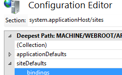

Adding a Default Binding &lt;binding&gt;
====================

## Overview

The `<binding>` element of the `<bindings>` element allows you to configure the information required for requests to communicate with a Web site.

You can configure binding information when you create a Web site, or you can edit the binding information after you create the site. Binding information includes the protocol that clients use to communicate with the site, the site's IP address, the port number, and a host header.

The `<binding>` element contains two attributes to configure the binding information: **bindingInformation** and **protocol**. The **bindingInformation** attribute contains the IP address, the port number and, optionally, the host header for the site. The **protocol** attribute defines the protocol to use to communicate with the site.

## Compatibility

| Version | Notes |
| --- | --- |
| IIS 10.0 | The `<binding>` element was not modified in IIS 10.0. |
| IIS 8.5 | The `<binding>` element was not modified in IIS 8.5. |
| IIS 8.0 | The `sslFlags` attribute was added to specify the binding used for Secure Sockets Layer certificates. |
| IIS 7.5 | The `<binding>` element was not modified in IIS 7.5. |
| IIS 7.0 | The `<binding>` element of the `<bindings>` collection was introduced in IIS 7.0. |
| IIS 6.0 | The `<bindings>` collection replaces sections of the **ServerBindings** property on the IIS 6.0 **IIsWebServer** metabase object. |

## Setup

The `<binding>` element is included in the default installation of IIS 7 and later.

## How To

### How to add default binding information to a server

1. Open **Internet Information Services (IIS) Manager**: 

    - If you are using Windows Server 2012 or Windows Server 2012 R2: 

        - On the taskbar, click **Server Manager**, click **Tools**, and then click **Internet Information Services (IIS) Manager**.
    - If you are using Windows 8 or Windows 8.1: 

        - Hold down the **Windows** key, press the letter **X**, and then click **Control Panel**.
        - Click **Administrative Tools**, and then double-click **Internet Information Services (IIS) Manager**.
    - If you are using Windows Server 2008 or Windows Server 2008 R2: 

        - On the taskbar, click **Start**, point to **Administrative Tools**, and then click **Internet Information Services (IIS) Manager**.
    - If you are using Windows Vista or Windows 7: 

        - On the taskbar, click **Start**, and then click **Control Panel**.
        - Double-click **Administrative Tools**, and then double-click **Internet Information Services (IIS) Manager**.
2. In the **Connections** pane, select the server name.
3. In the **Home** pane, double-click **Configuration Editor**.
4. Move to **system.applicationHost/sites** in **Section**.
5. In the **Site Bindings** dialog box, click **Add...**.
6. Expand **siteDefaults**.
7. Select **bindings** and then click the ellipsis to the right to open the Collection Editor.  
  
    
8. Click **Add**, and enter values for **bindingInformation**, **protocol**, and **sslFlags**.
9. Close **Collection Editor** and in the **Actions** pane, click **Apply**.

## Configuration

You can add default `<binding>` elements within the `<bindings>` element in the `<siteDefaults>` section of the ApplicationHost.config file.

| Attribute | Description |
| --- | --- |
| `bindingInformation` | Required string attribute.  Specifies information to communicate with a site. For example, a Web site binding includes the IP address (or unspecified IP addresses), the port number, and an optional host header used to communicate with the site. |
| `protocol` | Required string attribute.  Specifies the protocol for communicating with a site. |
| `sslFlags` | Optional uint attribute.  Specifies the type of binding used for Secure Sockets Layer (SSL) certificates. <ul> <li>A value of "0" specifies that the secure connection be made using an IP/Port combination. Only one certificate can be bound to a combination of IP address and the port.</li> <li>A value of "1" specifies that the secure connection be made using the port number and the host name obtained by using Server Name Indication (SNI).</li> <li>A value of "2" specifies that the secure connection be made using the centralized SSL certificate store without requiring Server Name Indicator (SNI)</li> <li>A value of "3" specifies that the secure connection be made using the centralized SSL certificate store while requiring Server Name Indicator (SNI)</li></ul> Centralized SSL certificate support enables you to create a centralized certificate store that can contain multiple certificate files. You can name the certificate files to correspond to the host names that they contain. This enables you to create a binding that only requires a port, rather than an IP/port or a host name/port combination. When a request comes in, IIS matches the port, determines the host name from the request, and searches the centralized certificate store for a certificate file with a matching name. It uses that certificate.    With a Server Name Indicator (SNI), the host name is exchanged as part of the SSL handshake. SNI is enabled in the Add Site Binding dialog box when you add a binding with a type of HTTPS. This is especially useful for SSL connections that host multiple servers on a single network address.    The default value is `0`. |

### Child Elements

None.

### Configuration Sample

The following configuration sample specifies the default `bindings` options for IIS 7.

[!code-xml[Main](binding/samples/sample1.xml)]

## Sample Code

The following code samples configure the default `bindings` options for IIS 7.

### AppCmd.exe

[!code-console[Main](binding/samples/sample2.cmd)]

> [!NOTE]
> You must be sure to set the **commit** parameter to `apphost` when you use AppCmd.exe to configure these settings. This commits the configuration settings to the appropriate location section in the ApplicationHost.config file.

### C#

[!code-csharp[Main](binding/samples/sample3.cs)]

### VB.NET

[!code-vb[Main](binding/samples/sample4.vb)]

### JavaScript

[!code-javascript[Main](binding/samples/sample5.js)]

### VBScript

[!code-vb[Main](binding/samples/sample6.vb)]