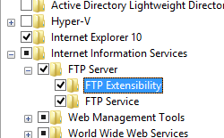
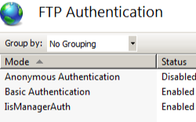
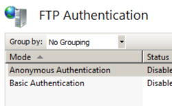
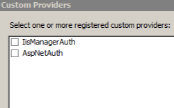
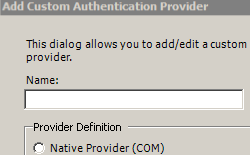

Default FTP Custom Authentication Settings &lt;customAuthentication&gt;
====================

## Overview

The `<customAuthentication>` element specifies the default settings for Custom authentication for FTP sites. This form of authentication uses custom authentication providers to validate user names and passwords.

When custom authentication providers are added to FTP sites, the FTP service will attempt to authenticate a user with each custom authentication provider that is enabled in the order that the providers are specified in the FTP configuration settings. In the event that the user cannot be authenticated by using any of the custom authentication providers, the FTP service will attempt to Basic authentication, if it is enabled, to authenticate the user.

The main advantage of using custom authentication providers is that user accounts do not have to be created on your server or domain. This improves your network's security.

> [!NOTE]
> FTP 7.0 and FTP 7.5 ship with two custom authentication providers:

- ASP.NET Membership authentication: This uses an ASP.NET membership database to validate user names and passwords. For more information, see the [Configuring FTP with .NET Membership Authentication](https://docs.microsoft.com/en-us/iis/publish/using-the-ftp-service/configuring-ftp-with-net-membership-authentication-in-iis-7) topic on Microsoft's IIS.net Web site.
- IIS Manager authentication: This uses the IIS management user store to validate user names and passwords. For more information, see the [Configure FTP with IIS 7.0 Manager Authentication](https://docs.microsoft.com/en-us/iis/publish/using-the-ftp-service/configure-ftp-with-iis-manager-authentication-in-iis-7) topic Microsoft's IIS.net Web site.

> [!NOTE]
> The custom authentication providers that are added to the `<customAuthentication/providers>` element must be registered in the [`<system.ftpServer/providerDefinitions>`](../../../../../../../system.ftpserver/providerdefinitions/index.md) collection.

> [!NOTE]
> Support for creating custom authentication providers was introduced in FTP 7.5. For additional information about how to create custom authentication providers, see the [Developing for FTP 7.5](https://www.iis.net/learn/develop/developing-for-ftp) section of Microsoft's [www.iis.net/learn](https://www.iis.net/learn) Web site.

## Compatibility

| Version | Notes |
| --- | --- |
| IIS 10.0 | The `<customAuthentication>` element was not modified in IIS 10.0. |
| IIS 8.5 | The `<customAuthentication>` element was not modified in IIS 8.5. |
| IIS 8.0 | The `<customAuthentication>` element was not modified in IIS 8.0. |
| IIS 7.5 | The `<customAuthentication>` element of the `<authentication>` element ships as a feature of IIS 7.5. |
| IIS 7.0 | The `<customAuthentication>` element of the `<authentication>` element was introduced in FTP 7.0, which was a separate download for IIS 7.0. |
| IIS 6.0 | The `<ftpServer>` element and its child elements replace the IIS 6.0 FTP settings that were located in the **LM/MSFTPSVC** metabase path. |

> [!NOTE]
> The FTP 7.0 and FTP 7.5 services shipped out-of-band for IIS 7.0, which required downloading and installing the modules from the following URL:

> [https://www.iis.net/expand/FTP](https://www.iis.net/downloads/microsoft/ftp)

With Windows 7 and Windows Server 2008 R2, the FTP 7.5 service ships as a feature for IIS 7.5, so downloading the FTP service is no longer necessary.

## Setup

To support FTP publishing for your Web server, you must install the FTP service. To do so, use the following steps.

### Windows Server 2012 or Windows Server 2012 R2

1. On the taskbar, click **Server Manager**.
2. In **Server Manager**, click the **Manage** menu, and then click **Add Roles and Features**.
3. In the **Add Roles and Features** wizard, click **Next**. Select the installation type and click **Next**. Select the destination server and click **Next**.
4. On the **Server Roles** page, expand **Web Server (IIS)**, and then select **FTP Server**.  
  
    > [!NOTE]
    > To support ASP.Membership authentication or IIS Manager authentication for the FTP service, you will need to select     **FTP Extensibility** , in addition to     **FTP Service** .  
     .
5. Click **Next**, and then on the **Select features** page, click **Next** again.
6. On the **Confirm installation selections** page, click **Install**.
7. On the **Results** page, click **Close**.

### Windows 8 or Windows 8.1

1. On the **Start** screen, move the pointer all the way to the lower left corner, right-click the **Start** button, and then click **Control Panel**.
2. In **Control Panel**, click **Programs and Features**, and then click **Turn Windows features on or off**.
3. Expand **Internet Information Services**, and then select **FTP Server**.   
  
    > [!NOTE]
    > To support ASP.Membership authentication or IIS Manager authentication for the FTP service, you will also need to select     **FTP Extensibility** .   
    
4. Click **OK**.
5. Click **Close**.

### Windows Server 2008 R2

1. On the taskbar, click **Start**, point to **Administrative Tools**, and then click **Server Manager**.
2. In the **Server Manager** hierarchy pane, expand **Roles**, and then click **Web Server (IIS)**.
3. In the **Web Server (IIS)** pane, scroll to the **Role Services** section, and then click **Add Role Services**.
4. On the **Select Role Services** page of the **Add Role Services Wizard**, expand **FTP Server**.
5. Select **FTP Service**.  
  
    > [!NOTE]
    > To support ASP.Membership authentication or IIS Manager authentication for the FTP service, you will also need to select     **FTP Extensibility** .  
    
6. Click **Next**.
7. On the **Confirm Installation Selections** page, click **Install**.
8. On the **Results** page, click **Close**.

### Windows 7

1. On the taskbar, click **Start**, and then click **Control Panel**.
2. In **Control Panel**, click **Programs and Features**, and then click **Turn Windows Features on or off**.
3. Expand **Internet Information Services**, and then **FTP Server**.
4. Select **FTP Service**.  
  
    > [!NOTE]
    > To support ASP.Membership authentication or IIS Manager authentication for the FTP service, you will also need to select     **FTP Extensibility** .   
    
5. Click **OK**.

### Windows Server 2008 or Windows Vista

1. Download the installation package from the following URL: 

    - [https://www.iis.net/expand/FTP](https://www.iis.net/downloads/microsoft/ftp)
- Follow the instructions in the following walkthrough to install the FTP service: 

    - [Installing and Troubleshooting FTP 7](https://go.microsoft.com/fwlink/?LinkId=88547)

## How To

### How to enable IIS Manager authentication for an FTP site

1. Open **Internet Information Services (IIS) Manager**: 

    - If you are using Windows Server 2012 or Windows Server 2012 R2: 

        - On the taskbar, click **Server Manager**, click **Tools**, and then click **Internet Information Services (IIS) Manager**.
    - If you are using Windows 8 or Windows 8.1: 

        - Hold down the **Windows** key, press the letter **X**, and then click **Control Panel**.
        - Click **Administrative Tools**, and then double-click **Internet Information Services (IIS) Manager**.
    - If you are using Windows Server 2008 or Windows Server 2008 R2: 

        - On the taskbar, click **Start**, point to **Administrative Tools**, and then click **Internet Information Services (IIS) Manager**.
    - If you are using Windows Vista or Windows 7: 

        - On the taskbar, click **Start**, and then click **Control Panel**.
        - Double-click **Administrative Tools**, and then double-click **Internet Information Services (IIS) Manager**.
2. In the **Connections** pane, expand the server name, expand the **Sites** node, and then click the name of the site.
3. In the site's **Home** pane, double-click the **FTP Authentication** feature.
4. When the **FTP Authentication** page displays, click **Custom Providers...** in the **Actions** pane.  
    
5. When the **Custom Providers** dialog box displays, click to select **IIS Manager Authentication**. Click **OK**.  
    
6. Your **FTP Authentication** page should now show **IIS Manager Authentication** enabled.  
    
7. If desired, you can disable **Basic Authentication** or **Anonymous Authentication** by highlighting either mode and clicking **Disable** in the **Actions** pane.

For additional information about how to configure IIS Manager authentication for FTP, see the [Configure FTP with IIS 7.0 Manager Authentication](https://docs.microsoft.com/en-us/iis/publish/using-the-ftp-service/configure-ftp-with-iis-manager-authentication-in-iis-7) topic on Microsoft's [www.iis.net/learn](https://www.iis.net/learn) Web site.

* * *

### How to add a managed-code custom authentication provider for an FTP site

> [!NOTE]
> These steps assume that a custom FTP authentication provider has already been installed and registered on your server's Global Assembly Cache (GAC.) For more information about how to register managed assemblies, see the [Global Assembly Cache Tool (Gacutil.exe)](https://msdn.microsoft.com/en-us/library/ex0ss12c(VS.80).aspx) topic on Microsoft the MSDN Web site.

1. Determine the assembly information for the extensibility provider: 

    - In Windows Explorer, open your "C:\Windows\assembly" path, where C: is your operating system drive.
    - Locate the assembly. For example, **FtpAuthenticationDemo**.
    - Right-click the assembly, and then click **Properties**.
    - Copy the **Culture** value. For example, **Neutral**.
    - Copy the **Version** number. For example, **1.0.0.0**.
    - Copy the **Public Key Token** value. For example, **426f62526f636b73**.
    - Click **Cancel**.
2. Add the extensibility provider to the global list of FTP authentication providers: 

    - Open **Internet Information Services (IIS) Manager**.
    - Click your computer name in the **Connections** pane.
    - Double-click **FTP Authentication** in the main window.  
        
    - Click **Custom Providers...** in the **Actions** pane.
    - Click **Register**.  
        
    - Enter a friendly name for the custom authentication provider in the **Name** box. For example, **FtpAuthenticationDemo**.
    - Click **Managed Provider (.NET)**.  
        
    - Enter the assembly information for the extensibility provider using the information that you copied earlier. For example:  
        **FtpAuthentication.FtpAuthDemo, FtpAuthenticationDemo, version=1.0.0.0, Culture=neutral, PublicKeyToken=426f62526f636b73**
    - Click **OK**.
    - Clear the check box for the custom authentication provider in the providers list.
    - Click **OK**.
3. Add the custom authentication provider for an FTP site: 

    - Open an FTP site in **Internet Information Services (IIS) Manager**.
    - Double-click **FTP Authentication** in the main window.
    - Click **Custom Providers...** in the **Actions** pane.
    - Check to select and enable the custom authentication provider in the providers list.
    - Click **OK**.

## Configuration

### Attributes

None.

### Child Elements

| Element | Description |
| --- | --- |
| [`providers`](providers/index.md) | Optional element. Specifies the default collection of custom authentication providers. |

### Configuration Sample

The following configuration sample displays an example `<siteDefaults>` element for the FTP service that defines a default custom authentication provider.

[!code-xml[Main](index/samples/sample1.xml)]

## Sample Code

The following code samples illustrate the configuration of a default custom authentication provider for the FTP service.

### AppCmd.exe

[!code-console[Main](index/samples/sample2.cmd)]

> [!NOTE]
> You must be sure to set the **commit** parameter to `apphost` when you use AppCmd.exe to configure these settings. This commits the configuration settings to the appropriate location section in the ApplicationHost.config file.

### C#

[!code-csharp[Main](index/samples/sample3.cs)]

### VB.NET

[!code-vb[Main](index/samples/sample4.vb)]

### JavaScript

[!code-javascript[Main](index/samples/sample5.js)]

### VBScript

[!code-vb[Main](index/samples/sample6.vb)]