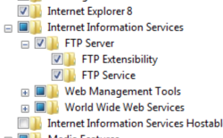
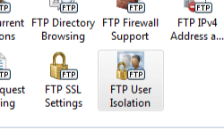
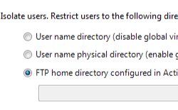

Default FTP Active Directory User Isolation Settings &lt;activeDirectory&gt;
====================

## Overview

The `<activeDirectory>` element specifies the credentials and connection time-out for communicating with an Active Directory server for FTP user isolation. This option is the same as choosing Active Directory user isolation in the IIS 6.0 FTP server, where a user's account must have the **msIIS-FTPRoot** and **msIIS-FTPDir** properties configured in their Active Directory objects.

- If the FTP service successfully accesses the path that is specified by the **msIIS-FTPRoot** and **msIIS-FTPDir** properties, it becomes the home directory for the user and the user cannot access the file system outside this directory. - If the FTP service cannot access the path that is specified by the **msIIS-FTPRoot** and **msIIS-FTPDir** properties, or either of the **msIIS-FTPRoot** or **msIIS-FTPDir** properties do not exist, the user is denied access.

For additional information about how to configure the Active Director properties, see the "Isolate Users Using Active Directory Mode" section in the [Hosting Multiple FTP Sites with FTP User Isolation (IIS 6.0)](https://go.microsoft.com/fwlink/?LinkId=99787) topic.

## Compatibility

| Version | Notes |
| --- | --- |
| IIS 10.0 | The `<activeDirectory>` element was not modified in IIS 10.0. |
| IIS 8.5 | The `<activeDirectory>` element was not modified in IIS 8.5. |
| IIS 8.0 | The `<activeDirectory>` element was not modified in IIS 8.0. |
| IIS 7.5 | The `<activeDirectory>` element of the `<userIsolation>` element ships as a feature of IIS 7.5. |
| IIS 7.0 | The `<activeDirectory>` element of the `<userIsolation>` element was introduced in FTP 7.0, which was a separate download for IIS 7.0. |
| IIS 6.0 | N/A |

> [!NOTE]
> The FTP 7.0 and FTP 7.5 services shipped out-of-band for IIS 7.0, which required downloading and installing the modules from the following URL:
> 
> [https://www.iis.net/expand/FTP](https://www.iis.net/downloads/microsoft/ftp)

With Windows 7 and Windows Server 2008 R2, the FTP 7.5 service ships as a feature for IIS 7.5, so downloading the FTP service is no longer necessary.

## Setup

To support FTP publishing for your Web server, you must install the FTP service. To do so, use the following steps.

### Windows Server 2012 or Windows Server 2012 R2

1. On the taskbar, click **Server Manager**.
2. In **Server Manager**, click the **Manage** menu, and then click **Add Roles and Features**.
3. In the **Add Roles and Features** wizard, click **Next**. Select the installation type and click **Next**. Select the destination server and click **Next**.
4. On the **Server Roles** page, expand **Web Server (IIS)**, and then select **FTP Server**.  
  
    > [!NOTE]
    > To support ASP.Membership authentication or IIS Manager authentication for the FTP service, you will need to select **FTP Extensibility**, in addition to **FTP Service**.  
     .
5. Click **Next**, and then on the **Select features** page, click **Next** again.
6. On the **Confirm installation selections** page, click **Install**.
7. On the **Results** page, click **Close**.

### Windows 8 or Windows 8.1

1. On the **Start** screen, move the pointer all the way to the lower left corner, right-click the **Start** button, and then click **Control Panel**.
2. In **Control Panel**, click **Programs and Features**, and then click **Turn Windows features on or off**.
3. Expand **Internet Information Services**, and then select **FTP Server**.   
  
    > [!NOTE]
    > To support ASP.Membership authentication or IIS Manager authentication for the FTP service, you will also need to select **FTP Extensibility**.   
    
4. Click **OK**.
5. Click **Close**.

### Windows Server 2008 R2

1. On the taskbar, click **Start**, point to **Administrative Tools**, and then click **Server Manager**.
2. In the **Server Manager** hierarchy pane, expand **Roles**, and then click **Web Server (IIS)**.
3. In the **Web Server (IIS)** pane, scroll to the **Role Services** section, and then click **Add Role Services**.
4. On the **Select Role Services** page of the **Add Role Services Wizard**, expand **FTP Server**.
5. Select **FTP Service**.  
  
    > [!NOTE]
    > To support ASP.Membership authentication or IIS Manager authentication for the FTP service, you will also need to select **FTP Extensibility**.  
    
6. Click **Next**.
7. On the **Confirm Installation Selections** page, click **Install**.
8. On the **Results** page, click **Close**.

### Windows 7

1. On the taskbar, click **Start**, and then click **Control Panel**.
2. In **Control Panel**, click **Programs and Features**, and then click **Turn Windows Features on or off**.
3. Expand **Internet Information Services**, and then **FTP Server**.
4. Select **FTP Service**.  
  
    > [!NOTE]
    > To support ASP.Membership authentication or IIS Manager authentication for the FTP service, you will also need to select **FTP Extensibility**.   
    
5. Click **OK**.

### Windows Server 2008 or Windows Vista

1. Download the installation package from the following URL: 

    - [https://www.iis.net/expand/FTP](https://www.iis.net/downloads/microsoft/ftp)
2. Follow the instructions in the following walkthrough to install the FTP service: 

     - [Installing and Troubleshooting FTP 7](https://go.microsoft.com/fwlink/?LinkId=88547)

## How To

### How to isolate users using Active Directory

1. Open **Internet Information Services (IIS) Manager**: 

    - If you are using Windows Server 2012 or Windows Server 2012 R2: 

        - On the taskbar, click **Server Manager**, click **Tools**, and then click **Internet Information Services (IIS) Manager**.
    - If you are using Windows 8 or Windows 8.1: 

        - Hold down the **Windows** key, press the letter **X**, and then click **Control Panel**.
        - Click **Administrative Tools**, and then double-click **Internet Information Services (IIS) Manager**.
    - If you are using Windows Server 2008 or Windows Server 2008 R2: 

        - On the taskbar, click **Start**, point to **Administrative Tools**, and then click **Internet Information Services (IIS) Manager**.
    - If you are using Windows Vista or Windows 7: 

        - On the taskbar, click **Start**, and then click **Control Panel**.
        - Double-click **Administrative Tools**, and then double-click **Internet Information Services (IIS) Manager**.
2. In the **Connections** pane, expand the server name, expand the **Sites** node, and then click the name of the site.
3. In the site's **Home** pane, double-click **FTP User Isolation**.  
    
4. On the **FTP User Isolation** page, under **Isolate users. Restrict users to the following directory:**, select **FTP home directory configured in Active Directory** and then click **Set**.  
    
5. In the **Set Credentials** dialog box, enter a user name and password in the **User name** and **Password** boxes. Enter the password again in the **Confirm Password** box, and then click **OK**.
6. In the **Actions** pane, click **Apply**.

For additional information about how to set up the Active Directory, see the "Isolate Users Using Active Directory Mode" section in the [Hosting Multiple FTP Sites with FTP User Isolation (IIS 6.0)](https://go.microsoft.com/fwlink/?LinkId=99787) topic.

## Configuration

The `<activeDirectory>` element is configured at the site level.

### Attributes

| Attribute | Description |
| --- | --- |
| `adCacheRefresh` | Optional timeSpan attribute.  Specifies the time span to cache active directory information.  The default value is `00:01:00`. |
| `adPassword` | Optional encrypted string attribute.  Specifies the user password for the connection to the active directory server.  There is no default value. |
| `adUserName` | Optional string attribute.  Specifies the user name for the connection to the active directory server.  There is no default value. |

### Child Elements

None.

### Configuration Sample

The following configuration sample displays an example `<siteDefaults>` element for a server that defines several of the FTP site defaults.

[!code-xml[Main](activeDirectory/samples/sample1.xml)]

## Sample Code

The following code samples illustrate setting several of the FTP site defaults.

### AppCmd.exe

[!code-console[Main](activeDirectory/samples/sample2.cmd)]

> [!NOTE]
> You must be sure to set the **commit** parameter to `apphost` when you use AppCmd.exe to configure these settings. This commits the configuration settings to the appropriate location section in the ApplicationHost.config file.

### C\#

[!code-csharp[Main](activeDirectory/samples/sample3.cs)]

### VB.NET

[!code-vb[Main](activeDirectory/samples/sample4.vb)]

### JavaScript

[!code-javascript[Main](activeDirectory/samples/sample5.js)]

### VBScript

[!code-vb[Main](activeDirectory/samples/sample6.vb)]
