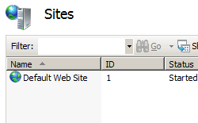
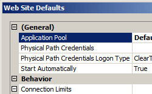

Default Limits for Web Sites &lt;limits&gt;
====================

## Overview

The `<limits>` element of the `<siteDefaults>` element configures default settings that limit the amount of bandwidth, the number of connections, or the connection time-out for client requests for a Web server.

> [!NOTE]
> If the `<limits>` element is configured in both the `<siteDefaults>` section and in the `<site>` section for a specific site, the configuration in the `<site>` section is used for that site.

## Compatibility

| Version | Notes |
| --- | --- |
| IIS 8.5 | The `<limits>` element was not modified in IIS 8.5. |
| IIS 8.0 | The `<limits>` element was not modified in IIS 8.0. |
| IIS 7.5 | The `<limits>` element was not modified in IIS 7.5. |
| IIS 7.0 | The `<limits>` element of the `<siteDefaults>` element was introduced in IIS 7.0. |
| IIS 6.0 | The `<limits>` element replaces the following IIS 6.0 metabase settings: - **ConnectionTimeout** - **MaxBandwidth** - **MaxConnections** |

## Setup

The `<limits>` element of the `<siteDefaults>` element is included in the default installation of IIS 7 and later.

## How To

### How to configure the default connection limit options for a server

1. Open **Internet Information Services (IIS) Manager**: 

    - If you are using Windows Server 2012 or Windows Server 2012 R2: 

        - On the taskbar, click **Server Manager**, click **Tools**, and then click **Internet Information Services (IIS) Manager**.
    - If you are using Windows 8 or Windows 8.1: 

        - Hold down the **Windows** key, press the letter **X**, and then click **Control Panel**.
        - Click **Administrative Tools**, and then double-click **Internet Information Services (IIS) Manager**.
    - If you are using Windows Server 2008 or Windows Server 2008 R2: 

        - On the taskbar, click **Start**, point to **Administrative Tools**, and then click **Internet Information Services (IIS) Manager**.
    - If you are using Windows Vista or Windows 7: 

        - On the taskbar, click **Start**, and then click **Control Panel**.
        - Double-click **Administrative Tools**, and then double-click **Internet Information Services (IIS) Manager**.
2. In the **Connections** pane, and then click the **Sites** node.
3. In the **Sites** pane, click **Set Web Site Defaults...** in the **Actions** pane.  
    
4. In the **Web Site Defaults** dialog box, expand **Limits**, specify limit options, and then click **OK**.  
    

## Configuration

### Attributes

| Attribute | Description |
| --- | --- |
| `connectionTimeout` | Optional timeSpan attribute. Specifies the time (in seconds) that IIS waits before it disconnects a connection that is considered inactive. Connections can be considered inactive for the following reasons: - The HTTP.sys Timer\_ConnectionIdle timer expired. The connection expired and remains idle. - The HTTP.sys Timer\_EntityBody timer expired. The connection expired before the request entity body arrived. When it is clear that a request has an entity body, the HTTP API turns on the Timer\_EntityBody timer. Initially, the limit of this timer is set to the connectionTimeout value. Each time another data indication is received on this request, the HTTP API resets the timer to give the connection more minutes as specified in the connectionTimeout attribute. - The HTTP.sys Timer\_AppPool timer expired. The connection expired because a request waited too long in an application pool queue for a server application to dequeue and process it. This time-out duration is connectionTimeout. The default value is `00:02:00` (two minutes). |
| `maxBandwidth` | Optional uint attribute. Specifies the maximum network bandwidth, in bytes per second, that is used for a site. Use this setting to help prevent overloading the network with IIS activity. The default value is `4294967295`. |
| `maxConnections` | Optional uint attribute. Specifies the maximum number of connections for a site. Use this setting to limit the number of simultaneous client connections. The default value is `4294967295`. |
| `maxUrlSegments` | Optional uint attribute. Specifies the maximum number of segments permitted in a Url. The default value is `32`. |

### Child Elements

None.

### Configuration Sample

The following configuration sample specifies the default `limits` options for IIS 7 and later.

[!code-xml[Main](limits/samples/sample1.xml)]

## Sample Code

The following code samples configure the default `limits` options for IIS 7 and later with a `connectionTimeout` of 3 minutes.

### AppCmd.exe

[!code-csharp[Main](limits/samples/sample2.cs)]

> [!NOTE]
> You must be sure to set the **commit** parameter to `apphost` when you use AppCmd.exe to configure these settings. This commits the configuration settings to the appropriate location section in the ApplicationHost.config file.

### C#

[!code-csharp[Main](limits/samples/sample3.cs)]

### VB.NET

[!code-vb[Main](limits/samples/sample4.vb)]

### JavaScript

[!code-javascript[Main](limits/samples/sample5.js)]

### VBScript

[!code-vb[Main](limits/samples/sample6.vb)]