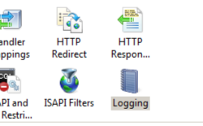
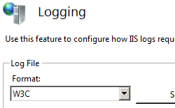
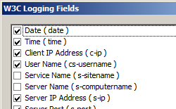
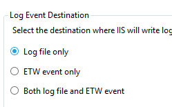
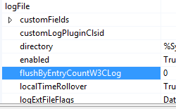
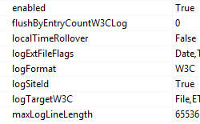

Default Log File Settings for Web Sites &lt;logFile&gt;
====================

## Overview

The `<logFile>` element of the `<siteDefaults>` element contains attributes that allow you to configure default logging for a site on IIS 7 and later.

For example, you can enable or disable logging, configure the format of the IIS log file, specify the categories of information to store in the log file, and change the directory where the log file is stored. You can also use the `<logFile>` element to control how often IIS creates a new log file based either on log file size or time interval and the maximum size (in bytes) that a log file can become.

By default, IIS 7 and later uses the World Wide Web Consortium (W3C) log file format. You can change this setting by modifying the **logFormat** attribute to **IIS**, **NCSA**, or **Custom**.

> [!NOTE]
> ODBC logging is implemented as a custom logging module in IIS 7 and later. As a result, enabling and configuring ODBC logging in IIS 7 and later consists of two separate actions:

- Setting the ODBC logging attributes in the [`<odbcLogging>`](https://www.iis.net/configreference/system.webserver/odbclogging) element. These attributes specify the System Data Source Name (DSN), table name, user name, and password for the ODBC connection.
- Setting the correct custom logging attributes in `<logFile>` element. These attributes must set the log file format to "Custom" and the custom log plug-in class ID to "{FF16065B-DE82-11CF-BC0A-00AA006111E0}".

For more information about ODBC logging, see the [`<odbcLogging>`](https://www.iis.net/configreference/system.webserver/odbclogging) element.

You can define the categories of information that IIS logs by editing the **logExtFileFlags** attribute. The default values are `Date`, `Time`, `ClientIP`, `UserName`, `ServerIP`, `Method`, `UriStem`, `UriQuery`, `TimeTaken`, `HttpStatus`, `Win32Status`, `ServerPort`, `UserAgent`, `HttpSubStatus`, and `Referer`.

> [!NOTE]
> If the `<logFile>` element is configured in both the `<siteDefaults>` section and in the `<site>` section for a specific site, the configuration in the `<site>` section is used for that site.

IIS 8.5 enables you to log custom fields in addition to the standard logged set. The log file format must be W3C to add custom fields. For more information, see [`customFields`](https://www.iis.net/configreference/system.applicationhost/sites/site/logfile/customfields).

## Compatibility

| Version | Notes |
| --- | --- |
| IIS 10.0 | The `<logFile>` element was not modified in IIS 10.0. |
| IIS 8.5 | Added the `flushByEntrycountW3CLog` attribute to specify the number of events to be store in the buffer before they are flushed to the log file. Added the `logTargetW3C` attribute to specify how logged IIS events are processed. Added the `maxLogLineLength` attribute to specify the maximum length of a line in a log file. Added the `<customFields>` child element. |
| IIS 8.0 | The `logSiteId` attribute was added to specify the contents of the -sitename field, and `referer` flag was added to the default value of the `logExtFileFlags` attribute. |
| IIS 7.5 | The `<logFile>` element was not modified in IIS 7.5. |
| IIS 7.0 | The `<logFile>` element of the `<siteDefaults>` element was introduced in IIS 7.0. |
| IIS 6.0 | The `<logFile>` element replaces sections of the logging properties on the IIS 6.0 **IIsWebService** metabase object. |

## Setup

The `<logFile>` element is included in the default installation of IIS 7 and later.

## How To

### How to edit the default logging settings for a server

1. Open **Internet Information Services (IIS) Manager**: 

    - If you are using Windows Server 2012 or Windows Server 2012 R2: 

        - On the taskbar, click **Server Manager**, click **Tools**, and then click **Internet Information Services (IIS) Manager**.
    - If you are using Windows 8 or Windows 8.1: 

        - Hold down the **Windows** key, press the letter **X**, and then click **Control Panel**.
        - Click **Administrative Tools**, and then double-click **Internet Information Services (IIS) Manager**.
    - If you are using Windows Server 2008 or Windows Server 2008 R2: 

        - On the taskbar, click **Start**, point to **Administrative Tools**, and then click **Internet Information Services (IIS) Manager**.
    - If you are using Windows Vista or Windows 7: 

        - On the taskbar, click **Start**, and then click **Control Panel**.
        - Double-click **Administrative Tools**, and then double-click **Internet Information Services (IIS) Manager**.
2. In the **Connections** pane, click the server name on which you want to configure logging.
3. In the **Home** pane, double-click **Logging**.  
    
4. In the **Logging** pane, select the log file format in the **Format** box, and then type the path to the directory where you store the log files in the **Directory** box or click **Browse...** to choose the directory in which to store the log files.  
    
5. If you choose to use the W3C log file format: 

    - Click **Select Fields** to choose the types of information to log.
    - In the **W3C Logging Fields** dialog box, select the check boxes for options you want to log, clear the check boxes for options you do not want to log, and then click **OK**.  
        

### How to configure ETW or file logging for W3C logs

1. Open **Internet Information Services (IIS) Manager**: 

    - If you are using Windows Server 2012 R2: 

        - On the taskbar, click **Server Manager**, click **Tools**, and then click **Internet Information Services (IIS) Manager**.
    - If you are using Windows 8.1: 

        - Hold down the **Windows** key, press the letter **X**, and then click **Control Panel**.
        - Click **Administrative Tools**, and then double-click **Internet Information Services (IIS) Manager**.
2. In the **Connections** pane, expand the server name.
3. In the site's home pane, double-click **Logging**.
4. In the **Logging** home page, for **Log Event Destination**, select **Log file only**, **ETW event only**, or **Both log file and ETW event**.  
  
    

### How to configure flushing a W3C log by entry count

1. Open **Internet Information Services (IIS) Manager**: 

    - If you are using Windows Server 2012 R2: 

        - On the taskbar, click **Server Manager**, click **Tools**, and then click **Internet Information Services (IIS) Manager**.
    - If you are using Windows 8.1: 

        - Hold down the **Windows** key, press the letter **X**, and then click **Control Panel**.
        - Click **Administrative Tools**, and then double-click **Internet Information Services (IIS) Manager**.
2. In the **Connections** pane, select the server, and then double-click **Configuration Editor**.
3. In the **Configuration Editor**, for the **Section**, expand `system.applicationHost`, and then select **sites**.
4. Expand **siteDefaults**, and then expand **logFile**.
5. For **flushByEntryCountW3Clog**, enter the number of events to be stored in the buffer before they are flushed to the log file.
6. In the **Action** pane, click **Apply**.  
  
    

### How to configure the maximum log line length

1. Open **Internet Information Services (IIS) Manager**: 

    - If you are using Windows Server 2012 R2: 

        - On the taskbar, click **Server Manager**, click **Tools**, and then click **Internet Information Services (IIS) Manager**.
    - If you are using Windows 8.1: 

        - Hold down the **Windows** key, press the letter **X**, and then click **Control Panel**.
        - Click **Administrative Tools**, and then double-click **Internet Information Services (IIS) Manager**.
2. In the **Connections** pane, expand the server, and then double-click **Configuration Editor**.
3. In the **Configuration Editor**, for the **Section**, expand `system.applicationHost`, and then select **sites**.
4. Expand **siteDefaults**, and then expand **logFile**.
5. For **maxLogLineLength**, enter the maximum number of bytes in a single line of a log file.
6. In the **Action** pane, click **Apply**.  
  
    

## Configuration

### Attributes

| Attribute | Description |
| --- | --- |
| `customLogPluginClsid` | Optional string attribute. Specifies the COM object class ID (CLSID) or IDs, in order of precedence, for custom modules. |
| `directory` | Optional string attribute. Specifies the logging directory, where the log file and logging-related support files are stored. The default value is `%SystemDrive%\inetpub\logs\LogFiles`. |
| `enabled` | Optional Boolean attribute. Specifies whether logging is enabled (**true**) or disabled (**false**) for a site.   **Note:** ASP and ODBC errors are not logged in the IIS log files. The default value is `true`. |
| `flushByEntryCountW3CLog` | Optional uint attribute. Specifies the number of events to be stored in the buffer before they are flushed to the log file. A lower number will cause events to be flushed more quickly, at the cost of performance as a result of a greater number of disk operations. Reduce this value for more real-time troubleshooting, increase it for performance. A value of `0` specifies that the flush will occur at the default maximum of 64k. The default value is `0`. |
| `localTimeRollover` | Optional Boolean attribute. Specifies whether a new log file is created based on local time or Coordinated Universal Time (UTC), which was previously called Greenwich Mean Time (GMT). When false, a new log file is created based on UTC.   **Note:** Regardless of the setting, the time stamp for each W3C Extended Logging log record is UTC-based. The default value is `false`. |
| `logExtFileFlags` | Optional flags attribute. Specifies the categories of information that are written to either the log file (when you use W3C Extended log file format) or to the ODBC data source during logging events for a site. The **logExtFileFlags** attribute can be one or more of the following values. If you specify more than one value, separate them with a comma (,). The default values are `Date`, `Time`, `ClientIP`, `UserName`, `ServerIP`, `Method`, `UriStem`, `UriQuery`, `TimeTaken`, `HttpStatus`, `Win32Status`, `ServerPort`, `UserAgent`, `HttpSubStatus`, `Referer`. | Value | Description | | --- | --- | | `BytesRecv` | Log the number of bytes that the server received. | | `BytesSent` | Log the number of bytes that the server sent. | | `ClientIP` | Log the IP address of the client that made the request. | | `ComputerName` | Log the name of the server on which the log file entry was generated. | | `Cookie` | Log the content of the cookie that was sent or received, if any content exists. | | `Date` | Log the date on which the activity occurred. | | `Host` | Log the host header name, if there is one. | | `HttpStatus` | Log the HTTP status code. | | `HttpSubStatus` | Log the sub-status code of the HTTP error. For example, for the 500.18 HTTP error, the status code is 500 and the sub-status code is 18. | | `Method` | Log the requested action. For example, **GET**, **POST**, etc. | | `ProtocolVersion` | Log the protocol version that the client used. | | `Referer` | Log the site that the user last visited. This site provided a link to the current site. | | `ServerIP` | Log the IP address of the server on which the log file entry was generated. | | `ServerPort` | Log the server port number that is configured for the site. | | `SiteName` | Log the Internet service name and instance number for the site. | | `Time` | Log the time in Coordinated Universal Time (UTC), at which the activity occurred. | | `TimeTaken` | Log the length of time taken for a request to be completed. The time taken is recorded in milliseconds.   **Note:** The client-request timestamp is initialized when HTTP.sys receives the first byte, but before HTTP.sys begins to parse the request. The client-request timestamp is stopped when the last IIS send completion occurs. Time taken does not reflect time across the network. The first request to the site shows a slightly longer time taken than other similar requests because HTTP.sys opens the log file that contains the first request. | | `UriQuery` | Log the query, if any, that the client was trying to perform. A Universal Resource Identifier (URI) query is necessary only for dynamic pages, and usually consists of parameters passed to the URL. | | `UriStem` | Log the Universal Resource Identifier (URI) stem information, which is the target of the action. For example, Default.htm. | | `UserAgent` | Log the browser type that the client used. | | `UserName` | Log the name of the authenticated user who accessed your server. Anonymous users are indicated by a hyphen. | | `Win32Status` | Log the Windows status code. | |
| `logFormat` | Optional enum attribute. Specifies the log file format. The **logFormat** attribute can be one of the following values. The default value is `W3C`. | Value | Description | | --- | --- | | `Custom` | Use a custom log file format for a custom logging module. The numeric value is `3`. | | `IIS` | Use the Microsoft IIS log file format to log information about a site. This format is handled by HTTP.sys, and is a fixed ASCII text-based format, which means that you cannot customize the fields that are logged. Fields are separated by commas, and time is recorded as local time. The following list is a list of fields that are logged when you use the IIS log file format: - **Client IP address** - **User name** - **Date** - **Time** - **Service and instance** - **Server name** - **Server IP address** - **Time taken** - **Client bytes sent** - **Server bytes sent** - **Service status code** (A value of 200 indicates that the request was fulfilled successfully.) - **Windows status code** (A value of 0 indicates that the request was fulfilled successfully.) - **Request type** - **Target of operation** - **Parameters** (the parameters that are passed to a script) Not all fields will contain data. When a field does not contain data, a hyphen (-) appears as a placeholder. When a field contains a non-printable character, HTTP.sys replaces it with a plus sign (+) to preserve the log file format. The numeric value is `0`. | | `NCSA` | Use the National Center for Supercomputing Applications (NCSA) Common log file format to log information about a site. This format is handled by HTTP.sys, and is a fixed ASCII text-based format, which means that you cannot customize the fields that are logged. Fields are separated by spaces, and time is recorded as local time with the Coordinated Universal Time (UTC) offset. The following list is a list of fields that are logged when you use the NCSA Common log file format: - **Remote host address** - **Remote log name** (This value is always a hyphen.) - **User name** - **Date, time, and UTC offset** - **Request and protocol version** - **Service status code** (A value of 200 indicates that the request was fulfilled successfully.) - **Bytes sent** Not all fields will contain data. When a field does not contain data, a hyphen (-) appears as a placeholder. When a field contains a non-printable character, HTTP.sys replaces it with a plus sign (+) to preserve the log file format. The numeric value is `1`. | | `W3C` | Use the W3C Extended log file format to log information about a site. This format is handled by HTTP.sys, and is a customizable ASCII text-based format, which means that you specify the fields that are logged. Specify the fields that are logged in the **logExtFileFlags** attribute. Fields are separated by spaces, and time is recorded in Coordinated Universal Time (UTC). The numeric value is `2`. | |
| `logSiteId` | Optional Boolean attribute. Specifies that the s-sitename field will contain either the site name (false) or the site ID (true). If the One log file per property is set to `Site` (the out-of-box default], then you won't get s-sitename column in the log file by default, because the log file name property will contain the site ID instead. If the One log file per property is set to `Server`, the-s-sitename column will be included in the log file by default. The default value is `True`, meaning that the s-sitename field contains the site ID. To log the site name instead, set logSiteID to `False`. |
| `logTargetW3C` | Optional Flags attribute. Specifies whether IIS will use Event Tracing for Windows (ETW) and/or file logging for processing logged IIS events. ETW provides real-time logging and use of an ETW provider and standard querying mechanisms. File logging stores event data in text files that you can parse to access logging data. When IIS uses log files, HTTP.sys logs data directly into text log files after the transaction has completed. When using ETW, HTTP.sys sends data into ETW using the iislogging provider, and the LOGSVC service manages the log data, including querying ETW for data, gathering data directly from worker processes, and sending the data to a log file. The `logTargetW3C` attribute can have the following possible values. The default value is `File`. If both `File` and `ETW` are listed for `logTargetW3C` for the server's log file defaults in applicationHost.config, that is equivalent to selecting **Both log file and ETW event** in the server's **Logging** pane in the IIS Manager. | Value | Description | | --- | --- | | `File` | IIS event data will be stored in a text log file. To process the event data, you must parse the text-based log file. Text log files take time to process and flush, so you will not be able to process the event data in real time. The numeric value is `1`. | | `ETW` | Instead of logging data directly into text files, IIS will send logged information to Event Tracing for Windows, a generic event mechanism built into Windows. You can manage logged data using standard query tools, such as the Message Analyzer, or custom tools. ETW processes logged information in real time, and gives you the ability to filter and view the data, and to enable or disable logging, dynamically. ETW also adds detailed information to event data, providing data that HTTP.sys does not have access to. For more information, see [Event Tracing](https://msdn.microsoft.com/en-us/library/windows/desktop/bb968803(v=vs.85).aspx). The numeric value is `2`. | |
| `maxLogLineLength` | Optional uint attribute. Specifies the maximum length of a line in a log file. This enables you to limit the amount of data accumulated by logging, and save on disk space, especially when you add custom logging fields. The range is 2 to 65,536. The default value is `65536`. |
| `period` | Optional enum attribute. Specifies how often IIS creates a new log file. The period attribute can be one of the following possible values. The default value is `Daily`. | Value | Description | | --- | --- | | `Daily` | Create a new log file daily. The numeric value is `1`. | | `Hourly` | Create a new log file hourly. The numeric value is `4`. | | `MaxSize` | Create a new log file when a maximum size is reached. The maximum size is specified in the truncateSize attribute. The numeric value is `0`. | | `Monthly` | Create a new log file monthly. The numeric value is `3`. | | `Weekly` | Create a new log file weekly. The numeric value is `2`. | |
| `truncateSize` | Optional int64 attribute. Specifies the maximum size of the log file (in bytes) after which to create a new log file. This value is only applicable when MaxSize is chosen for the period attribute. The minimum file size is 1,048,576 bytes. If this attribute is set to a value less than 1,048,576 bytes, the default value is implicitly assumed as 1,048,576 bytes. The default value is `20971520`. |

### Child Elements

| Element | Description |
| --- | --- |
| [`customFields`](https://www.iis.net/configreference/system.applicationhost/sites/sitedefaults/logfile/customfields) | Optional element. Specifies the configuration settings for default custom fields in a W3C log. |

### Configuration Sample

The following configuration sample specifies default `logFile` options.

[!code-xml[Main](index/samples/sample1.xml)]

## Sample Code

The following code samples configure the default `logFile` options for IIS 7.

### AppCmd.exe

[!code-csharp[Main](index/samples/sample2.cs)]

> [!NOTE]
> You must be sure to set the **commit** parameter to `apphost` when you use AppCmd.exe to configure these settings. This commits the configuration settings to the appropriate location section in the ApplicationHost.config file.

### C#

[!code-csharp[Main](index/samples/sample3.cs)]

### VB.NET

[!code-vb[Main](index/samples/sample4.vb)]

### JavaScript

[!code-javascript[Main](index/samples/sample5.js)]

### VBScript

[!code-vb[Main](index/samples/sample6.vb)]