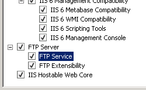
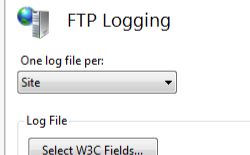

FTP Logging Options &lt;log&gt;
====================

## Overview

The `<system.ftpServer/log>` element specifies the global log settings for the FTP service. More specifically, the attributes on the `<system.ftpServer/log>` element specify the following options:

- `centralLogFileMode` - This attribute specifies whether the FTP service should use central logging (per-server) or site logging (per site). 

    - If you specify central logging, a single log file will be kept for all of your FTP sites.
    - If you specify site logging, each FTP site will write to individual log files.
- `logInUTF8` - This attribute specifies that log files should be encoded in UTF8 format.

When you specify central logging, you can use the [`<centralLogFile>`](centrallogfile.md) child element to configure the options for central log file.

## Compatibility

| Version | Notes |
| --- | --- |
| IIS 10.0 | The `<log>` element was not modified in IIS 10.0. |
| IIS 8.5 | The `<log>` element was not modified in IIS 8.5. |
| IIS 8.0 | The `<log>` element was not modified in IIS 8.0. |
| IIS 7.5 | The `<log>` element of the `<system.ftpServer>` element ships as a feature of IIS 7.5. |
| IIS 7.0 | The `<log>` element of the `<system.ftpServer>` element was introduced in FTP 7.0, which was a separate download for IIS 7.0. |
| IIS 6.0 | The `<system.ftpServer>` element and its child elements replace the IIS 6.0 FTP settings that were located in the **LM/MSFTPSVC** metabase path. |

> [!NOTE]
> The FTP 7.0 and FTP 7.5 services shipped out-of-band for IIS 7.0, which required downloading and installing the modules from the following URL:

> [https://www.iis.net/expand/FTP](https://www.iis.net/downloads/microsoft/ftp)

With Windows 7 and Windows Server 2008 R2, the FTP 7.5 service ships as a feature for IIS 7.5, so downloading the FTP service is no longer necessary.

## Setup

To support FTP publishing for your Web server, you must install the FTP service. To do so, use the following steps.

### Windows Server 2012 or Windows Server 2012 R2

1. On the taskbar, click **Server Manager**.
2. In **Server Manager**, click the **Manage** menu, and then click **Add Roles and Features**.
3. In the **Add Roles and Features** wizard, click **Next**. Select the installation type and click **Next**. Select the destination server and click **Next**.
4. On the **Server Roles** page, expand **Web Server (IIS)**, and then select **FTP Server**.  
  
    > [!NOTE]
    > To support ASP.Membership authentication or IIS Manager authentication for the FTP service, you will need to select     **FTP Extensibility** , in addition to     **FTP Service** .  
     .
5. Click **Next**, and then on the **Select features** page, click **Next** again.
6. On the **Confirm installation selections** page, click **Install**.
7. On the **Results** page, click **Close**.

### Windows 8 or Windows 8.1

1. On the **Start** screen, move the pointer all the way to the lower left corner, right-click the **Start** button, and then click **Control Panel**.
2. In **Control Panel**, click **Programs and Features**, and then click **Turn Windows features on or off**.
3. Expand **Internet Information Services**, and then select **FTP Server**.   
  
    > [!NOTE]
    > To support ASP.Membership authentication or IIS Manager authentication for the FTP service, you will also need to select     **FTP Extensibility** .   
    
4. Click **OK**.
5. Click **Close**.

### Windows Server 2008 R2

1. On the taskbar, click **Start**, point to **Administrative Tools**, and then click **Server Manager**.
2. In the **Server Manager** hierarchy pane, expand **Roles**, and then click **Web Server (IIS)**.
3. In the **Web Server (IIS)** pane, scroll to the **Role Services** section, and then click **Add Role Services**.
4. On the **Select Role Services** page of the **Add Role Services Wizard**, expand **FTP Server**.
5. Select **FTP Service**.  
  
    > [!NOTE]
    > To support ASP.Membership authentication or IIS Manager authentication for the FTP service, you will also need to select     **FTP Extensibility** .  
    
6. Click **Next**.
7. On the **Confirm Installation Selections** page, click **Install**.
8. On the **Results** page, click **Close**.

### Windows 7

1. On the taskbar, click **Start**, and then click **Control Panel**.
2. In **Control Panel**, click **Programs and Features**, and then click **Turn Windows Features on or off**.
3. Expand **Internet Information Services**, and then **FTP Server**.
4. Select **FTP Service**.  
  
    > [!NOTE]
    > To support ASP.Membership authentication or IIS Manager authentication for the FTP service, you will also need to select     **FTP Extensibility** .   
    
5. Click **OK**.

### Windows Server 2008 or Windows Vista

1. Download the installation package from the following URL: 

    - [https://www.iis.net/expand/FTP](https://www.iis.net/downloads/microsoft/ftp)
- Follow the instructions in the following walkthrough to install the FTP service: 

    - [Installing and Troubleshooting FTP 7](https://go.microsoft.com/fwlink/?LinkId=88547)
 

## How To

### How to configure site-level or server-level logging for the FTP service

1. Open **Internet Information Services (IIS) Manager**: 

    - If you are using Windows Server 2012 or Windows Server 2012 R2: 

        - On the taskbar, click **Server Manager**, click **Tools**, and then click **Internet Information Services (IIS) Manager**.
    - If you are using Windows 8 or Windows 8.1: 

        - Hold down the **Windows** key, press the letter **X**, and then click **Control Panel**.
        - Click **Administrative Tools**, and then double-click **Internet Information Services (IIS) Manager**.
    - If you are using Windows Server 2008 or Windows Server 2008 R2: 

        - On the taskbar, click **Start**, point to **Administrative Tools**, and then click **Internet Information Services (IIS) Manager**.
    - If you are using Windows Vista or Windows 7: 

        - On the taskbar, click **Start**, and then click **Control Panel**.
        - Double-click **Administrative Tools**, and then double-click **Internet Information Services (IIS) Manager**.
2. In the **Connections** pane, click the server name.
3. In the **Home** pane, double-click the **FTP Logging** feature.  
    
4. In the **One log file per** drop-down list, choose one of the following options: 

    - Choose **Site** to specify that each FTP site will write to individual log files.
    - Choose **Server** to specify a single log file for all of your FTP sites.  
        
5. In the **Actions** pane, click **Apply**.
 

## Configuration

The `<system.ftpServer/log>` element is configured at the global level in ApplicationHost.config.

### Attributes

| Attribute | Description |
| --- | --- |
| `centralLogFileMode` | Optional enum attribute. Specifies whether the FTP service should use central logging (per-server) or site logging (per-site). | Attribute | Description | | --- | --- | | `Site` | Specifies that each FTP site will write to individual log files. The numeric value is `0`. | | `Central` | Specifies that a single log file will be kept for all of your FTP sites. The numeric value is `1`. | The default value is `Site`. |
| `logInUTF8` | Optional **Boolean** attribute. Specifies whether IIS should log all strings for the FTP server in UCS Transformation Format 8 (UTF-8). This setting applies to text-mode logging for all of the sites on the FTP server. The default value is `true`. |

### Child Elements

| Element | Description |
| --- | --- |
| [`centralLogFile`](centrallogfile.md) | Optional element. Specifies the settings for the central log file. |

> [!NOTE]
> An unused element named `<customLogging>` was declared in the FTP 7.0 schema, but this was removed from the FTP 7.5 schema and should not be used.

### Configuration Sample

The following configuration example enables central file logging for the FTP service.

[!code-xml[Main](index/samples/sample1.xml)]

## Sample Code

The following examples enable central file logging for the FTP service.

### AppCmd.exe

[!code-console[Main](index/samples/sample2.cmd)]

> [!NOTE]
> You must be sure to set the **commit** parameter to `apphost` when you use AppCmd.exe to configure these settings. This commits the configuration settings to the appropriate location section in the ApplicationHost.config file.

### C#

[!code-csharp[Main](index/samples/sample3.cs)]

### VB.NET

[!code-vb[Main](index/samples/sample4.vb)]

### JavaScript

[!code-javascript[Main](index/samples/sample5.js)]

### VBScript

[!code-vb[Main](index/samples/sample6.vb)]