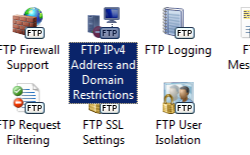
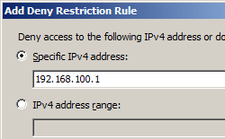
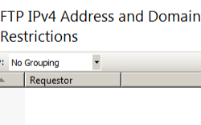
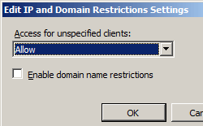

FTP IP Security &lt;ipSecurity&gt;
====================

## Overview

The `<ipSecurity>` element defines a list of IP-based security restrictions in FTP 7. These restrictions can be based on the IP version 4 address, a range of IP version 4 addresses, or a DNS domain name.

## Compatibility

| Version | Notes |
| --- | --- |
| IIS 10.0 | The `<ipSecurity>` element was not modified in IIS 10.0. |
| IIS 8.5 | The `<ipSecurity>` element was not modified in IIS 8.5. |
| IIS 8.0 | The `<ipSecurity>` element was not modified in IIS 8.0. |
| IIS 7.5 | The `<ipSecurity>` element of the `<system.ftpServer/security>` element ships as a feature of IIS 7.5. |
| IIS 7.0 | The `<ipSecurity>` element of the `<system.ftpServer/security>` element was introduced in FTP 7.0, which was a separate download for IIS 7.0. |
| IIS 6.0 | N/A |

> [!NOTE]
> The FTP 7.0 and FTP 7.5 services shipped out-of-band for IIS 7.0, which required downloading and installing the modules from the following URL:

> [https://www.iis.net/expand/FTP](https://www.iis.net/downloads/microsoft/ftp)

With Windows 7 and Windows Server 2008 R2, the FTP 7.5 service ships as a feature for IIS 7.5, so downloading the FTP service is no longer necessary.

## Setup

To support FTP publishing for your Web server, you must install the FTP service. To do so, use the following steps.

### Windows Server 2012 or Windows Server 2012 R2

1. On the taskbar, click **Server Manager**.
2. In **Server Manager**, click the **Manage** menu, and then click **Add Roles and Features**.
3. In the **Add Roles and Features** wizard, click **Next**. Select the installation type and click **Next**. Select the destination server and click **Next**.
4. On the **Server Roles** page, expand **Web Server (IIS)**, and then select **FTP Server**.  
  
    > [!NOTE]
    > To support ASP.Membership authentication or IIS Manager authentication for the FTP service, you will need to select     **FTP Extensibility** , in addition to     **FTP Service** .  
     .
5. Click **Next**, and then on the **Select features** page, click **Next** again.
6. On the **Confirm installation selections** page, click **Install**.
7. On the **Results** page, click **Close**.

### Windows 8 or Windows 8.1

1. On the **Start** screen, move the pointer all the way to the lower left corner, right-click the **Start** button, and then click **Control Panel**.
2. In **Control Panel**, click **Programs and Features**, and then click **Turn Windows features on or off**.
3. Expand **Internet Information Services**, and then select **FTP Server**.   
  
    > [!NOTE]
    > To support ASP.Membership authentication or IIS Manager authentication for the FTP service, you will also need to select     **FTP Extensibility** .   
    
4. Click **OK**.
5. Click **Close**.

### Windows Server 2008 R2

1. On the taskbar, click **Start**, point to **Administrative Tools**, and then click **Server Manager**.
2. In the **Server Manager** hierarchy pane, expand **Roles**, and then click **Web Server (IIS)**.
3. In the **Web Server (IIS)** pane, scroll to the **Role Services** section, and then click **Add Role Services**.
4. On the **Select Role Services** page of the **Add Role Services Wizard**, expand **FTP Server**.
5. Select **FTP Service**.  
  
    > [!NOTE]
    > To support ASP.Membership authentication or IIS Manager authentication for the FTP service, you will also need to select     **FTP Extensibility** .  
    
6. Click **Next**.
7. On the **Confirm Installation Selections** page, click **Install**.
8. On the **Results** page, click **Close**.

### Windows 7

1. On the taskbar, click **Start**, and then click **Control Panel**.
2. In **Control Panel**, click **Programs and Features**, and then click **Turn Windows Features on or off**.
3. Expand **Internet Information Services**, and then **FTP Server**.
4. Select **FTP Service**.  
  
    > [!NOTE]
    > To support ASP.Membership authentication or IIS Manager authentication for the FTP service, you will also need to select     **FTP Extensibility** .   
    
5. Click **OK**.

### Windows Server 2008 or Windows Vista

1. Download the installation package from the following URL: 

    - [https://www.iis.net/expand/FTP](https://www.iis.net/downloads/microsoft/ftp)
- Follow the instructions in the following walkthrough to install the FTP service: 

    - [Installing and Troubleshooting FTP 7](https://go.microsoft.com/fwlink/?LinkId=88547)
 

## How To

### How to add IP restrictions to allow or access for an FTP site

1. Open **Internet Information Services (IIS) Manager**: 

    - If you are using Windows Server 2012 or Windows Server 2012 R2: 

        - On the taskbar, click **Server Manager**, click **Tools**, and then click **Internet Information Services (IIS) Manager**.
    - If you are using Windows 8 or Windows 8.1: 

        - Hold down the **Windows** key, press the letter **X**, and then click **Control Panel**.
        - Click **Administrative Tools**, and then double-click **Internet Information Services (IIS) Manager**.
    - If you are using Windows Server 2008 or Windows Server 2008 R2: 

        - On the taskbar, click **Start**, point to **Administrative Tools**, and then click **Internet Information Services (IIS) Manager**.
    - If you are using Windows Vista or Windows 7: 

        - On the taskbar, click **Start**, and then click **Control Panel**.
        - Double-click **Administrative Tools**, and then double-click **Internet Information Services (IIS) Manager**.
2. In the **Connections** pane, expand the server name, expand **Sites**, and then FTP site or URL for which you want to add IP restrictions.
3. In the **Home** pane, double-click the **FTP IPv4 Address and Domain Restrictions** feature.  
    
4. In the **FTP IPv4 Address and Domain Restrictions** feature, click **Add Allow Entry...** or **Add Deny Entry...** in the **Actions** pane.  
    
5. Enter the IP address that you wish to allow or deny, and then click **OK**.  
    

* * *

### How to edit the IP restrictions feature settings for an FTP site

1. Open **Internet Information Services (IIS) Manager**: 

    - If you are using Windows Server 2012 or Windows Server 2012 R2: 

        - On the taskbar, click **Server Manager**, click **Tools**, and then click **Internet Information Services (IIS) Manager**.
    - If you are using Windows 8 or Windows 8.1: 

        - Hold down the **Windows** key, press the letter **X**, and then click **Control Panel**.
        - Click **Administrative Tools**, and then double-click **Internet Information Services (IIS) Manager**.
    - If you are using Windows Server 2008 or Windows Server 2008 R2: 

        - On the taskbar, click **Start**, point to **Administrative Tools**, and then click **Internet Information Services (IIS) Manager**.
    - If you are using Windows Vista or Windows 7: 

        - On the taskbar, click **Start**, and then click **Control Panel**.
        - Double-click **Administrative Tools**, and then double-click **Internet Information Services (IIS) Manager**.
2. In the Connections pane, expand the server name, expand **Sites**, and then FTP site or URL for which you want to configure IP restrictions.
3. In the **Home** pane, double-click the **FTP IPv4 Address and Domain Restrictions** feature.  
    
4. In the **FTP IPv4 Address and Domain Restrictions** feature, click **Edit Feature Settings...** in the **Actions** pane.  
    
5. Choose the default access behavior for unspecified clients, specify whether to enable restrictions by domain name, and then click **OK**.  
    

## Configuration

The `<ipSecurity>` element is configured at the site or URL level.

Rules are processed from top to bottom, in the order they appear in the list. The **allowunlisted** attribute is processed last. Best practice for Internet Protocol security (IPsec) restrictions is to list Deny rules first. You cannot clear the **allowunlisted** attribute if it is set to **false**.

### Attributes

| Attribute | Description |
| --- | --- |
| `allowUnlisted` | Optional **Boolean** attribute. Specifies whether to allow unlisted IP addresses. Setting the **allowUnlisted** attribute to **true** allows an unlisted IP address to access the server. Setting the **allowUnlisted** attribute to **false** locks down the server, preventing access to all IP address unless they are listed. If you set this attribute to false and do not list the local loopback address (127.0.0.1) as an allowed IP address, you will not be able to access your server by using a browser from a local console. The default value is `true`. |
| `enableReverseDns` | Optional **Boolean** attribute. Specifies whether to enable or disable reverse Domain Name System (DNS) lookups for the FTP server. Reverse lookups involve looking up the domain name when the IP address is known. **Caution**: Reverse DNS lookups will use significant resources and time. The default value is `false`. |

### Child Elements

| Element | Description |
| --- | --- |
| [`add`](https://www.iis.net/configreference/system.ftpserver/security/ipsecurity/add) | Optional element. Adds an IP restriction to the collection of IP address restrictions. |
| `remove` | Optional element. Removes a reference to a restriction from the `<ipSecurity>` collection. |
| `clear` | Optional element. Removes all references to restrictions from the `<ipSecurity>` collection. |

### Configuration Sample

The following sample illustrates several security-related configuration settings in the `<system.ftpServer>` element for an FTP site. More specifically, the `<location>` settings in this example demonstrate how to:

- Specify an FTP authorization rule for read and write access for the administrators group.
- Specify FTP request filtering options that deny \*.exe, \*.bat, and \*.cmd files.
- Specify FTP request limits for a maximum content length of 1000000 bytes and a maximum URL length of 1024 bytes.
- Block FTP access to the \_vti\_bin virtual directory, which is used with the FrontPage Server Extensions.
- Specify FTP IP filtering options that allow access from 127.0.0.1 and deny access from the 169.254.0.0/255.255.0.0 range of IP addresses.

[!code-xml[Main](index/samples/sample1.xml)]
 

## Sample Code

The following examples configure FTP IP security to allow unlisted IP addresses, then specify IP restrictions that allow access from 127.0.0.1 and deny access from the 169.254.0.0/255.255.0.0 range of IP addresses.

### AppCmd.exe

[!code-console[Main](index/samples/sample2.cmd)]

> [!NOTE]
> You must be sure to set the **commit** parameter to `apphost` when you use AppCmd.exe to configure these settings. This commits the configuration settings to the appropriate location section in the ApplicationHost.config file.

### C#

[!code-csharp[Main](index/samples/sample3.cs)]

### VB.NET

[!code-vb[Main](index/samples/sample4.vb)]

### JavaScript

[!code-javascript[Main](index/samples/sample5.js)]

### VBScript

[!code-vb[Main](index/samples/sample6.vb)]