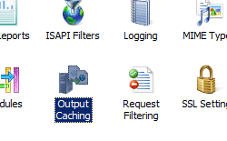
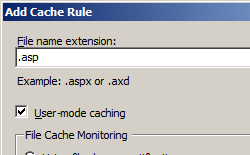

Caching Profiles &lt;profiles&gt;
====================

## Overview

The `<profiles>` element of the `<caching>` element specifies a profile to use for output caching.

## Compatibility

| Version | Notes |
| --- | --- |
| IIS 10.0 | The `<profiles>` element was not modified in IIS 10.0. |
| IIS 8.5 | The `<profiles>` element was not modified in IIS 8.5. |
| IIS 8.0 | The `<profiles>` element was not modified in IIS 8.0. |
| IIS 7.5 | The `<profiles>` element was not modified in IIS 7.5. |
| IIS 7.0 | The `<profiles>` element of the `<caching>` element was introduced in IIS 7.0. |
| IIS 6.0 | N/A |

## Setup

The `<profiles>` element of the `<caching>` element is included in the default installation of IIS 7.

## How To

### How to configure page output caching

1. Open **Internet Information Services (IIS) Manager**: 

    - If you are using Windows Server 2012 or Windows Server 2012 R2: 

        - On the taskbar, click **Server Manager**, click **Tools**, and then click **Internet Information Services (IIS) Manager**.
    - If you are using Windows 8 or Windows 8.1: 

        - Hold down the **Windows** key, press the letter **X**, and then click **Control Panel**.
        - Click **Administrative Tools**, and then double-click **Internet Information Services (IIS) Manager**.
    - If you are using Windows Server 2008 or Windows Server 2008 R2: 

        - On the taskbar, click **Start**, point to **Administrative Tools**, and then click **Internet Information Services (IIS) Manager**.
    - If you are using Windows Vista or Windows 7: 

        - On the taskbar, click **Start**, and then click **Control Panel**.
        - Double-click **Administrative Tools**, and then double-click **Internet Information Services (IIS) Manager**.
2. In the **Connections** pane, go to the connection, site, application, or directory for which you want to configure page output caching.
3. In the **Home** pane, scroll to **Output Caching**, and then double-click **Output Caching**.  
    
4. In the **Actions** pane, click **Add...**
5. In the **Add Cache Rule** dialog box, type the file name extension you want to cache in the **File name extension** box, and then select the **User-mode caching** option, the **Kernel-mode caching** option, or both.
6. Select the options that you want to use for caching, and then click **OK**.  
    

## Configuration

### Attributes

None.

### Child Elements

| Element | Description |
| --- | --- |
| [`add`](add.md) | Optional element.  Adds an output caching profile to the collection of output caching profiles. |
| `clear` | Optional element.  Removes all references to output caching profiles from the output caching profile collection. |
| `remove` | Optional element.  Removes a reference to an output caching profile from the output caching profile collection. |

### Configuration Sample

The following configuration example enables user-mode caching and kernel-mode caching, both of which are enabled by default in IIS 7.0. It also uses the `<add>` element contained by the `<profiles>` element to enable output caching for files with the .asp file name extension. It also uses the **policy** attribute to output cache the page until it changes; it does the same for kernel caching using the **kernelCachePolicy** attribute.

[!code-xml[Main](index/samples/sample1.xml)]

The following code example sets the maximum output cache size to 1 gigabyte and sets the maximum size of a response that can be stored in the output cache to 512 kilobytes.

[!code-xml[Main](index/samples/sample2.xml)]

## Sample Code

The following examples configure page output caching for files with the .asp file name extension, and configure IIS to cache in user mode and kernel mode until ASP files change.

### AppCmd.exe

[!code-console[Main](index/samples/sample3.cmd)]

> [!NOTE]
> You must be sure to set the **commit** parameter to `apphost` when you use AppCmd.exe to configure these settings. This commits the configuration settings to the appropriate location section in the ApplicationHost.config file.

### C#

[!code-csharp[Main](index/samples/sample4.cs)]

### VB.NET

[!code-vb[Main](index/samples/sample5.vb)]

### JavaScript

[!code-javascript[Main](index/samples/sample6.js)]

### VBScript

[!code-vb[Main](index/samples/sample7.vb)]