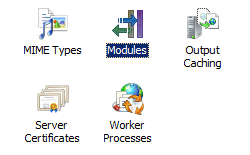
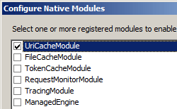

Adding Global Modules &lt;add&gt;
====================

## Overview

The `<add>` element of the `<globalModules>` collection specifies an individual global module to be added to the Web server.

## Compatibility

| Version | Notes |
| --- | --- |
| IIS 10.0 | The `<add>` element was not modified in IIS 10.0. |
| IIS 8.5 | The `<add>` element was not modified in IIS 8.5. |
| IIS 8.0 | The `<add>` element was not modified in IIS 8.0. |
| IIS 7.5 | The `<add>` element was not modified in IIS 7.5. |
| IIS 7.0 | The `<add>` element of the `<globalModules>` collection was introduced in IIS 7.0. |
| IIS 6.0 | N/A |

## Setup

The `<globalModules>` element is included in the default installation of IIS 7.

## How To

### How to install a native module

1. Open **Internet Information Services (IIS) Manager**: 

    - If you are using Windows Server 2012 or Windows Server 2012 R2: 

        - On the taskbar, click **Server Manager**, click **Tools**, and then click **Internet Information Services (IIS) Manager**.
    - If you are using Windows 8 or Windows 8.1: 

        - Hold down the **Windows** key, press the letter **X**, and then click **Control Panel**.
        - Click **Administrative Tools**, and then double-click **Internet Information Services (IIS) Manager**.
    - If you are using Windows Server 2008 or Windows Server 2008 R2: 

        - On the taskbar, click **Start**, point to **Administrative Tools**, and then click **Internet Information Services (IIS) Manager**.
    - If you are using Windows Vista or Windows 7: 

        - On the taskbar, click **Start**, and then click **Control Panel**.
        - Double-click **Administrative Tools**, and then double-click **Internet Information Services (IIS) Manager**.
2. In the **Connections** pane, click the server connection to which you want to add the native module.
3. On the server Home page, double-click **Modules**.  
    
4. In the **Actions** pane, click **Configure Native Modules...**
5. In the **Configure Native Modules** dialog box, click **Register...**  
    
6. In the **Register Native Module** dialog box, in the **Name** box, type a name for the native module.
7. In the **Path** box, type the file system path of the location of the .dll file or click the **Browse** button  
    
8. In the **Configure Native Modules** dialog box, select the option for the native module that you just registered, click **OK**, and then click **OK** again. This enables the native module to run and makes it available to sites and applications on your Web server.  
  
    > [!NOTE]
    > If you do not want to enable the native module to run, clear the option for the native module, and then click     **OK** .
9. Optionally, you can lock the native module if you do not want it to be overridden at lower levels in the configuration system. On the **Modules** page, select the module, and then click **Lock** in the **Actions** pane.

### How to enable a native module

1. Open **Internet Information Services (IIS) Manager**: 

    - If you are using Windows Server 2012 or Windows Server 2012 R2: 

        - On the taskbar, click **Server Manager**, click **Tools**, and then click **Internet Information Services (IIS) Manager**.
    - If you are using Windows 8 or Windows 8.1: 

        - Hold down the **Windows** key, press the letter **X**, and then click **Control Panel**.
        - Click **Administrative Tools**, and then double-click **Internet Information Services (IIS) Manager**.
    - If you are using Windows Server 2008 or Windows Server 2008 R2: 

        - On the taskbar, click **Start**, point to **Administrative Tools**, and then click **Internet Information Services (IIS) Manager**.
    - If you are using Windows Vista or Windows 7: 

        - On the taskbar, click **Start**, and then click **Control Panel**.
        - Double-click **Administrative Tools**, and then double-click **Internet Information Services (IIS) Manager**.
2. Navigate to the server, site, or application level that you want to manage.
3. On the server, site, or application Home page, double-click **Modules**.
4. In the **Actions** pane, click **Configure Native Modules...**
5. In the **Configure Native Modules** dialog box, select the option for the native module that you want to enable, and then click **OK**.  
    

## Configuration

Each `<add>` element in the `<globalModules>` collection must contain a **name** attribute that identifies the module, and an **image** attribute that points to the DLL that implements the module.

### Attributes

| Attribute | Description |
| --- | --- |
| `image` | Required string attribute. Specifies the physical path of the .dll file for the global module. The attribute value will be expanded when environment variables, such as %*windir*%, are used. |
| `name` | Required string attribute. Specifies the name of the global module. |
| `preCondition` | Optional string attribute. Specifies conditions under which the global module will run. The **preCondition** attribute can have one or more of the following possible values. If you specify more than one value, separate the values with a comma (,). | Value | Description | | --- | --- | | `bitness32` | Specify the **bitness32** value when the global module is a 32-bit .dll file, and IIS should load the global module only for worker processes that run in WOW64 mode (32-bit simulation) on a 64-bit operating system. | | `bitness64` | Specify the **bitness64** value when the global module is a 64-bit .dll file, and IIS should load the global module only for worker processes that run in 64-bit mode. | | `integratedMode` | Specify the **integratedMode** value when the global module should use the integrated request-processing pipeline to process requests for managed content. | | `ISAPIMode` | Specify the **ISAPIMode** value when the global module should use the ASP.NET ISAPI extension, Aspnet\_isapi.dll, to process requests for managed content. | | `runtimeVersionv1.1` | Specify the **runtimeVersionv1.1** value when the global module should load only for application pools that are configured to use .NET Framework version 1.1. | | `runtimeVersionv2.0` | Specify the **runtimeVersionv2.0** value when the global module should load only for application pools that are configured to use .NET Framework version 2.0. | |

### Child Elements

None.

### Configuration Sample

The following example shows an IIS 7 `<globalModules>` section that contains entries for all modules included in the minimal installation of the Web server. It also includes an entry for the **BasicAuthenticationModule** and another for the **ImageCopyrightModule** third-party module.

[!code-xml[Main](add/samples/sample1.xml)]

## Sample Code

The following examples install a native module named ImageCopyrightModule on IIS 7 and automatically enable it on the entire server.

### AppCmd.exe

[!code-console[Main](add/samples/sample2.cmd)]

You can also use the following syntax:

[!code-console[Main](add/samples/sample3.cmd)]

> [!NOTE]
> You must be sure to set the **commit** parameter to `apphost` when you use AppCmd.exe to configure these settings. This commits the configuration settings to the appropriate location section in the ApplicationHost.config file.

### C#

[!code-csharp[Main](add/samples/sample4.cs)]

### VB.NET

[!code-vb[Main](add/samples/sample5.vb)]

### JavaScript

[!code-javascript[Main](add/samples/sample6.js)]

### VBScript

[!code-vb[Main](add/samples/sample7.vb)]