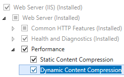
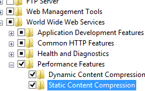
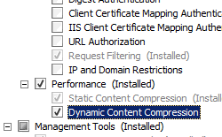
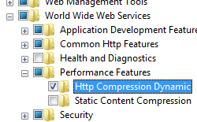

Adding Static Types &lt;add&gt;
====================

## Overview

The `<add>` element of the `<staticTypes>` element adds a unique MIME type to the list of types that IIS 7 will compress statically.

> [!NOTE]
> Unlike the IIS 6.0 **HcFileExtensions** metabase property that defined specific file name extensions as "static content," IIS 7 uses the `<staticTypes>` element to specify which MIME types IIS 7 will compress statically, and it uses mappings in the `<handlers>` element to specify which file name extensions refer to static or dynamic content.

## Compatibility

| Version | Notes |
| --- | --- |
| IIS 10.0 | The `<add>` element was not modified in IIS 10.0. |
| IIS 8.5 | The `<add>` element was not modified in IIS 8.5. |
| IIS 8.0 | The `<add>` element was not modified in IIS 8.0. |
| IIS 7.5 | The `<add>` element was not modified in IIS 7.5. |
| IIS 7.0 | The `<add>` element of the `<staticTypes>` element was introduced in IIS 7.0. |
| IIS 6.0 | The `<staticTypes>` element is somewhat analogous to the IIS 6.0 **HcFileExtensions** metabase property. |

## Setup

HTTP compression is usually available on the default installation of IIS 7 and later. However, only static compression is installed by default. To install static or dynamic compression, use the following steps.

### Windows Server 2012 or Windows Server 2012 R2

1. On the taskbar, click **Server Manager**.
2. In **Server Manager**, click the **Manage** menu, and then click **Add Roles and Features**.
3. In the **Add Roles and Features** wizard, click **Next**. Select the installation type and click **Next**. Select the destination server and click **Next**.
4. On the **Server Roles** page, expand **Web Server (IIS)**, expand **Web Server**, expand **Performance**, and then select **Static Content Compression** and/or **Dynamic Content Compression**. Click **Next**.  
     .
5. On the **Select features** page, click **Next**.
6. On the **Confirm installation selections** page, click **Install**.
7. On the **Results** page, click **Close**.

### Windows 8 or Windows 8.1

1. On the **Start** screen, move the pointer all the way to the lower left corner, right-click the **Start** button, and then click **Control Panel**.
2. In **Control Panel**, click **Programs and Features**, and then click **Turn Windows features on or off**.
3. Expand **Internet Information Services**, expand **World Wide Web Services**, expand **Performance Features**, and then select **Dynamic Content Compression** and/or **Static Content Compression**.  
    
4. Click **OK**.
5. Click **Close**.

### Windows Server 2008 or Windows Server 2008 R2

1. On the taskbar, click **Start**, point to **Administrative Tools**, and then click **Server Manager**.
2. In the **Server Manager** hierarchy pane, expand **Roles**, and then click **Web Server (IIS)**.
3. In the **Web Server (IIS)** pane, scroll to the **Role Services** section, and then click **Add Role Services**.
4. On the **Select Role Services** page of the **Add Role Services Wizard**, select **Dynamic** **Content Compression** if you want to install dynamic compression and **Static Content Compression** if you want to install static compression, and then click **Next**.  
    
5. On the **Confirm Installation Selections** page, click **Install**.
6. On the **Results** page, click **Close**.

### Windows Vista or Windows 7

1. On the taskbar, click **Start**, and then click **Control Panel**.
2. In **Control Panel**, click **Programs and Features**, and then click **Turn Windows Features on or off**.
3. Expand **Internet Information Services**, then **World Wide Web Services**, then **Performance Features**.
4. Select **Http Compression Dynamic** if you want to install dynamic compression and **Static Content Compression** if you want to install static compression.   
    
5. Click **OK**.
 

## How To

There is no user interface for setting the static content types for IIS 7. For examples of how to set the static content types programmatically, see the [Code Samples](#006) section of this document.

## Configuration

### Attributes

| Attribute | Description |
| --- | --- |
| `enabled` | Required Boolean attribute.   Specifies whether a new MIME type can use static compression.   The default value is `true`. |
| `mimeType` | Required string attribute.   Specifies the name of the MIME type, also called the content type, that uses static compression. |

### Child Elements

None.

### Configuration Sample

The following default `<httpCompression>` element is configured in the ApplicationHost.config file in IIS 7. This configuration section inherits the default configuration settings unless you use the `<clear>` element.

[!code-xml[Main](add/samples/sample1.xml)]

## Sample Code

The following code samples will add the MIME types for Office 2003 documents to the list of static compression types.  
  
 (> [!NOTE]
> Office 2007 documents use built-in compression, so they do not need to be compressed by IIS.)

### AppCmd.exe

[!code-console[Main](add/samples/sample2.cmd)]

> [!NOTE]
> You must be sure to set the **commit** parameter to `apphost` when you use AppCmd.exe to configure these settings. This commits the configuration settings to the appropriate location section in the ApplicationHost.config file.

### C\#

[!code-csharp[Main](add/samples/sample3.cs)]

### VB.NET

[!code-vb[Main](add/samples/sample4.vb)]

### JavaScript

[!code-javascript[Main](add/samples/sample5.js)]

### VBScript

[!code-vb[Main](add/samples/sample6.vb)]
