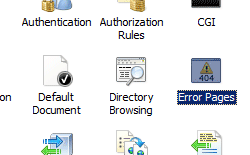
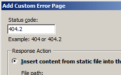

HTTP Errors &lt;httpErrors&gt;
====================

## Overview

The `<httpErrors>` element allows you to configure custom error messages for your Web site or application. Custom error messages let you provide a friendly or a more informative response by serving a file, returning another resource, or redirecting to a URL when visitors to your site cannot access the content they requested. For example, you might want to customize each of the error message pages for your Web site to have the same look and feel as the rest of your site.

The `<httpErrors>` element contains a collection of `<error>` elements, each of which defines an error message that IIS uses to respond to specific HTTP errors. You can add custom error messages to IIS by adding an `<error>` element to the `<httpErrors>` element in the Web.config file for your site, application, or URL. Each `<error>` element uses the **responseMode** attribute to specify whether IIS serves static content, dynamic content, or redirects to a separate URL in response to an error.

You can use the `<remove>` element to remove a specific error message from the collection of error messages your site or application inherits from a higher level in the IIS configuration hierarchy. Also, you can use the `<clear>` element to remove all HTTP error messages from the collection of HTTP error messages that your site or application inherits.

The `<httpErrors>` element also contains attributes that configure IIS 7 to process requests that cause errors. The **existingResponse** attribute defines what IIS 7 does to an existing response when the server returns an HTTP error status code. The **defaultPath** attribute defines the path to a customer error page if you choose specify **File** for the **responseMode** attribute in an `<error>` element.

The **detailedMoreInformationLink** attribute specifies a link to more information about a particular error.

The `<httpErrors>` element also can contain an **errorMode** attribute that you can use to control the level of detail that IIS returns to a browser when an HTTP error occurs. You can set the **errorMode** attribute to **DetailedLocalOnly**, which is the default setting, or you can set it to **Custom** or **Detailed**. If you specify **DetailedLocalOnly**, or if you do not specify an **errorMode** value, IIS returns detailed error information only to the browser on the local server and a custom error message to a browser on an external computer. If you set the **errorMode** value to **Custom**, IIS returns only custom error messages to all requesting browsers. If you set the **errorMode** value to **Detailed**, IIS returns detailed error information to all requesting browsers. The default **DetailedLocalOnly** value allows you to troubleshoot HTTP errors on the local server while not exposing sensitive information to external browsers.

By default, IIS serves error messages defined in files stored in the %*SystemRoot*%\Help\IisHelp\Common folder. You can create a custom error message for users and configure IIS to return this page whenever it encounters a specific HTTP error on your site. 

## Compatibility

| Version | Notes |
| --- | --- |
| IIS 10.0 | The `<httpErrors>` element was not modified in IIS 10.0. |
| IIS 8.5 | The `<httpErrors>` element was not modified in IIS 8.5. |
| IIS 8.0 | The `<httpErrors>` element was not modified in IIS 8.0. |
| IIS 7.5 | The `allowAbsolutePathsWhenDelegated` attribute was added to the `<httpErrors>` element in IIS 7.5 |
| IIS 7.0 | The `<httpErrors>` element was introduced in IIS 7.0. |
| IIS 6.0 | The `<httpErrors>` element replaces the IIS 6.0 **HttpErrors** property of the **IIsWebService** metabase object. |

## Setup

The `<httpErrors>` element is included in the default installation of IIS 7.

## How To

### How to add a custom error page

1. Open **Internet Information Services (IIS) Manager**: 

    - If you are using Windows Server 2012 or Windows Server 2012 R2: 

        - On the taskbar, click **Server Manager**, click **Tools**, and then click **Internet Information Services (IIS) Manager**.
    - If you are using Windows 8 or Windows 8.1: 

        - Hold down the **Windows** key, press the letter **X**, and then click **Control Panel**.
        - Click **Administrative Tools**, and then double-click **Internet Information Services (IIS) Manager**.
    - If you are using Windows Server 2008 or Windows Server 2008 R2: 

        - On the taskbar, click **Start**, point to **Administrative Tools**, and then click **Internet Information Services (IIS) Manager**.
    - If you are using Windows Vista or Windows 7: 

        - On the taskbar, click **Start**, and then click **Control Panel**.
        - Double-click **Administrative Tools**, and then double-click **Internet Information Services (IIS) Manager**.
2. In the **Connections** pane, expand the server name, expand **Sites**, and then navigate to the Web site or application that you want to configure custom error pages for.
3. In the **Home** pane, double-click **Error Pages**.  
    
4. In the **Actions** pane, click **Add...**
5. In the **Add Custom Error Page** dialog box, under **Status code**, type the number of the HTTP status code for which you want to create a custom error message.  
    
6. In the **Response Action** section, do one of the following:

    - Select **Insert content from static file into the error response** to serve static content, for example, an .html file, for the custom error.
    - Select **Execute a URL on this site** to serve dynamic content, for example, an .asp file for the custom error.
    - Select **Respond with a 302 redirect** to redirect client browsers to a different URL that contains the custom error file.
7. In the **File path** text box, type the path of the custom error page if you chose **Insert content from static file into the error response** or the URL of the custom error page if you use either the **Execute a URL on this site** or **Respond with a 302 redirect**, and then click **OK**.  
  
    > [!NOTE]
    > If you select **Execute a URL on this site**, the path must be a relative path. If you select **Respond with a 302 redirect**, the URL must be an absolute URL.

## Configuration

You can configure the `<httpErrors>` element at the server level in the ApplicationHost.config file and at the site and application level in the appropriate Web.config file.

### Attributes

| Attribute | Description |
| --- | --- |
| `allowAbsolutePathsWhenDelegated` | Optional Boolean attribute.  When set to **true**, absolute paths are allowed for custom error pages when the `<httpErrors>` section is delegated. When set to **false**, only paths that are relative to the site root are allowed.  The default value is `false`. |
| `defaultPath` | Optional string attribute.  Specifies the default path of the custom error page. The type of path is determined by the **defaultResponseMode** attribute. If you choose **File**, the file path is returned. If you choose either the **ExecuteURL** or **Redirect** path type, the URL of the custom error page is returned. |
| `defaultResponseMode` | Optional enum attribute.  Specifies how custom error content is returned.  The **defaultResponseMode** attribute can be one of the following possible values; the default is `File`. <table> <tbody> <tr> <th>Value</th> <th>Description</th></tr> <tr> <th><code>File</code></th> <td>Serves static content, for example, a .html file for the custom error. If <strong>responseMode</strong> is set to <strong>File</strong>, the path value has to be a file path.  The numeric value is <code>0</code>.</td></tr> <tr> <th><code>ExecuteURL</code></th> <td>Serves dynamic content, for example, a .asp file for the custom error. If <strong>responseMode</strong> is set to <strong>ExecuteURL</strong>, the path value has to be a server relative URL.  The numeric value is <code>1</code>.</td></tr> <tr> <th><code>Redirect</code></th> <td>Redirects client browsers to a different URL that contains the custom error file. If <strong>responseMode</strong> is set to <strong>Redirect</strong>, the path value has to be an absolute URL.  The numeric value is <code>2</code>.</td></tr></tbody></table> |
| `detailedMoreInformationLink` | Optional string attribute.  Specifies a link, shown at the bottom of the page, to a page with more detailed information about a particular error. You can use this property to point end users to a custom location for error information. The status, sub-status, HRESULT and message ID are sent as part of the query string.   The default value is [`https://go.microsoft.com/fwlink/?LinkID=62293`](https://go.microsoft.com/fwlink/?LinkID=62293). |
| `errorMode` | Optional enum attribute.  Specifies whether HTTP errors are enabled.  The **errorMode** attribute can be one of the following values; the default is `DetailedLocalOnly`. <table> <tbody> <tr> <th>Value</th> <th>Description</th></tr> <tr> <th><code>DetailedLocalOnly</code></th> <td>Returns detailed error information if the request is from the local computer, and returns a custom error message if the request is from an external computer.  The numeric value is <code>0</code>.</td></tr> <tr> <th><code>Custom</code></th> <td>Replaces the error that the module or server generates with a custom page that you specify. This mode is useful in providing friendlier error messages to end users.  <strong>Note</strong>: This setting turns off detailed errors, even for local requests.  The numeric value is <code>1</code>.</td></tr> <tr> <th><code>Detailed</code></th> <td>Sends detailed error information back to the client. This mode is useful for testing and debugging Web sites and applications.  The numeric value is <code>2</code>.</td></tr></tbody></table> |
| `existingResponse` | Optional enum attribute.  Specifies what happens to an existing response when the HTTP status code is an error, i.e. response codes &gt;= 400.  The **existingResponse** attribute can be one of the following values; the default is `Auto`. <table> <tbody> <tr> <th>Value</th> <th>Description</th></tr> <tr> <th><code>Auto</code></th> <td>Leaves the response untouched only if the <strong>SetStatus</strong> flag is set.  The numeric value is <code>0</code>.</td></tr> <tr> <th><code>Replace</code></th> <td>Replaces the existing response even if the <strong>SetStatus</strong> flag is set.  The numeric value is <code>1</code>.</td></tr> <tr> <th><code>PassThrough</code></th> <td>Leaves the response untouched if an existing response exists.  The numeric value is <code>2</code>.</td></tr></tbody></table> |

### Child Elements

| Element | Description |
| --- | --- |
| [`error`](error.md) | Optional element.  Adds an HTTP error to the collection of HTTP errors. |
| `remove` | Optional element.   Removes a reference to an HTTP error from the HTTP error collection. |
| `clear` | Optional element.  Removes all references to HTTP errors from the HTTP error collection. |

### Configuration Sample

The following configuration example, when included in the Web.config file for a Web site or application, uses the **errorMode** attribute to only allow detailed error messages to appear on the local computer. It also uses the **defaultResponseMode** attribute to set the response mode for the site or application. The sample then removes the inherited error message for the 500 status code. Next, it sets the **prefixLanguageFilePath** attribute to the directory where IIS should search of a new custom error page, and sets the **path** attribute to 500.htm, the file that contains the custom error message.

[!code-xml[Main](index/samples/sample1.xml)]

## Sample Code

The following examples adds a new file for all status code 404 errors with a substatus of 5, which IIS returns for &quot;URL Sequence Denied&quot; errors. In these examples, the prefix path is set to &quot;%SystemDrive%\inetpub\custerr&quot;, and the file name is specified as &quot;404.5.htm&quot;.

### AppCmd.exe

[!code-console[Main](index/samples/sample2.cmd)]

> [!NOTE]
> You must be sure to set the **commit** parameter to `apphost` when you use AppCmd.exe to configure these settings. This commits the configuration settings to the appropriate location section in the ApplicationHost.config file.

### C\#

[!code-csharp[Main](index/samples/sample3.cs)]

### VB.NET

[!code-vb[Main](index/samples/sample4.vb)]

### JavaScript

[!code-javascript[Main](index/samples/sample5.js)]

### VBScript

[!code-vb[Main](index/samples/sample6.vb)]
