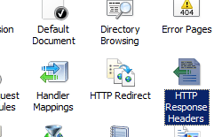
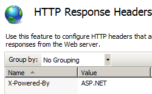
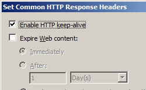

HTTP Protocol Settings &lt;httpProtocol&gt;
====================

## Overview

The `<httpProtocol>` element configures HTTP keep-alive connections as well as both custom and redirect response headers that Internet Information Services (IIS) 7 sends to Web clients.

A browser typically makes multiple requests in order to download an entire Web page. To enhance server performance, most Web browsers request that the server keep the connection open across these multiple requests, which is a feature known as HTTP keep-alives. Without HTTP keep-alives, a browser that makes many requests for a page containing multiple elements, such as graphics, might require a separate connection for each element. These additional requests and connections require extra server activity and resources, decreasing server efficiency. The additional connections also make a browser much slower and less responsive, especially across a slow connection.

## Compatibility

| Version | Notes |
| --- | --- |
| IIS 10.0 | The `<httpProtocol>` element was not modified in IIS 10.0. |
| IIS 8.5 | The `<httpProtocol>` element was not modified in IIS 8.5. |
| IIS 8.0 | The `<httpProtocol>` element was not modified in IIS 8.0. |
| IIS 7.5 | The `<httpProtocol>` element was not modified in IIS 7.5. |
| IIS 7.0 | The `<httpProtocol>` element was introduced in IIS 7.0. |
| IIS 6.0 | The **allowKeepAlive** attribute of the `<httpProtocol>` element replaces the IIS 6.0 **AllowKeepAlive** metabase property. |

## Setup

The `<httpProtocol>` element is included in the default installation of IIS 7.

## How To

### How to enable HTTP keep-alives for a Web site or application

1. Open **Internet Information Services (IIS) Manager**: 

    - If you are using Windows Server 2012 or Windows Server 2012 R2: 

        - On the taskbar, click **Server Manager**, click **Tools**, and then click **Internet Information Services (IIS) Manager**.
    - If you are using Windows 8 or Windows 8.1: 

        - Hold down the **Windows** key, press the letter **X**, and then click **Control Panel**.
        - Click **Administrative Tools**, and then double-click **Internet Information Services (IIS) Manager**.
    - If you are using Windows Server 2008 or Windows Server 2008 R2: 

        - On the taskbar, click **Start**, point to **Administrative Tools**, and then click **Internet Information Services (IIS) Manager**.
    - If you are using Windows Vista or Windows 7: 

        - On the taskbar, click **Start**, and then click **Control Panel**.
        - Double-click **Administrative Tools**, and then double-click **Internet Information Services (IIS) Manager**.
2. In the **Connections** pane, go to the site, application, or directory for which you want to enable HTTP keep-alives.
3. In the **Home** pane, double-click **HTTP Response Headers**.  
    
4. In the **HTTP Response Headers** pane, click **Set Common Headers...** in the **Actions** pane.  
    
5. In the **Set Common HTTP Response Headers** dialog box, check the box to enable HTTP keep-alives, and then click **OK**.  
    

## Configuration

### Attributes

| Attribute | Description |
| --- | --- |
| `allowKeepAlive` | Optional Boolean attribute. Specifies whether keep-alive processing is permitted (**true**) or not (**false**). The default value is `true`. |

### Child Elements

| Element | Description |
| --- | --- |
| [`customHeaders`](../system.webserver/httpprotocol/customheaders.md) | Configures custom response headers that are returned in responses from the Web server. |
| [`redirectHeaders`](../system.webserver/httpprotocol/redirectheaders.md) | Configures response headers that are returned in responses only when the Web server redirects requests. |

### Configuration Sample

The following code samples enable HTTP keep-alives for the Default Web Site.

[!code-xml[Main](index/samples/sample1.xml)]

> [!NOTE]
> The following default `<httpProtocol>` element is configured in the ApplicationHost.config file in IIS 7.

[!code-xml[Main](index/samples/sample2.xml)]

## Sample Code

The following code samples enable HTTP keep-alives for the Default Web Site.

### AppCmd.exe

[!code-console[Main](index/samples/sample3.cmd)]

### C#

[!code-csharp[Main](index/samples/sample4.cs)]

### VB.NET

[!code-vb[Main](index/samples/sample5.vb)]

### JavaScript

[!code-javascript[Main](index/samples/sample6.js)]

### VBScript

[!code-vb[Main](index/samples/sample7.vb)]