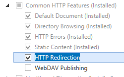
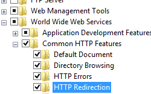
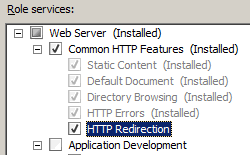
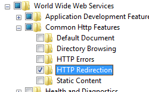
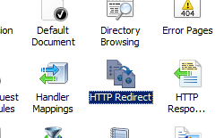
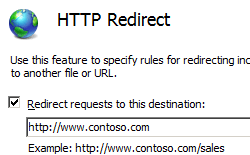

HTTP Redirects &lt;httpRedirect&gt;
====================

## Overview

The `<httpRedirect>` element configures settings for Internet Information Services (IIS) 7 that redirect client requests to a new location.

There are several reasons why you might want to redirect clients to a new location. For example, if your company is migrating to a new Web site, you could redirect all requests from the old Web site to the new Web site. Likewise, if you have deployed a new application on a Web server, you could redirect all requests for the old application's URL namespace (for example, http://www.contoso.com/app\_v1.0/) to the new applications location (for example, http://www.contoso.com/app\_v2.0/).

In the simplest configuration, you need only set the **enabled** and **destination** attributes of the `<httpRedirect>` element in order to redirect clients to a new location. However, additional elements like the **exactDestination** and **httpResponseStatus** attributes allow you to configure the end-user experience of the redirection by respectively specifying whether IIS 7 will return the destination URL exactly as entered and which HTTP response code to return to the Web client.

## Compatibility

| Version | Notes |
| --- | --- |
| IIS 10.0 | An additional HTTP response status was added to the `<httpRedirect>` element in IIS 10.0. |
| IIS 8.5 | The `<httpRedirect>` element was not modified in IIS 8.5. |
| IIS 8.0 | The `<httpRedirect>` element was not modified in IIS 8.0. |
| IIS 7.5 | The `<httpRedirect>` element was not modified in IIS 7.5. |
| IIS 7.0 | The `<httpRedirect>` element was introduced in IIS 7.0. |
| IIS 6.0 | The `<httpRedirect>` element replaces the IIS 6.0 **HttpRedirect** metabase property. |

## Setup

HTTP Redirection is not available on the default installation of IIS 7 and later. To install it, use the following steps.

### Windows Server 2012 or Windows Server 2012 R2

1. On the taskbar, click **Server Manager**.
2. In **Server Manager**, click the **Manage** menu, and then click **Add Roles and Features**.
3. In the **Add Roles and Features** wizard, click **Next**. Select the installation type and click **Next**. Select the destination server and click **Next**.
4. On the **Server Roles** page, expand **Web Server (IIS)**, expand **Web Server**, expand **Common HTTP Features**, and then select **HTTP Redirection**. Click **Next**.  
     .
5. On the **Select features** page, click **Next**.
6. On the **Confirm installation selections** page, click **Install**.
7. On the **Results** page, click **Close**.

### Windows 8 or Windows 8.1

1. On the **Start** screen, move the pointer all the way to the lower left corner, right-click the **Start** button, and then click **Control Panel**.
2. In **Control Panel**, click **Programs and Features**, and then click **Turn Windows features on or off**.
3. Expand **Internet Information Services**, expand **World Wide Web Services**, expand **Common HTTP Features**, and then select **HTTP Redirection**.  
    
4. Click **OK**.
5. Click **Close**.

### Windows Server 2008 or Windows Server 2008 R2

1. On the taskbar, click **Start**, point to **Administrative Tools**, and then click **Server Manager**.
2. In the **Server Manager** hierarchy pane, expand **Roles**, and then click **Web Server (IIS)**.
3. In the **Web Server (IIS)** pane, scroll to the **Role Services** section, and then click **Add Role Services**.
4. On the **Select Role Services** page of the **Add Role Services Wizard**, expand **Common Http Features**, select **HTTP Redirection**, and then click **Next**.  
    
5. On the **Confirm Installation Selections** page, click **Install**.
6. On the **Results** page, click **Close**.

### Windows Vista or Windows 7

1. On the taskbar, click **Start**, and then click **Control Panel**.
2. In **Control Panel**, click **Programs and Features**, and then click **Turn Windows Features on or off**.
3. Expand **Internet Information Services**, then **World Wide Web Services**, then **Common Http Features**.
4. Select **HTTP Redirection**, and then click **OK**.  
    
 

## How To

There is no user interface for adding wildcard HTTP redirects for IIS 7. For examples of how to add `<add>` elements to the `<httpRedirect>` element programmatically, see the [Code Samples](#006) section of this document.

### How to add an HTTP redirect rule to a Web site or application

1. Open **Internet Information Services (IIS) Manager**: 

    - If you are using Windows Server 2012 or Windows Server 2012 R2: 

        - On the taskbar, click **Server Manager**, click **Tools**, and then click **Internet Information Services (IIS) Manager**.
    - If you are using Windows 8 or Windows 8.1: 

        - Hold down the **Windows** key, press the letter **X**, and then click **Control Panel**.
        - Click **Administrative Tools**, and then double-click **Internet Information Services (IIS) Manager**.
    - If you are using Windows Server 2008 or Windows Server 2008 R2: 

        - On the taskbar, click **Start**, point to **Administrative Tools**, and then click **Internet Information Services (IIS) Manager**.
    - If you are using Windows Vista or Windows 7: 

        - On the taskbar, click **Start**, and then click **Control Panel**.
        - Double-click **Administrative Tools**, and then double-click **Internet Information Services (IIS) Manager**.
2. In the **Connections** pane, expand the server name, expand **Sites**, and then navigate to the Web site or application that you want to configure custom error pages for.
3. In the **Home** pane, double-click **HTTP Redirect**.  
    
4. In the **HTTP Redirect** pane, check the box to redirect requests and enter the destination URL.  
    
5. You can optionally specify any of the following options: 

    - Configure the redirection destination to be the exact destination as entered.
    - Configure the redirection destination to be limited to the destination URL's root folder, not subfolders.
    - Configure the HTTP status code, which can be one of these three options: 

        - **301 Permanent**
        - **302 Found**
        - **307 Temporary**
        - **308 Permanent Redirect**

        > [!NOTE]
        > IIS 7 will respectively return the following actual HTTP response statuses for each of the above options: 

        - **HTTP/1.1 301 Moved Permanently**
        - **HTTP/1.1 302 Redirect**
        - **HTTP/1.1 307 Redirect**
        - **HTTP 1.1 308 Redirected Permanently**
6. When you have finished all the above changes, click **Apply** in the **Tasks** pane.

## Configuration

### Attributes

| Attribute | Description |
| --- | --- |
| `childOnly` | Optional Boolean attribute. Specifies whether the destination value should be added to the beginning of the file name that contains the request to be redirected. For example, if **childOnly** were set to true and the destination value were configured to be http://marking.contoso.com/, a request for http://contoso.com/default.htm would be redirected to http://marketing.contoso.com/default.htm. The default value is `false`. |
| `destination` | Optional string attribute. Specifies a URL or virtual path to which to redirect the client. |
| `enabled` | Optional Boolean attribute. Specifies whether redirection is enabled (**true**) or disabled (**false**). The default value is `false`. |
| `exactDestination` | Optional Boolean attribute. Specifies that the destination value should be considered an absolute target location, not a relative location. The default value is `false`. |
| `httpResponseStatus` | Optional enum attribute. Specifies type of redirection. The **httpResponseStatus** attribute can be one of the following possible values. The default is `Found`. | Value | Description | | --- | --- | | `Found` | Returns a 302 status code, which tells the client to issue a new request to the location specified in the destination attribute. The numeric value is `302`. | | `Permanent` | Returns a 301 status code, which informs the client that the location for the requested resource has permanently changed. The numeric value is `301`. | | `Temporary` | Returns a 307 status code, which prevents the client from losing data when the browser issues an HTTP POST request. The numeric value is `307`. | | `PermRedirect` | Returns a 308 status code, which informs the client that the location for the requested resource has permanently changed. The numeric value is `308`. | |

### Child Elements

| Element | Description |
| --- | --- |
| [`add`](add.md) | Optional element. Adds a wildcard redirection rule to the collection of redirection rules. |
| `clear` | Optional element. Removes all references to wildcard redirection rules from the collection of redirection rules. |
| `remove` | Optional element. Removes a reference to a wildcard redirection rule from the collection of redirection rules. |

### Configuration Sample

The following default `<httpRedirect>` element is configured in the root ApplicationHost.config file in IIS 7 when the HTTP Redirection role service is installed. This configuration section inherits the default configuration settings unless you use the `<clear>` element.

[!code-xml[Main](index/samples/sample1.xml)]

The following configuration sample enables redirection and configures the destination URL to which clients are redirected.

[!code-xml[Main](index/samples/sample2.xml)]

The following configuration sample adds a wildcard redirection entry that redirects all requests for ASP files to the home page of your Web site. > [!NOTE]
 > This example is useful if you have removed all ASP-based applications from your Web site and you wanted client requests for the old applications to be redirected to the root of your Web site rather than receiving an **HTTP 404 Not Found** response.

[!code-xml[Main](index/samples/sample3.xml)]

## Sample Code

The following code samples configure the Default Web Site to redirect all requests to "http://www.contoso.com" using an HTTP 302 status code.

### AppCmd.exe

[!code-console[Main](index/samples/sample4.cmd)]

### C#

[!code-csharp[Main](index/samples/sample5.cs)]

### VB.NET

[!code-vb[Main](index/samples/sample6.vb)]

### JavaScript

[!code-javascript[Main](index/samples/sample7.js)]

### VBScript

[!code-vb[Main](index/samples/sample8.vb)]

The following code samples adds a wildcard redirection entry that redirects all requests for ASP files to the home page of your Web site. > [!NOTE]
 > This example is useful if you have removed all ASP-based applications from your Web site and you wanted client requests for the old applications to be redirected to the root of your Web site rather than receiving an **HTTP 404 Not Found** response.

### AppCmd.exe

[!code-console[Main](index/samples/sample9.cmd)]

### C#

[!code-csharp[Main](index/samples/sample10.cs)]

### VB.NET

[!code-vb[Main](index/samples/sample11.vb)]

### JavaScript

[!code-javascript[Main](index/samples/sample12.js)]

### VBScript

[!code-vb[Main](index/samples/sample13.vb)]