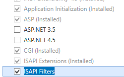
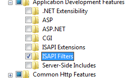

Filter &lt;filter&gt;
====================

## Overview

The `<filter>` element of the `<isapiFilters>` collection configures an ISAPI filter to process client request data or server response data.

## Compatibility

| Version | Notes |
| --- | --- |
| IIS 10.0 | The `<filter>` element was not modified in IIS 10.0. |
| IIS 8.5 | The `<filter>` element was not modified in IIS 8.5. |
| IIS 8.0 | The `<filter>` element was not modified in IIS 8.0. |
| IIS 7.5 | The `<filter>` element was not modified in IIS 7.5. |
| IIS 7.0 | The `<filter>` element of the `<isapiFilters>` collection was introduced in IIS 7.0. |
| IIS 6.0 | The `<isapiFilters>` collection replaces the IIS 6.0 **FilterEnableCache** and **FilterPath** metabase properties. |

## Setup

To use the `<isapiFilters>` element, you must install the ISAPI Filters module on your IIS 7 and later server. To do so, use the following steps.

### Windows Server 2012 or Windows Server 2012 R2

1. On the taskbar, click **Server Manager**.
2. In **Server Manager**, click the **Manage** menu, and then click **Add Roles and Features**.
3. In the **Add Roles and Features** wizard, click **Next**. Select the installation type and click **Next**. Select the destination server and click **Next**.
4. On the **Server Roles** page, expand **Web Server (IIS)**, expand **Web Server**, expand **Application Development**, and then select **ISAPI Filters**. Click **Next**.  
     .
5. On the **Select features** page, click **Next**.
6. On the **Confirm installation selections** page, click **Install**.
7. On the **Results** page, click **Close**.

### Windows 8 or Windows 8.1

1. On the **Start** screen, move the pointer all the way to the lower left corner, right-click the **Start** button, and then click **Control Panel**.
2. In **Control Panel**, click **Programs and Features**, and then click **Turn Windows features on or off**.
3. Expand **Internet Information Services**, expand **World Wide Web Services**, expand **Application Development Features**, and then select **ISAPI Filters**.  
    
4. Click **OK**.
5. Click **Close**.

### Windows Server 2008 or Windows Server 2008 R2

1. On the taskbar, click **Start**, point to **Administrative Tools**, and then click **Server Manager**.
2. In the **Server Manager** hierarchy pane, expand **Roles**, and then click **Web Server (IIS)**.
3. In the **Web Server (IIS)** pane, scroll to the **Role Services** section, and then click **Add Role Services**.
4. On the **Select Role Services** page of the **Add Role Services Wizard**, select **ISAPI Filters**, and then click **Next**.  
    
5. On the **Confirm Installation Selections** page, click **Install**.
6. On the **Results** page, click **Close**.

### Windows Vista or Windows 7

1. On the taskbar, click **Start**, and then click **Control Panel**.
2. In **Control Panel**, click **Programs and Features**, and then click **Turn Windows Features on or off**.
3. In the **Windows Features** dialog box, expand **Internet Information Services**, then **World Wide Web Services**, then **Application Development Features**.  
    
4. Select **ISAPI Filters**, and then click **OK**.
 

## How To

### How to add an ISAPI filter

1. Open **Internet Information Services (IIS) Manager**: 

    - If you are using Windows Server 2012 or Windows Server 2012 R2: 

        - On the taskbar, click **Server Manager**, click **Tools**, and then click **Internet Information Services (IIS) Manager**.
    - If you are using Windows 8 or Windows 8.1: 

        - Hold down the **Windows** key, press the letter **X**, and then click **Control Panel**.
        - Click **Administrative Tools**, and then double-click **Internet Information Services (IIS) Manager**.
    - If you are using Windows Server 2008 or Windows Server 2008 R2: 

        - On the taskbar, click **Start**, point to **Administrative Tools**, and then click **Internet Information Services (IIS) Manager**.
    - If you are using Windows Vista or Windows 7: 

        - On the taskbar, click **Start**, and then click **Control Panel**.
        - Double-click **Administrative Tools**, and then double-click **Internet Information Services (IIS) Manager**.
2. In the **Connections** pane, go to the connection or site for which you want to configure ISAPI filters.
3. In the **Home** pane, double-click **ISAPI Filters**.  
    
4. In the **Actions** pane, click **Add...**
5. In the **Filter name** text box of the **Add ISAPI Filter** dialog box, type a friendly name for the ISAPI filter.
6. In the **Executable** box, type the file system path of the location of ISAPI filter file or click the ellipsis (**...**) to navigate to the folder that contains the ISAPI filter file, and then click **OK**.  
    
 

## Configuration

### Attributes

| Attribute | Description |
| --- | --- |
| `enableCache` | Optional Boolean attribute.  Specifies whether HTTP.sys caching is enabled (**true**) or disabled (**false**) for filtered server responses.  The default value is `false`. |
| `enabled` | Optional Boolean attribute.  Specifies whether the installed filter is enabled (**true**) or disabled (**false**).  The default value is `true`. |
| `name` | Required string attribute.  Specifies the unique name of the ISAPI filter. |
| `path` | Required string attribute.  Specifies the full physical path of the ISAPI filter .dll file. |
| `preCondition` | Optional string attribute.  Specifies conditions under which the ISAPI filter will run.  The preCondition attribute can be one or more of the following possible values. If you specify more than one value, separate the values with a comma (,). <table> <tbody> <tr> <th>Value</th> <th>Description</th></tr> <tr> <th><code>bitness32</code></th> <td>Specify the <strong>bitness32</strong> value when the ISAPI filter is a 32-bit .dll file and IIS should load the filter only for worker processes that run in WOW64 mode (32-bit simulation) on a 64-bit operating system.</td></tr> <tr> <th><code>bitness64</code></th> <td>Specify the <strong>bitness64</strong> value when the ISAPI filter is a 64-bit .dll file and IIS should load the filter only for worker processes that run in 64-bit mode.</td></tr> <tr> <th><code>integratedMode</code></th> <td>Specify the <strong>integratedMode</strong> value when the ISAPI filter should use the integrated request-processing pipeline to process requests for managed content.</td></tr> <tr> <th><code>ISAPIMode</code></th> <td>Specify the <strong>ISAPIMode</strong> value when the ISAPI filter should use the ASP.NET ISAPI extension, Aspnet_isapi.dll, to process requests for managed content.</td></tr> <tr> <th><code>runtimeVersionv1.1</code></th> <td>Specify the <strong>runtimeVersionv1.1</strong> value when the ISAPI filter should load only for application pools that are configured to use .NET Framework version 1.1.</td></tr> <tr> <th><code>runtimeVersionv2.0</code></th> <td>Specify the <strong>runtimeVersionv2.0</strong> value when the ISAPI filter should load only for application pools that are configured to use .NET Framework version 2.0.</td></tr></tbody></table> |

### Child Elements

None.

### Configuration Sample

The following configuration example adds an ISAPI filter named SalesQueryIsapi to a Web site or application. The sample names and enables the ISAPI filter with the **name** and **enabled** attributes. It also uses the **enableCache** attribute to disable HTTP.sys caching and the **path** attribute to specify the location of the ISAPI DLL.

[!code-xml[Main](filter/samples/sample1.xml)]
 

## Sample Code

The following examples configure an ISAPI filter named SalesQueryIsapi on the server. Each of the examples use the **name** property to specify a name for the ISAPI filter, the **enableCache** property to disable HTTP.sys caching, and the **path** property to specify the location of the ISAPI DLL.

### AppCmd.exe

[!code-console[Main](filter/samples/sample2.cmd)]

> [!NOTE]
> You must be sure to set the **commit** parameter to `apphost` when you use AppCmd.exe to configure these settings. This commits the configuration settings to the appropriate location section in the ApplicationHost.config file.

### C\#

[!code-csharp[Main](filter/samples/sample3.cs)]

### VB.NET

[!code-vb[Main](filter/samples/sample4.vb)]

### JavaScript

[!code-javascript[Main](filter/samples/sample5.js)]

### VBScript

[!code-vb[Main](filter/samples/sample6.vb)]
