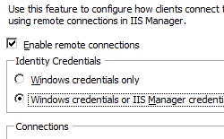
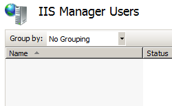
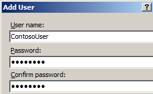

Management Authentication &lt;authentication&gt;
====================

## Overview

The `<authentication>` element of the `<management>` element specifies authentication credentials for IIS Manager user accounts. IIS Manager users can use IIS Manager to connect to sites and applications for which they are authorized by a server administrator.

When you use the default *ConfigurationAuthenticationProvider* as your authentication provider and you enable IIS Manager authentication, the `<credentials>` child element may contain a series of `<add>` elements that define the user names and passwords for your IIS Manager user accounts. These IIS Manager user accounts are not Windows accounts, so they are limited to configuring only the sites and settings that a server administrator makes available to them.

## Compatibility

| Version | Notes |
| --- | --- |
| IIS 10.0 | The `<authentication>` element was not modified in IIS 10.0. |
| IIS 8.5 | The `<authentication>` element was not modified in IIS 8.5. |
| IIS 8.0 | The `<authentication>` element was not modified in IIS 8.0. |
| IIS 7.5 | The `<authentication>` element was not modified in IIS 7.5. |
| IIS 7.0 | The `<authentication>` element of the `<management>` element was introduced in IIS 7.0. |
| IIS 6.0 | N/A |

## Setup

The default installation of IIS 7 and later does not include the **Management Service** role service. To install this role service, use the following steps.

### Windows Server 2012 or Windows Server 2012 R2

1. On the taskbar, click **Server Manager**.
2. In **Server Manager**, click the **Manage** menu, and then click **Add Roles and Features**.
3. In the **Add Roles and Features** wizard, click **Next**. Select the installation type and click **Next**. Select the destination server and click **Next**.
4. On the **Server Roles** page, expand **Web Server (IIS)**, expand **Management Tools**, and then select **Management Service**. Click **Next**.  
     .
5. On the **Select features** page, click **Next**.
6. On the **Confirm installation selections** page, click **Install**.
7. On the **Results** page, click **Close**.

### Windows 8 or Windows 8.1

1. On the **Start** screen, move the pointer all the way to the lower left corner, right-click the **Start** button, and then click **Control Panel**.
2. In **Control Panel**, click **Programs and Features**, and then click **Turn Windows features on or off**.
3. Expand **Internet Information Services**, expand **Web Management Tools**, and then select **IIS Management Service**.  
    
4. Click **OK**.
5. Click **Close**.

### Windows Server 2008 or Windows Server 2008 R2

1. On the taskbar, click **Start**, point to **Administrative Tools**, and then click **Server Manager**.
2. In the **Server Manager** hierarchy pane, expand **Roles**, and then click **Web Server (IIS)**.
3. In the **Web Server (IIS)** pane, scroll to the **Role Services** section, and then click **Add Role Services**.
4. On the **Select Role Services** page of the **Add Role Services Wizard**, select **Management Service**, and then click **Next**.  
    
5. On the **Confirm Installation Selections** page, click **Install**.
6. On the **Results** page, click **Close**.

### Windows Vista or Windows 7

1. On the taskbar, click **Start**, and then click **Control Panel**.
2. In **Control Panel**, click **Programs and Features**, and then click **Turn Windows Features on or off**.
3. Expand **Internet Information Services**, then **Web Management Tool**.
4. Select **IIS Management Service**, and then click **OK**.   
    
 

## How To

### How to enable IIS Manager credentials for a server

1. Open **Internet Information Services (IIS) Manager**: 

    - If you are using Windows Server 2012 or Windows Server 2012 R2: 

        - On the taskbar, click **Server Manager**, click **Tools**, and then click **Internet Information Services (IIS) Manager**.
    - If you are using Windows 8 or Windows 8.1: 

        - Hold down the **Windows** key, press the letter **X**, and then click **Control Panel**.
        - Click **Administrative Tools**, and then double-click **Internet Information Services (IIS) Manager**.
    - If you are using Windows Server 2008 or Windows Server 2008 R2: 

        - On the taskbar, click **Start**, point to **Administrative Tools**, and then click **Internet Information Services (IIS) Manager**.
    - If you are using Windows Vista or Windows 7: 

        - On the taskbar, click **Start**, and then click **Control Panel**.
        - Double-click **Administrative Tools**, and then double-click **Internet Information Services (IIS) Manager**.
2. In the **Connections** pane, click the server name.
3. In the server's **Home** pane, double-click **Management Service**.  
    
4. On the **Management Service** page, choose **Windows credentials or IIS Manager credentials**, then click **Apply** in the **Actions** pane.  
    

### How to add IIS Manager user credentials to a server

1. Open **Internet Information Services (IIS) Manager**: 

    - If you are using Windows Server 2012 or Windows Server 2012 R2: 

        - On the taskbar, click **Server Manager**, click **Tools**, and then click **Internet Information Services (IIS) Manager**.
    - If you are using Windows 8 or Windows 8.1: 

        - Hold down the **Windows** key, press the letter **X**, and then click **Control Panel**.
        - Click **Administrative Tools**, and then double-click **Internet Information Services (IIS) Manager**.
    - If you are using Windows Server 2008 or Windows Server 2008 R2: 

        - On the taskbar, click **Start**, point to **Administrative Tools**, and then click **Internet Information Services (IIS) Manager**.
    - If you are using Windows Vista or Windows 7: 

        - On the taskbar, click **Start**, and then click **Control Panel**.
        - Double-click **Administrative Tools**, and then double-click **Internet Information Services (IIS) Manager**.
2. In the **Connections** pane, click the server name.
3. In the server's **Home** pane, double-click **IIS Manager Users**.  
    
4. On the **IIS Manager Users** page, click **Add User...** in the **Actions** pane.  
    
5. In the **Add User** dialog box, enter the user name and password, and then click **OK**.  
    

## Configuration

### Attributes

| Attribute | Description |
| --- | --- |
| `defaultProvider` | Optional string attribute. Specifies the default provider that provides authentication for IIS Manager users on the Web server. If you change the default provider, you must restart the Management Service (WMSVC) for changes to take effect. If you have IIS Manager open, you must also reopen IIS Manager. |

### Child Elements

| Element | Description |
| --- | --- |
| [`credentials`](credentials/index.md) | Optional element. Configures IIS Manager user credentials for users to connect to sites and applications on the server by using IIS Manager. |
| [`providers`](providers/index.md) | Optional element. Configures authentication providers that authenticate IIS Manager users who connect remotely to sites and applications by using IIS Manager. |

### Configuration Sample

The following configuration sample shows how to add an IIS Manager user named ContosoUser to Administration.config.

[!code-xml[Main](index/samples/sample1.xml)]

The following default `<providers>` element under the `<authentication>` element is configured in the Administration.config file in IIS 7 when the Management Service role service is installed.

[!code-xml[Main](index/samples/sample2.xml)]

## Sample Code

The following code samples add an IIS Manager user account named ContosoUser to IIS 7.

### AppCmd.exe

> [!NOTE]
> You cannot configure `<system.webServer/management/authentication>` settings using AppCmd.exe.

### C#

[!code-csharp[Main](index/samples/sample3.cs)]

### VB.NET

[!code-vb[Main](index/samples/sample4.vb)]

### JavaScript

[!code-javascript[Main](index/samples/sample5.js)]

### VBScript

[!code-vb[Main](index/samples/sample6.vb)]

> [!NOTE]
> The examples in this document illustrate using a managed-code assembly that has been stored in the .NET Global Assembly Cache (GAC). Before using the code in these examples to deploy your own assemblies, you need to retrieve the assembly information from the GAC. To do so, use the following steps:

- In Windows Explorer, open your C:\Windows\assembly path, where C: is your operating system drive.
- Locate your assembly.
- Right-click the assembly and click **Properties**.
- Copy the **Culture** value; for example: **Neutral**.
- Copy the **Version** number; for example: **1.0.0.0**.
- Copy the **Public Key Token** value; for example: **426f62526f636b73**.
- Click **Cancel**.

The following code examples add an authentication provider named ContosoAuthenticationProvider to the collection of management authentication providers, and set the default authentication provider to ContosoAuthenticationProvider.

### AppCmd.exe

> [!NOTE]
> You cannot configure `<system.webServer/Management>` settings using AppCmd.exe.

### C#

[!code-csharp[Main](index/samples/sample7.cs)]

### VB.NET

[!code-vb[Main](index/samples/sample8.vb)]

### JavaScript

[!code-javascript[Main](index/samples/sample9.js)]

### VBScript

[!code-vb[Main](index/samples/sample10.vb)]