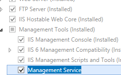
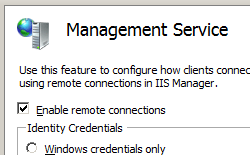
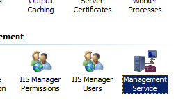
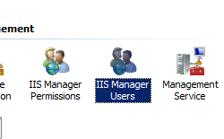
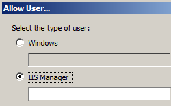

Management &lt;management&gt;
====================

## Overview

The `<management>` element specifies remote management settings for users that connect to your server using IIS Manager. The `<management>` element contains three child elements:

- `<authentication>` - This child element contains a list of authentication providers in a `<providers>` element, and may contain the user names and passwords for IIS Manager user accounts if you are using the default *ConfigurationAuthenticationProvider* as your authentication provider.
- `<authorization>` - This child element contains a list of authorization providers in a `<providers>` element, and may contain the authorization rules for user accounts if you are using the default *ConfigurationAuthorizationProvider* as your authorization provider.
- `<trustedProviders>` - This child element contains a list of the management providers that are trusted by IIS Manager and the Management Service (WMSVC).

> [!NOTE]
> The settings in the `<management>` element can only be configured in the Administration.config file.

## Compatibility

| Version | Notes |
| --- | --- |
| IIS 10.0 | The `<management>` element was not modified in IIS 10.0. |
| IIS 8.5 | The `<management>` element was not modified in IIS 8.5. |
| IIS 8.0 | The `<management>` element was not modified in IIS 8.0. |
| IIS 7.5 | The `<management>` element was not modified in IIS 7.5. |
| IIS 7.0 | The `<management>` element was introduced in IIS 7.0. |
| IIS 6.0 | N/A |

## Setup

The default installation of IIS 7 and later does not include the **Management Service** role service. To install this role service, use the following steps.

### Windows Server 2012 or Windows Server 2012 R2

1. On the taskbar, click **Server Manager**.
2. In **Server Manager**, click the **Manage** menu, and then click **Add Roles and Features**.
3. In the **Add Roles and Features** wizard, click **Next**. Select the installation type and click **Next**. Select the destination server and click **Next**.
4. On the **Server Roles** page, expand **Web Server (IIS)**, expand **Management Tools**, and then select **Management Service**. Click **Next**.  
     .
5. On the **Select features** page, click **Next**.
6. On the **Confirm installation selections** page, click **Install**.
7. On the **Results** page, click **Close**.

### Windows 8 or Windows 8.1

1. On the **Start** screen, move the pointer all the way to the lower left corner, right-click the **Start** button, and then click **Control Panel**.
2. In **Control Panel**, click **Programs and Features**, and then click **Turn Windows features on or off**.
3. Expand **Internet Information Services**, expand **Web Management Tools**, and then select **IIS Management Service**.  
    
4. Click **OK**.
5. Click **Close**.

### Windows Server 2008 or Windows Server 2008 R2

1. On the taskbar, click **Start**, point to **Administrative Tools**, and then click **Server Manager**.
2. In the **Server Manager** hierarchy pane, expand **Roles**, and then click **Web Server (IIS)**.
3. In the **Web Server (IIS)** pane, scroll to the **Role Services** section, and then click **Add Role Services**.
4. On the **Select Role Services** page of the **Add Role Services Wizard**, select **Management Service**, and then click **Next**.  
    
5. On the **Confirm Installation Selections** page, click **Install**.
6. On the **Results** page, click **Close**.

### Windows Vista or Windows 7

1. On the taskbar, click **Start**, and then click **Control Panel**.
2. In **Control Panel**, click **Programs and Features**, and then click **Turn Windows Features on or off**.
3. Expand **Internet Information Services**, then **Web Management Tool**.
4. Select **IIS Management Service**, and then click **OK**.   
    
 

## How To

### How to enable IIS Manager credentials for a server

1. Open **Internet Information Services (IIS) Manager**: 

    - If you are using Windows Server 2012 or Windows Server 2012 R2: 

        - On the taskbar, click **Server Manager**, click **Tools**, and then click **Internet Information Services (IIS) Manager**.
    - If you are using Windows 8 or Windows 8.1: 

        - Hold down the **Windows** key, press the letter **X**, and then click **Control Panel**.
        - Click **Administrative Tools**, and then double-click **Internet Information Services (IIS) Manager**.
    - If you are using Windows Server 2008 or Windows Server 2008 R2: 

        - On the taskbar, click **Start**, point to **Administrative Tools**, and then click **Internet Information Services (IIS) Manager**.
    - If you are using Windows Vista or Windows 7: 

        - On the taskbar, click **Start**, and then click **Control Panel**.
        - Double-click **Administrative Tools**, and then double-click **Internet Information Services (IIS) Manager**.
2. In the **Connections** pane, click the server name.
3. In the server's **Home** pane, double-click **Management Service**.  
    
4. On the **Management Service** page, choose **Windows credentials or IIS Manager credentials**, then click **Apply** in the **Actions** pane.  
    

### How to add IIS Manager user credentials to a server

1. Open **Internet Information Services (IIS) Manager**: 

    - If you are using Windows Server 2012 or Windows Server 2012 R2: 

        - On the taskbar, click **Server Manager**, click **Tools**, and then click **Internet Information Services (IIS) Manager**.
    - If you are using Windows 8 or Windows 8.1: 

        - Hold down the **Windows** key, press the letter **X**, and then click **Control Panel**.
        - Click **Administrative Tools**, and then double-click **Internet Information Services (IIS) Manager**.
    - If you are using Windows Server 2008 or Windows Server 2008 R2: 

        - On the taskbar, click **Start**, point to **Administrative Tools**, and then click **Internet Information Services (IIS) Manager**.
    - If you are using Windows Vista or Windows 7: 

        - On the taskbar, click **Start**, and then click **Control Panel**.
        - Double-click **Administrative Tools**, and then double-click **Internet Information Services (IIS) Manager**.
2. In the **Connections** pane, click the server name.
3. In the server's **Home** pane, double-click **IIS Manager Users**.  
    
4. On the **IIS Manager Users** page, click **Add User...** in the **Actions** pane.  
    
5. In the **Add User** dialog box, enter the user name and password, and then click **OK**.  
    

### How to authorize an IIS Manager user for a site or application

1. Open **Internet Information Services (IIS) Manager**: 

    - If you are using Windows Server 2012 or Windows Server 2012 R2: 

        - On the taskbar, click **Server Manager**, click **Tools**, and then click **Internet Information Services (IIS) Manager**.
    - If you are using Windows 8 or Windows 8.1: 

        - Hold down the **Windows** key, press the letter **X**, and then click **Control Panel**.
        - Click **Administrative Tools**, and then double-click **Internet Information Services (IIS) Manager**.
    - If you are using Windows Server 2008 or Windows Server 2008 R2: 

        - On the taskbar, click **Start**, point to **Administrative Tools**, and then click **Internet Information Services (IIS) Manager**.
    - If you are using Windows Vista or Windows 7: 

        - On the taskbar, click **Start**, and then click **Control Panel**.
        - Double-click **Administrative Tools**, and then double-click **Internet Information Services (IIS) Manager**.
2. In the **Connections** pane, go to the connection, site, application, or directory for which you want to authorize an IIS Manager user.
3. In the **Home** pane, double-click **IIS Manager Permissions**.  
    
4. On the **IIS Manager Permissions** page, click **Allow User...** in the **Actions** pane.  
    
5. In the **Allow User** dialog box, choose **IIS Manager**, then click **Select...**  
    
6. In the **Users** dialog box, highlight the user account that you want to allow, and then click **OK**.  
    
7. In the **Allow User** dialog box, click **OK**.  
    

## Configuration

### Attributes

None.

### Child Elements

| Element | Description |
| --- | --- |
| [`authentication`](authentication/index.md) | Optional element. Configures authentication settings for remote management of the Web server. |
| [`authorization`](authorization/index.md) | Optional element. Configures authorization settings for remote management of the Web server. |
| [`trustedProviders`](trustedproviders/index.md) | Optional element. Configures the providers that are trusted by IIS Manager and the Management Service (WMSVC). |

### Configuration Sample

The following default `<management>` element is configured in the Administration.config file in IIS 7 when the Management Service role service is installed.

[!code-xml[Main](index/samples/sample1.xml)]

The following configuration sample shows how to add an IIS Manager user named ContosoUser to Administration.config.

[!code-xml[Main](index/samples/sample2.xml)]

The following configuration sample shows how to authorize an IIS Manager user named Contoso, a Windows group named Test Group, and a Windows user named Contoso2 to connect to the Default Web Site by using IIS Manager.

[!code-xml[Main](index/samples/sample3.xml)]

## Sample Code

The following code samples add an IIS Manager user account named ContosoUser to IIS 7.

### AppCmd.exe

> [!NOTE]
> You cannot configure `<system.webServer/management/authentication>` settings using AppCmd.exe.

### C#

[!code-csharp[Main](index/samples/sample4.cs)]

### VB.NET

[!code-vb[Main](index/samples/sample5.vb)]

### JavaScript

[!code-javascript[Main](index/samples/sample6.js)]

### VBScript

[!code-vb[Main](index/samples/sample7.vb)]

The following code samples check to see if a `<scope>` element has already been added to the `<authorizationRules>` element for the Default Web Site; if not, a `<scope>` element is added the `<authorizationRules>` element. Next, an `<add>` element is added to the `<scope>` element that authorizes a user account named ContosoUser.

### AppCmd.exe

> [!NOTE]
> You cannot configure `<system.webServer/management/authorization>` settings using AppCmd.exe.

### C#

[!code-csharp[Main](index/samples/sample8.cs)]

### VB.NET

[!code-vb[Main](index/samples/sample9.vb)]

### JavaScript

[!code-javascript[Main](index/samples/sample10.js)]

### VBScript

[!code-vb[Main](index/samples/sample11.vb)]