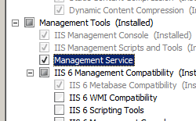

Adding Management Trusted Providers &lt;add&gt;
====================

## Overview

The `<add>` element of the `<trustedProviders>` element adds a provider to the collection of management providers that are trusted to be run by IIS Manager and the Management Service (WMSVC).

Before calling the provider for a site or an application, the .NET Users and .NET Roles features verify that the configured provider is trusted. If it is not trusted, the setting in the **allowUntrustedProviders** attribute will determine whether untrusted providers are allowed to run. If untrusted providers are not allowed and the provider is not in the trusted providers collection, the provider will not be allowed to run.

## Compatibility

| Version | Notes |
| --- | --- |
| IIS 10.0 | The `<add>` element was not modified in IIS 10.0. |
| IIS 8.5 | The `<add>` element was not modified in IIS 8.5. |
| IIS 8.0 | The `<add>` element was not modified in IIS 8.0. |
| IIS 7.5 | The `<add>` element was not modified in IIS 7.5. |
| IIS 7.0 | The `<add>` element of the `<trustedProviders>` element was introduced in IIS 7.0. |
| IIS 6.0 | N/A |

## Setup

The default installation of IIS 7 and later does not include the **Management Service** role service. To install this role service, use the following steps.

### Windows Server 2012 or Windows Server 2012 R2

1. On the taskbar, click **Server Manager**.
2. In **Server Manager**, click the **Manage** menu, and then click **Add Roles and Features**.
3. In the **Add Roles and Features** wizard, click **Next**. Select the installation type and click **Next**. Select the destination server and click **Next**.
4. On the **Server Roles** page, expand **Web Server (IIS)**, expand **Management Tools**, and then select **Management Service**. Click **Next**.  
     .
5. On the **Select features** page, click **Next**.
6. On the **Confirm installation selections** page, click **Install**.
7. On the **Results** page, click **Close**.

### Windows 8 or Windows 8.1

1. On the **Start** screen, move the pointer all the way to the lower left corner, right-click the **Start** button, and then click **Control Panel**.
2. In **Control Panel**, click **Programs and Features**, and then click **Turn Windows features on or off**.
3. Expand **Internet Information Services**, expand **Web Management Tools**, and then select **IIS Management Service**.  
    
4. Click **OK**.
5. Click **Close**.

### Windows Server 2008 or Windows Server 2008 R2

1. On the taskbar, click **Start**, point to **Administrative Tools**, and then click **Server Manager**.
2. In the **Server Manager** hierarchy pane, expand **Roles**, and then click **Web Server (IIS)**.
3. In the **Web Server (IIS)** pane, scroll to the **Role Services** section, and then click **Add Role Services**.
4. On the **Select Role Services** page of the **Add Role Services Wizard**, select **Management Service**, and then click **Next**.  
    
5. On the **Confirm Installation Selections** page, click **Install**.
6. On the **Results** page, click **Close**.

### Windows Vista or Windows 7

1. On the taskbar, click **Start**, and then click **Control Panel**.
2. In **Control Panel**, click **Programs and Features**, and then click **Turn Windows Features on or off**.
3. Expand **Internet Information Services**, then **Web Management Tool**.
4. Select **IIS Management Service**, and then click **OK**.   
    
 

## How To

There is no user interface for configuring the `<trustedProviders>` element for IIS 7. For examples of how to configure the `<trustedProviders>` element programmatically, see the [Code Samples](#006) section of this document.

## Configuration

### Attributes

| Attribute | Description |
| --- | --- |
| `type` | Required string attribute. Specifies the assembly-qualified type name for the provider. |

### Child Elements

None.

### Configuration Sample

The following default `<trustedProviders>` element is configured in the root Administration.config file in IIS 7.0 when the Management Service role service is installed.

[!code-xml[Main](add/samples/sample1.xml)]

## Sample Code

> [!NOTE]
> The examples in this document illustrate using a managed-code assembly that has been stored in the .NET Global Assembly Cache (GAC). Before using the code in these examples to deploy your own assemblies, you need to retrieve the assembly information from the GAC. To do so, use the following steps:

- In Windows Explorer, open your C:\Windows\assembly path, where C: is your operating system drive.
- Locate your assembly.
- Right-click the assembly and click **Properties**.
- Copy the **Culture** value; for example: **Neutral**.
- Copy the **Version** number; for example: **1.0.0.0**.
- Copy the **Public Key Token** value; for example: **426f62526f636b73**.
- Click **Cancel**.

The following code examples add a provider named Contoso.Provider to the collection of trusted management providers.

### AppCmd.exe

> [!NOTE]
> You cannot configure `<system.webServer/Management>` settings using AppCmd.exe.

### C#

[!code-csharp[Main](add/samples/sample2.cs)]

### VB.NET

[!code-vb[Main](add/samples/sample3.vb)]

### JavaScript

[!code-javascript[Main](add/samples/sample4.js)]

### VBScript

[!code-vb[Main](add/samples/sample5.vb)]