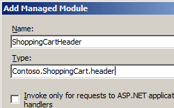

Adding Modules &lt;add&gt;
====================

## Overview

The `<add>` element of the `<modules>` collection adds a module to the list of modules for Internet Information Services (IIS) 7.

## Compatibility

| Version | Notes |
| --- | --- |
| IIS 10.0 | The `<add>` element was not modified in IIS 10.0. |
| IIS 8.5 | The `<add>` element was not modified in IIS 8.5. |
| IIS 8.0 | The `<add>` element was not modified in IIS 8.0. |
| IIS 7.5 | The `<add>` element was not modified in IIS 7.5. |
| IIS 7.0 | The `<add>` element of the `<modules>` collection was introduced in IIS 7.0. |
| IIS 6.0 | N/A |

## Setup

The `<add>` element of the `<modules>` collection is included in the default installation of IIS 7.

## How To

### How to add a managed module to application

1. Open **Internet Information Services (IIS) Manager**: 

    - If you are using Windows Server 2012 or Windows Server 2012 R2: 

        - On the taskbar, click **Server Manager**, click **Tools**, and then click **Internet Information Services (IIS) Manager**.
    - If you are using Windows 8 or Windows 8.1: 

        - Hold down the **Windows** key, press the letter **X**, and then click **Control Panel**.
        - Click **Administrative Tools**, and then double-click **Internet Information Services (IIS) Manager**.
    - If you are using Windows Server 2008 or Windows Server 2008 R2: 

        - On the taskbar, click **Start**, point to **Administrative Tools**, and then click **Internet Information Services (IIS) Manager**.
    - If you are using Windows Vista or Windows 7: 

        - On the taskbar, click **Start**, and then click **Control Panel**.
        - Double-click **Administrative Tools**, and then double-click **Internet Information Services (IIS) Manager**.
2. In the **Connections** pane, expand the server name, expand **Sites**, and then go to the Web site or application to which you want to add a managed module.
3. In the **Home** pane, double-click **Modules**.  
    
4. In the Actions pane, click **Add Managed Module**.
5. In the **Add Managed Module** dialog box, enter the name of the managed module in the **Name** box, and then enter or select the module's .NET Framework fully-qualified type in the Type box.
6. Select the **Invoke only for requests to ASP.NET applications or managed handlers** option if you want the module to respond only to managed requests.  
    
7. Click **OK**.

## Configuration

### Attributes

| Attribute | Description |
| --- | --- |
| `name` | Required string attribute.  Specifies the unique name of a managed module on the Web server. |
| `preCondition` | Optional string attribute. Specifies conditions under which the module will run.    The **preCondition** attribute can be one or more of the following possible values. If you specify more than one value, separate the values with a comma (,).   <table> <tbody> <tr> <th>Value</th> <th>Description</th></tr> <tr> <th><code>bitness32</code></th> <td>Specify the <strong>bitness32</strong> value when the module is a 32-bit .dll file. IIS should load the handler only for worker processes that run in WOW64 mode (32-bit simulation) on a 64-bit operating system.</td></tr> <tr> <th><code>bitness64</code></th> <td>Specify the <strong>bitness64</strong> value when the module is a 64-bit .dll file. IIS should load the handler only for worker processes that run in 64-bit mode.</td></tr> <tr> <th><code>integratedMode</code></th> <td>Specify the <strong>integratedMode</strong> value when the module should respond only to requests in application pools that are configured to use the integrated request-processing pipeline.</td></tr> <tr> <th><code>ISAPIMode</code></th> <td>Specify the <strong>ISAPIMode</strong> value when the module should respond only to requests in application pools that are configured to use Classic mode.</td></tr> <tr> <th><code>managedHandler</code></th> <td>Specify the <strong>managedHandler</strong> value when the module should process requests only for managed resources, such as .aspx files, and should not respond to requests for non-managed resources, such as .html files.</td></tr> <tr> <th><code>runtimeVersion1.1</code></th> <td>Specify the <strong>runtimeVersionv1.1</strong> value when the module should respond only to requests in application pools that are configured to use .NET Framework version 1.1.</td></tr> <tr> <th><code>runtimeVersion2.0</code></th> <td>Specify the <strong>runtimeVersionv2.0</strong> value when the module should respond only to requests in application pools that are configured to use .NET Framework version 2.0.</td></tr></tbody></table> |
| `type` | Optional string attribute.  Specifies the managed type of a managed module. The type attribute does not apply to native modules. |

### Child Elements

None.

### Configuration Sample

The example configures a module for a Web application running in IIS 7 Integrated mode.

[!code-xml[Main](add/samples/sample1.xml)]

## Sample Code

> [!NOTE]
> The examples in this document illustrate using a managed-code assembly that has been stored in the .NET Global Assembly Cache (GAC). Before using the code in these examples to deploy your own assemblies, you need to retrieve the assembly information from the GAC. To do so, use the following steps:

- In Windows Explorer, open your C:\Windows\assembly path, where C: is your operating system drive.
- Locate your assembly.
- Right-click the assembly and click **Properties**.
- Copy the **Culture** value; for example: **Neutral**.
- Copy the **Version** number; for example: **1.0.0.0**.
- Copy the **Public Key Token** value; for example: **426f62526f636b73**.
- Click **Cancel**.

The following code examples enable a managed module for a Web site named Contoso. The **name** property defines the name CartHeader for the module, the **type** property defines the managed type for the module, the **preCondition** property defines that IIS invokes the module only for managed requests.

### AppCmd.exe

[!code-console[Main](add/samples/sample2.cmd)]

### C\#

[!code-csharp[Main](add/samples/sample3.cs)]

### VB.NET

[!code-vb[Main](add/samples/sample4.vb)]

### JavaScript

[!code-javascript[Main](add/samples/sample5.js)]

### VBScript

[!code-vb[Main](add/samples/sample6.vb)]
