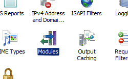

Modules &lt;modules&gt;
====================

## Overview

The `<modules>` element defines the native-code modules and managed-code modules that are registered for an application. As a part of Internet Information Services (IIS) request pipeline processing, IIS calls each module listed in the `<modules>` element on every request. You commonly use modules to implement customized functionality, such as security, statistics, and logging, or customized content processing, such as adding customized headers or footers.

The `<modules>` element contains a collection of `<add>` elements. Each element defines an enabled module for the application. When you enable a module, you allow it to provide its service for a particular application.

If you want to enable a native module, you must first install it on the server. For more information, see the [&lt;globalModules&gt;](https://www.iis.net/configreference/system.webserver/globalmodules) element.

You do not have to install a managed module; you can enable it directly for each application. This allows applications to include their managed modules directly within the application by registering them in the application's Web.config file, and by providing the implementation in the /BIN or /App\_Code directories.

## Compatibility

| Version | Notes |
| --- | --- |
| IIS 10.0 | The `<modules>` element was not modified in IIS 10.0. |
| IIS 8.5 | The `<modules>` element was not modified in IIS 8.5. |
| IIS 8.0 | The `<modules>` element was not modified in IIS 8.0. |
| IIS 7.5 | The `<modules>` element was not modified in IIS 7.5. |
| IIS 7.0 | The `<modules>` element was introduced in IIS 7.0. |
| IIS 6.0 | N/A |

## Setup

The `<modules>` element is included in the default installation of IIS 7.

## How To

### How to add a managed module to application

1. Open **Internet Information Services (IIS) Manager**: 

    - If you are using Windows Server 2012 or Windows Server 2012 R2: 

        - On the taskbar, click **Server Manager**, click **Tools**, and then click **Internet Information Services (IIS) Manager**.
    - If you are using Windows 8 or Windows 8.1: 

        - Hold down the **Windows** key, press the letter **X**, and then click **Control Panel**.
        - Click **Administrative Tools**, and then double-click **Internet Information Services (IIS) Manager**.
    - If you are using Windows Server 2008 or Windows Server 2008 R2: 

        - On the taskbar, click **Start**, point to **Administrative Tools**, and then click **Internet Information Services (IIS) Manager**.
    - If you are using Windows Vista or Windows 7: 

        - On the taskbar, click **Start**, and then click **Control Panel**.
        - Double-click **Administrative Tools**, and then double-click **Internet Information Services (IIS) Manager**.
2. In the **Connections** pane, expand the server name, expand **Sites**, and then go to the Web site or application to which you want to add a managed module.
3. In the **Home** pane, double-click **Modules**.  
    
4. In the Actions pane, click **Add Managed Module**.
5. In the **Add Managed Module** dialog box, enter the name of the managed module in the **Name** box, and then enter or select the module's .NET Framework fully-qualified type in the Type box.
6. Select the **Invoke only for requests to ASP.NET applications or managed handlers** option if you want the module to respond only to managed requests.  
    
7. Click **OK**.

## Configuration

You configure the `<modules>` element at the server level in the ApplicationHost.config file and at the application level in the Web.config file.

### Attributes

| Attribute | Description |
| --- | --- |
| `runAllManagedModulesForAllRequests` | Optional Boolean value. **True** if all managed modules can process all requests, even if the request was not for managed content; otherwise, **false**. **Note:** In ASP.NET websites, the value of `runAllManagedModulesForAllRequests` previously had to be set to `true` to support routing. However, once IIS 7 has been updated with a Service Pack, the value of `runAllManagedModulesForAllRequests` can be set to `false` or omitted when working with ASP.NET routing. For more information, see [ASP.NET Routing](https://go.microsoft.com/fwlink/?LinkID=215230) on the MSDN website. The default value is `false`. |
| `runManagedModulesForWebDavRequests` | Optional Boolean value. **True** if managed modules can process WebDAV requests; otherwise, **false**. The default value is `false`. |

### Child Elements

| Element | Description |
| --- | --- |
| [`add`](https://www.iis.net/configreference/system.webserver/modules/add) | Optional element. Adds a module to the collection of modules. |
| `clear` | Optional element. Removes all references to modules from the modules collection. |
| `remove` | Optional element. Removes a reference to a module from the modules collection. |

### Configuration Sample

The example configures a module for a Web application running in IIS 7 Integrated mode.

[!code-xml[Main](index/samples/sample1.xml)]

## Sample Code

> [!NOTE]
> The examples in this document illustrate using a managed-code assembly that has been stored in the .NET Global Assembly Cache (GAC). Before using the code in these examples to deploy your own assemblies, you need to retrieve the assembly information from the GAC. To do so, use the following steps:

- In Windows Explorer, open your C:\Windows\assembly path, where C: is your operating system drive.
- Locate your assembly.
- Right-click the assembly and click **Properties**.
- Copy the **Culture** value; for example: **Neutral**.
- Copy the **Version** number; for example: **1.0.0.0**.
- Copy the **Public Key Token** value; for example: **426f62526f636b73**.
- Click **Cancel**.

The following code examples enable a managed module for a Web site named Contoso. The **name** property defines the name CartHeader for the module, the **type** property defines the managed type for the module, the **preCondition** property defines that IIS invokes the module only for managed requests.

### AppCmd.exe

[!code-console[Main](index/samples/sample2.cmd)]

### C#

[!code-csharp[Main](index/samples/sample3.cs)]

### VB.NET

[!code-vb[Main](index/samples/sample4.vb)]

### JavaScript

[!code-javascript[Main](index/samples/sample5.js)]

### VBScript

[!code-vb[Main](index/samples/sample6.vb)]