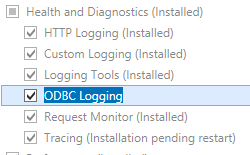
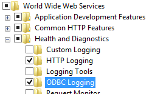
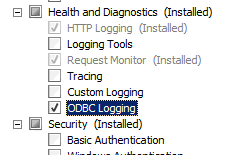
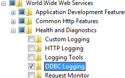

ODBC Logging &lt;odbcLogging&gt;
====================

## Overview

The `<odbcLogging>` element configures Open Database Connectivity (ODBC) logging for Internet Information Services (IIS) 7. ODBC logging records all HTTP activity to a user-defined database instead of to text files.

ODBC logging is implemented as a custom logging module in IIS 7, therefore enabling and configuring ODBC logging in IIS 7 consists of two separate actions:

- Setting the ODBC logging attributes in the `<odbcLogging>` element. Specifically, the following attributes must be configured: 

    - The **dataSource** attribute must specify the System Data Source Name (DSN) for the database where the table specified by the **tableName** attribute is located.
    - The **password** attribute must specify the database password that IIS 7 will use when writing log information to the database.
    - The **tableName** attribute must specify the name of the database table in the database that is specified by the **dataSource** attribute.
    - The **userName** attribute must specify the database user name that IIS 7 will use when writing log information to the database.
- Setting the correct custom logging attributes in the [&lt;logFile&gt;](../system.applicationhost/sites/site/logfile/index.md) element. Specifically, the following attributes must be configured: 

    - The **logFormat** attribute must be set to "**Custom**."
    - The **customLogPluginClsid** attribute must be set to "**{FF16065B-DE82-11CF-BC0A-00AA006111E0}**"

By default, IIS 7 logs all activity to text files that use the W3C extended log file format, and by default you can configure IIS to use other text file formats such as the NCSA or native IIS format. The major disadvantage of using these text-based formats is that they are more difficult to parse for activity, and generally require a utility like [Microsoft's LogParser](https://www.microsoft.com/download/details.aspx?id=24659) in order to retrieve any useful information from your logs. In addition, data-parsing performance with text files is also typically much slower than using a database. However, text-based logging is performed in kernel mode, which improves the performance for logging requests.

When you use ODBC logging, your server's activity is stored in a database, which should greatly improve data retrieval. This expands the possibilities for using a wide variety of database clients when data mining your server's activity. The major disadvantage to using ODBC logging is the performance for logging because when ODBC logging is enabled, IIS disables the kernel-mode cache. For this reason, implementing ODBC logging can degrade overall server performance.

> [!NOTE]
> To create the table for ODBC logging, you can use the "%*windir*%\System32\inetsrv\logtemp.sql" file that is provided with IIS 7. For more information about ODBC logging, see [Microsoft Knowledge Base Article 245243](https://support.microsoft.com/kb/245243).

## Compatibility

| Version | Notes |
| --- | --- |
| IIS 10.0 | The `<odbcLogging>` element was not modified in IIS 10.0. |
| IIS 8.5 | The `<odbcLogging>` element was not modified in IIS 8.5. |
| IIS 8.0 | The `<odbcLogging>` element was not modified in IIS 8.0. |
| IIS 7.5 | The `<odbcLogging>` element was not modified in IIS 7.5. |
| IIS 7.0 | The `<odbcLogging>` element was introduced in IIS 7.0. |
| IIS 6.0 | The attributes of the `<odbcLogging>` element replace the following IIS 6.0 metabase properties: <ul> <li><strong>LogOdbcDataSource</strong></li> <li><strong>LogOdbcPassword</strong></li> <li><strong>LogOdbcTableName</strong></li> <li><strong>LogOdbcUserName</strong> </li></ul> |

## Setup

The `<odbcLogging>` element is not available on the default installation of IIS 7 and later. To install it, use the following steps.

### Windows Server 2012 or Windows Server 2012 R2

1. On the taskbar, click **Server Manager**.
2. In **Server Manager**, click the **Manage** menu, and then click **Add Roles and Features**.
3. In the **Add Roles and Features** wizard, click **Next**. Select the installation type and click **Next**. Select the destination server and click **Next**.
4. On the **Server Roles** page, expand **Web Server (IIS)**, expand **Web Server**, expand **Health and Diagnostics**, and then select **ODBC Logging**. Click **Next**.  
     .
5. On the **Select features** page, click **Next**.
6. On the **Confirm installation selections** page, click **Install**.
7. On the **Results** page, click **Close**.

### Windows 8 or Windows 8.1

1. On the **Start** screen, move the pointer all the way to the lower left corner, right-click the **Start** button, and then click **Control Panel**.
2. In **Control Panel**, click **Programs and Features**, and then click **Turn Windows features on or off**.
3. Expand **Internet Information Services**, expand **World Wide Web Services**, expand **Health and Diagnostics**, and then select **ODBC Logging**.  
    
4. Click **OK**.
5. Click **Close**.

### Windows Server 2008 or Windows Server 2008 R2

1. On the taskbar, click **Start**, point to **Administrative Tools**, and then click **Server Manager**.
2. In the **Server Manager** hierarchy pane, expand **Roles**, and then click **Web Server (IIS)**.
3. In the **Web Server (IIS)** pane, scroll to the **Role Services** section, and then click **Add Role Services**.
4. On the **Select Role Services** page of the **Add Role Services Wizard**, select **ODBC Logging**, and then click **Next**.  
    
5. On the **Confirm Installation Selections** page, click **Install**.
6. On the **Results** page, click **Close**.

### Windows Vista or Windows 7

1. On the taskbar, click **Start**, and then click **Control Panel**.
2. In **Control Panel**, click **Programs and Features**, and then click **Turn Windows Features on or off**.
3. Expand **Internet Information Services**, then select **ODBC Logging**, and then click **OK**.  
    

## How To

There is no user interface for configuring ODBC logging for IIS 7. For examples of how to configure ODBC logging programmatically, see the [Code Samples](#006) section of this document.

## Configuration

### Attributes

| Attribute | Description |
| --- | --- |
| `dataSource` | Optional string attribute. Specifies the System Data Source Name (DSN) for the database to which the log is written.    The default value is `InternetDb`. |
| `password` | Optional string attribute. Specifies the ODBC database password that you use when you write information to the database during event logging. By default, this value is encrypted.    The default value is `[enc:AesProvider::enc]`. |
| `tableName` | Optional string attribute. Specifies the name of the ODBC database table where Windows writes information during event logging.    The default value is `InternetLog`. |
| `userName` | Optional string attribute. Specifies the ODBC database user name that is used for writing information to the database during event logging.    The default value is `InternetAdmin`. |

### Child Elements

None.

### Configuration Sample

This first configuration sample for the Default Web Site configures the attributes in the `<odbcLogging>` element that specify the system DSN, table name, user name, and password for an ODBC logging connection.

[!code-xml[Main](odbcLogging/samples/sample1.xml)]

This second configuration sample configures the correct custom logging attributes in [&lt;logFile&gt;](../system.applicationhost/sites/site/logfile/index.md) element that enable ODBC logging for the Default Web Site.

[!code-xml[Main](odbcLogging/samples/sample2.xml)]

## Sample Code

The following code samples configure two sets of options for the Default Web Site:

- The first half of each sample configures the attributes in the `<odbcLogging>` element that specify the system DSN, table name, user name, and password for an ODBC logging connection.
- The second half of each sample specifies the custom logging attributes in [&lt;logFile&gt;](../system.applicationhost/sites/site/logfile/index.md) element that enable ODBC logging.

### AppCmd.exe

[!code-console[Main](odbcLogging/samples/sample3.cmd)]

> [!NOTE]
> You must be sure to set the **commit** parameter to `apphost` when you use AppCmd.exe to configure these settings. This commits the configuration settings to the appropriate location section in the ApplicationHost.config file.

### C\#

[!code-csharp[Main](odbcLogging/samples/sample4.cs)]

### VB.NET

[!code-vb[Main](odbcLogging/samples/sample5.vb)]

### JavaScript

[!code-javascript[Main](odbcLogging/samples/sample6.js)]

### VBScript

[!code-vb[Main](odbcLogging/samples/sample7.vb)]
