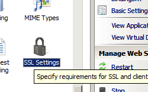

Access Security &lt;access&gt;
====================

## Overview

The `<access>` element allows you to configure whether a Web site or application uses client certificates for authentication and allows you to define the cryptographic strength required for encrypting those certificates.

The `<access>` element contains an **sslFlags** attribute that you can set to one of the following values:

- **None**. This default setting disables SSL for the site or application.
- **Ssl**. The site or application requires SSL.
- **SslNegotiateCert**. The site or application accepts client certificates for authentication.
- **SslRequireCert**. The site or application requires client certificates for authentication.
- **Ssl128**. The site or application requires 128-bit SSL certificate encryption.

You can use the access element to configure a site, an application, or a virtual directory to require client certificates. To do this, set an HTTPS binding for your site or application, and then request and receive certificates from a certification authority (CA). The certificates can be Internet Server certificates, domain server certificates, or self-signed server certificates. Internet Server certificates require a CA issue your server or servers a certificate after you request one. A domain server certificate is issued by a CA computer running on your company's domain and can help you control access to internal resources to only employees who have installed the certificate. You can use a self-signed certificate to troubleshoot third-party certificate problems, to manage Internet Information Services (IIS) 7 remotely, to create a secure private channel between the server and a selected group of users, or to test application features that rely on SSL.

## Compatibility

| Version | Notes |
| --- | --- |
| IIS 10.0 | The `<access>` element was not modified in IIS 10.0. |
| IIS 8.5 | The `<access>` element was not modified in IIS 8.5. |
| IIS 8.0 | The `<access>` element was not modified in IIS 8.0. |
| IIS 7.5 | The `<access>` element was not modified in IIS 7.5. |
| IIS 7.0 | The `<access>` element was introduced in IIS 7.0. |
| IIS 6.0 | The `<access>` element replaces the IIS 6.0 **SSLAlwaysNegoClientCert** and **AccessSSLFlags** metabase properties. |

## Setup

The `<access>` element is included in the default installation of IIS 7.

## How To

### How to require Secure Sockets Layer

1. Open **Internet Information Services (IIS) Manager**: 

    - If you are using Windows Server 2012 or Windows Server 2012 R2: 

        - On the taskbar, click **Server Manager**, click **Tools**, and then click **Internet Information Services (IIS) Manager**.
    - If you are using Windows 8 or Windows 8.1: 

        - Hold down the **Windows** key, press the letter **X**, and then click **Control Panel**.
        - Click **Administrative Tools**, and then double-click **Internet Information Services (IIS) Manager**.
    - If you are using Windows Server 2008 or Windows Server 2008 R2: 

        - On the taskbar, click **Start**, point to **Administrative Tools**, and then click **Internet Information Services (IIS) Manager**.
    - If you are using Windows Vista or Windows 7: 

        - On the taskbar, click **Start**, and then click **Control Panel**.
        - Double-click **Administrative Tools**, and then double-click **Internet Information Services (IIS) Manager**.
2. In the **Connections** pane, go to the site, application, or directory for which you want to configure SSL requirements. You cannot configure SSL at the server level.
3. In the **Home** pane, double-click **SSL Settings**.  
    
4. In the **SSL Settings** pane, click **Require SSL**.
5. In the **Actions** pane, click **Apply**.
 

## Configuration

You can configure the `<access>` element at the server level in the ApplicationHost.config file or at the site, application, or directory level in the appropriate Web.config file.

### Attributes

| Attribute | Description |
| --- | --- |
| `sslFlags` | The **sslFlags** attribute can be one of the following possible values. The default is `None`. <table> <tbody> <tr> <td>Value</td> <td>Description</td></tr> <tr> <td><code>None</code></td> <td>Disable SSL.</td></tr> <tr> <td><code>Ssl</code></td> <td>Require SSL.</td></tr> <tr> <td><code>SslNegotiateCert</code></td> <td>Accept client certificates for authentication.</td></tr> <tr> <td><code>SslRequireCert</code></td> <td>Require clients certificates for authentication.</td></tr> <tr> <td><code>SslMapCert</code></td> <td>Enable certificate mapping authentication.</td></tr> <tr> <td><code>Ssl128</code></td> <td>Require 128-bit SSL.</td></tr></tbody></table> |

### Child Elements

None.

### Configuration Sample

The following configuration example, when included in the ApplicationHost.config file, requires an SSL connection between a Web site named Contoso and all client browsers.

[!code-xml[Main](access/samples/sample1.xml)]

## Sample Code

The following examples make SSL required to access a Web site named Contoso.

### AppCmd.exe

[!code-console[Main](access/samples/sample2.cmd)]

> [!NOTE]
> You must be sure to set the **commit** parameter to `apphost` when you use AppCmd.exe to configure these settings. This commits the configuration settings to the appropriate location section in the ApplicationHost.config file.

### C#

[!code-csharp[Main](access/samples/sample3.cs)]

### VB.NET

[!code-vb[Main](access/samples/sample4.vb)]

### JavaScript

[!code-javascript[Main](access/samples/sample5.js)]

### VBScript

[!code-vb[Main](access/samples/sample6.vb)]