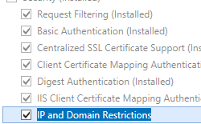
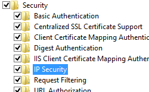
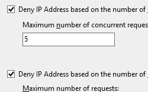

Dynamic IP Security <dynamicIpSecurity> &lt;dynamicIpSecurity&gt;
====================

## Overview

The `<dynamicIpSecurity>` element provides a dynamic means of blocking malicious Web requests. Using dynamic IP restrictions means the administrator does not need to identify the IP addresses that need to be blocked. Instead, the administrator can configure the system so that it blocks any IP address that meets the set criteria. This can include blocking a remote client if the number of concurrent HTTP connection requests from that client exceeds a specific number, or blocking a client if the number of requests received over a period of time exceeds a specific number. The dynamic IP restrictions can be configured at either the server or site levels.

The administrator can specify which HTTP response status code will be returned if a client is blocked: Unauthorized (401); Forbidden (403); or Not Found (404). You can also set the Deny Action Type to Abort to drop the connection without returning any indication why.

If you enable the proxy mode, a request can be blocked by identifying the originating IP address of a client that connects to a web server through an HTTP proxy or load balancer. This is done by examining the x-forwarded-for-HTTP header.

## Compatibility

| Version | Notes |
| --- | --- |
| IIS 10.0 | The `<dynamicIpSecurity>` element was not modified in IIS 10.0. |
| IIS 8.5 | The &lt;`dynamicIpSecurity>` element was not modified in IIS 8.5. |
| IIS 8.0 | The &lt;`dynamicIpSecurity>` element was introduced in IIS 8.0. |
| IIS 7.5 | N/A |
| IIS 7.0 | N/A |
| IIS 6.0 | N/A |

## Setup

### Windows Server 2012 or Windows Server 2012 R2

1. On the taskbar, click **Server Manager**.
2. In **Server Manager**, click the **Manage** menu, and then click **Add Roles and Features**.
3. In the **Add Roles and Features** wizard, click **Next**. Select the installation type and click **Next**. Select the destination server and click **Next**.
4. On the **Server Roles** page, expand **Web Server (IIS)**, expand **Web Server**, expand **Security**, and then select **IP and Domain Restrictions**. Click **Next**.  
     .
5. On the **Select features** page, click **Next**.
6. On the **Confirm installation selections** page, click **Install**.
7. On the **Results** page, click **Close**.

### Windows 8 or Windows 8.1

1. On the **Start** screen, move the pointer all the way to the lower left corner, right-click the **Start** button, and then click **Control Panel**.
2. In **Control Panel**, click **Programs and Features**, and then click **Turn Windows features on or off**.
3. Expand **Internet Information Services**, expand **World Wide Web Services**, expand **Security**, and then select **IP Security**.  
    
4. Click **OK**.
5. Click **Close**.

## How To

### How to add dynamic IP restrictions to deny access for a Web site

1. Open **Internet Information Services (IIS) Manager**: 

    - If you are using Windows Server 2012 or later: 

        - On the taskbar, click **Server Manager**, click **Tools**, and then click **Internet Information Services (IIS) Manager**.
    - If you are using Windows 8 or later: 

        - Hold down the **Windows** key, press the letter **X**, and then click **Control Panel**.
        - Click **Administrative Tools**, and then double-click **Internet Information Services (IIS) Manager**.
2. In the **Connections** pane, select the server name to add dynamic IP restrictions for the server, or expand **Sites** and then select a site to add dynamic IP restrictions for the site.
3. In the **Home** pane, double-click the **IP Address and Domain Restrictions** feature.
4. In the **Actions** pane, click **Edit Dynamic Restriction Settings...**.
5. In the **Dynamic IP Restriction Settings** dialog box, specify whether to deny an IP address based on the number of concurrent samples and/or the request rate, specify whether to enable logging-only mode, and then click **OK**.  
  
    

## Configuration

The `<dynamicIpSecurity>` element is configured at the server or site level.

### Attributes

| Attribute | Description |
| --- | --- |
| `denyAction` | Optional enum attribute. Specifies the default deny mode response that IIS should send back to clients. The default value is `Forbidden`. | Value | Description | | --- | --- | | `AbortRequest` | Specifies that by default IIS should send a deny mode response of `Abort` back to clients. The numeric value is `0`. | | `Unauthorized` | Specifies that by default IIS should send a deny mode response of `Unauthorized` back to clients. If a browser-based client is being used at the remote end, returning Unauthorized may cause an authentication dialog to appear at the remote client, resulting in spurious authentication attempts to IIS. The numeric value is `401`. | | `Forbidden` | Specifies that by default IIS should send a deny mode response of `Forbidden` back to clients. The numeric value is `403`. | | `NotFound` | Specifies that by default IIS should send a deny mode response of `Not Found` back to clients. The numeric value is `404`. | |
| `enableLoggingOnlyMode` | Optional Boolean attribute. Specifies that IIS will log requests from the client that would be rejected without actually rejecting them. The default value is `false`. |
| `enableProxyMode` | Optional Boolean attribute. Enables IIS not only to block requests from a client IP that is seen by IIS, but also to block requests from IP addresses that are received in the x-forwarded-for HTTP header. This header enables you to identify the originating IP address of a client that connects through an HTTP proxy or load balancer. This is referred to as proxy mode. The default value is `false`. |

### Child Elements

| Element | Description |
| --- | --- |
| [`denyByConcurrentRequests`](denybyconcurrentrequests.md) | Optional element. Specifies that certain remote clients will be blocked based on the number of requests received over time. |
| [`denyByRequestRate`](denybyrequestrate.md) | Optional element. Specifies that certain remote clients will be blocked based on the number of concurrent HTTP connection requests from clients. |

### Configuration Sample

The following configuration sample demonstrates how to set dynamic IP address restrictions.

[!code-xml[Main](index/samples/sample1.xml)]

## Sample Code

The following examples configure **&lt;dynamicIpSecurity&gt;** for a site.

### AppCmd.exe

[!code-console[Main](index/samples/sample2.cmd)]

> [!NOTE]
> You must be sure to set the **commit** parameter to `apphost` when using AppCmd.exe to configure these settings. This commits the configuration settings to the appropriate location section in the ApplicationHost.config file.

### C#

[!code-csharp[Main](index/samples/sample3.cs)]

### VB.NET

[!code-vb[Main](index/samples/sample4.vb)]

### JavaScript

[!code-javascript[Main](index/samples/sample5.js)]

### VBScript

[!code-vb[Main](index/samples/sample6.vb)]

### PowerShell

[!code-powershell[Main](index/samples/sample7.ps1)]