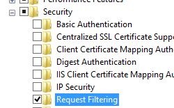
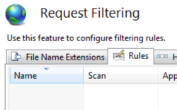
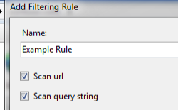

Adding HTTP Headers for Filtering Rules &lt;add&gt;
====================

## Overview

The `<add>` element of the `<scanHeaders>` element adds a unique HTTP header to the collection of HTTP headers that a request filtering rule will scan for strings that are specified in the [`&lt;denyStrings&gt;`](https://www.iis.net/configreference/system.webserver/security/requestfiltering/filteringrules/filteringrule/denystrings) collection.

## Compatibility

| Version | Notes |
| --- | --- |
| IIS 10.0 | The `<add>` element was not modified in IIS 10.0. |
| IIS 8.5 | The `<add>` element was not modified in IIS 8.5. |
| IIS 8.0 | The `<add>` element was not modified in IIS 8.0. |
| IIS 7.5 | The `<add>` element of the `<scanHeaders>` element ships as a feature of IIS 7.5. |
| IIS 7.0 | The `<add>` element of the `<scanHeaders>` element was introduced as an update for IIS 7.0 that is available through [Microsoft Knowledge Base Article 957508](https://support.microsoft.com/kb/957508). |
| IIS 6.0 | The `<filteringRules>` element is roughly analogous to the **RuleList** feature that was added to URLScan 3.0. |

## Setup

The default installation of IIS 7 and later includes the Request Filtering role service or feature. If the Request Filtering role service or feature is uninstalled, you can reinstall it using the following steps.

### Windows Server 2012 or Windows Server 2012 R2

1. On the taskbar, click **Server Manager**.
2. In **Server Manager**, click the **Manage** menu, and then click **Add Roles and Features**.
3. In the **Add Roles and Features** wizard, click **Next**. Select the installation type and click **Next**. Select the destination server and click **Next**.
4. On the **Server Roles** page, expand **Web Server (IIS)**, expand **Web Server**, expand **Security**, and then select **Request Filtering**. Click **Next**.  
     .
5. On the **Select features** page, click **Next**.
6. On the **Confirm installation selections** page, click **Install**.
7. On the **Results** page, click **Close**.

### Windows 8 or Windows 8.1

1. On the **Start** screen, move the pointer all the way to the lower left corner, right-click the **Start** button, and then click **Control Panel**.
2. In **Control Panel**, click **Programs and Features**, and then click **Turn Windows features on or off**.
3. Expand **Internet Information Services**, expand **World Wide Web Services**, expand **Security**, and then select **Request Filtering**.  
    
4. Click **OK**.
5. Click **Close**.

### Windows Server 2008 or Windows Server 2008 R2

1. On the taskbar, click **Start**, point to **Administrative Tools**, and then click **Server Manager**.
2. In the **Server Manager** hierarchy pane, expand **Roles**, and then click **Web Server (IIS)**.
3. In the **Web Server (IIS)** pane, scroll to the **Role Services** section, and then click **Add Role Services**.
4. On the **Select Role Services** page of the **Add Role Services Wizard**, select **Request Filtering**, and then click **Next**.   
    
5. On the **Confirm Installation Selections** page, click **Install**.
6. On the **Results** page, click **Close**.

### Windows Vista or Windows 7

1. On the taskbar, click **Start**, and then click **Control Panel**.
2. In **Control Panel**, click **Programs and Features**, and then click **Turn Windows Features on or off**.
3. Expand **Internet Information Services**, then **World Wide Web Services**, and then **Security**.
4. Select **Request Filtering**, and then click **OK**.   
    
 

## How To

### How to add a request filtering rule

1. Open **Internet Information Services (IIS) Manager**: 

    - If you are using Windows Server 2012 or Windows Server 2012 R2: 

        - On the taskbar, click **Server Manager**, click **Tools**, and then click **Internet Information Services (IIS) Manager**.
    - If you are using Windows 8 or Windows 8.1: 

        - Hold down the **Windows** key, press the letter **X**, and then click **Control Panel**.
        - Click **Administrative Tools**, and then double-click **Internet Information Services (IIS) Manager**.
    - If you are using Windows Server 2008 or Windows Server 2008 R2: 

        - On the taskbar, click **Start**, point to **Administrative Tools**, and then click **Internet Information Services (IIS) Manager**.
    - If you are using Windows Vista or Windows 7: 

        - On the taskbar, click **Start**, and then click **Control Panel**.
        - Double-click **Administrative Tools**, and then double-click **Internet Information Services (IIS) Manager**.
2. In the **Connections** pane, go to the site, application, or directory for which you want to configure request filtering.
3. In the **Home** pane, double-click **Request Filtering**.
4. In the **Request Filtering** pane, click the **Rules** tab.  
    
5. In the **Actions** pane, click **Add Filtering Rule**.
6. Enter the following information for the filtering rule in the **Add Filtering Rule** dialog: 

    - Enter a friendly name for the filtering rule in the **Name** field.
    - Select **Scan url** if you want the filtering rule to scan the URL stub for the request.
    - Select **Scan query string** if you want the filtering rule to scan the query string for the request.
    - Enter any HTTP headers to scan in the **Scan Headers** collection.
    - Enter the file name extensions to use with the filtering rule in the **Applies To** collection.
    - Enter the collection of strings to deny for the filtering rule in the **Deny Strings** collection.  
        
7. Click **OK** to close the **Add Filtering Rule** dialog.

## Configuration

The `<add>` element of the `<scanHeaders>` element is configured at the site, application, or directory level.

### Attributes

| Attribute | Description |
| --- | --- |
| `requestHeader` | Required string attribute. Specifies a unique HTTP header to scan for a request filtering rule. There is no default value. |

### Child Elements

None.

### Configuration Sample

The following sample displays a `<requestFiltering>` element that uses the `<denyStrings>`, `<appliesTo>`, and `<scanHeaders>` elements to define a request filtering rule that will prevent image stealing (leeching) for a specific user agent.

[!code-xml[Main](add/samples/sample1.xml)]
 

## Sample Code

The following examples demonstrate how to use the `<denyStrings>`, `<appliesTo>`, and `<scanHeaders>` elements to add a request filtering rule for the Default Web Site that will prevent image stealing (leeching) for a specific user agent. Here is the scenario for this example: If you detected that images on your web site were being leeched by a particular user agent, you could create a request filtering rule that denies access to image files for that specific user agent. In this particular example, the request filtering rule will search the HTTP user-agent header for the string "leech-bot," and will deny access to GIF, JPG, and PNG files if the user-agent header contains the search string.

### AppCmd.exe

[!code-console[Main](add/samples/sample2.cmd)]

### C#

[!code-csharp[Main](add/samples/sample3.cs)]

### VB.NET

[!code-vb[Main](add/samples/sample4.vb)]

### JavaScript

[!code-javascript[Main](add/samples/sample5.js)]

### VBScript

[!code-vb[Main](add/samples/sample6.vb)]