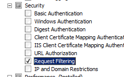
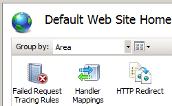

Request Limits &lt;requestLimits&gt;
====================

## Overview

The `<requestLimits>` element specifies limits on HTTP requests that are processed by the Web server. These limits include the maximum size of a request, the maximum URL length, and the maximum length for a query string. In addition, the `<requestLimits>` element can contain a collection of user-defined HTTP header limits in the `<headerLimits>` element, which allows you to define custom settings on HTTP headers.

> [!NOTE]
> When request filtering blocks an HTTP request because an HTTP request exceeds the request limits, IIS 7 will return an HTTP 404 error to the client and log one of the following HTTP statuses with a unique substatus that identifies the reason that the request was denied:

| HTTP Substatus | Description |
| --- | --- |
| `404.13` | Content Length Too Large |
| `404.14` | URL Too Long |
| `404.15` | Query String Too Long |

These substatuses allow Web administrators to analyze their IIS logs and identify potential threats.

In addition, when an HTTP request exceeds the header limits that are defined in the in the `<headerLimits>` element, IIS 7 will return an HTTP 404 error to the client with the following substatus:

| HTTP Substatus | Description |
| --- | --- |
| `404.10` | Request Header Too Long |

## Compatibility

| Version | Notes |
| --- | --- |
| IIS 10.0 | The `<requestLimits>` element was not modified in IIS 10.0. |
| IIS 8.5 | The `<requestLimits>` element was not modified in IIS 8.5. |
| IIS 8.0 | The `<requestLimits>` element was not modified in IIS 8.0. |
| IIS 7.5 | The `<requestLimits>` element was not modified in IIS 7.5. |
| IIS 7.0 | The `<requestLimits>` element of the `<requestFiltering>` collection was introduced in IIS 7.0. |
| IIS 6.0 | The `<requestLimits>` element replaces the IIS 6.0 UrlScan **[RequestLimits]** features. |

## Setup

The default installation of IIS 7 and later includes the Request Filtering role service or feature. If the Request Filtering role service or feature is uninstalled, you can reinstall it using the following steps.

### Windows Server 2012 or Windows Server 2012 R2

1. On the taskbar, click **Server Manager**.
2. In **Server Manager**, click the **Manage** menu, and then click **Add Roles and Features**.
3. In the **Add Roles and Features** wizard, click **Next**. Select the installation type and click **Next**. Select the destination server and click **Next**.
4. On the **Server Roles** page, expand **Web Server (IIS)**, expand **Web Server**, expand **Security**, and then select **Request Filtering**. Click **Next**.  
     .
5. On the **Select features** page, click **Next**.
6. On the **Confirm installation selections** page, click **Install**.
7. On the **Results** page, click **Close**.

### Windows 8 or Windows 8.1

1. On the **Start** screen, move the pointer all the way to the lower left corner, right-click the **Start** button, and then click **Control Panel**.
2. In **Control Panel**, click **Programs and Features**, and then click **Turn Windows features on or off**.
3. Expand **Internet Information Services**, expand **World Wide Web Services**, expand **Security**, and then select **Request Filtering**.  
    
4. Click **OK**.
5. Click **Close**.

### Windows Server 2008 or Windows Server 2008 R2

1. On the taskbar, click **Start**, point to **Administrative Tools**, and then click **Server Manager**.
2. In the **Server Manager** hierarchy pane, expand **Roles**, and then click **Web Server (IIS)**.
3. In the **Web Server (IIS)** pane, scroll to the **Role Services** section, and then click **Add Role Services**.
4. On the **Select Role Services** page of the **Add Role Services Wizard**, select **Request Filtering**, and then click **Next**.   
    
5. On the **Confirm Installation Selections** page, click **Install**.
6. On the **Results** page, click **Close**.

### Windows Vista or Windows 7

1. On the taskbar, click **Start**, and then click **Control Panel**.
2. In **Control Panel**, click **Programs and Features**, and then click **Turn Windows Features on or off**.
3. Expand **Internet Information Services**, then **World Wide Web Services**, and then **Security**.
4. Select **Request Filtering**, and then click **OK**.   
    
 

## How To

**Note for IIS 7.0 users**: Some of the steps in this section may require that you install the Microsoft Administration Pack for IIS 7.0, which includes a user interface for request filtering. To install the Microsoft Administration Pack for IIS 7.0, please see the following URL:

- [https://www.iis.net/expand/AdministrationPack](https://www.iis.net/downloads/microsoft/administration-pack)

### How to edit the request filtering feature settings and request limits

1. Open **Internet Information Services (IIS) Manager**: 

    - If you are using Windows Server 2012 or Windows Server 2012 R2: 

        - On the taskbar, click **Server Manager**, click **Tools**, and then click **Internet Information Services (IIS) Manager**.
    - If you are using Windows 8 or Windows 8.1: 

        - Hold down the **Windows** key, press the letter **X**, and then click **Control Panel**.
        - Click **Administrative Tools**, and then double-click **Internet Information Services (IIS) Manager**.
    - If you are using Windows Server 2008 or Windows Server 2008 R2: 

        - On the taskbar, click **Start**, point to **Administrative Tools**, and then click **Internet Information Services (IIS) Manager**.
    - If you are using Windows Vista or Windows 7: 

        - On the taskbar, click **Start**, and then click **Control Panel**.
        - Double-click **Administrative Tools**, and then double-click **Internet Information Services (IIS) Manager**.
2. In the **Connections** pane, go to the connection, site, application, or directory for which you want to modify your request filtering settings.
3. In the **Home** pane, double-click **Request Filtering**.  
    
4. Click **Edit Feature Settings...** in the **Actions** pane.  
    
5. Specify your options, and then click **OK**.  
      For example, you could make the following changes:

    - Change the maximum URL length to 2KB by specifying 2048.
    - Change the maximum query string length to 1KB by specifying 1024.
    - Deny access to unlisted HTTP verbs by clearing the **Allow unlisted verbs** check box.

* * *

### How to add limits for HTTP headers

1. Open **Internet Information Services (IIS) Manager**: 

    - If you are using Windows Server 2012 or Windows Server 2012 R2: 

        - On the taskbar, click **Server Manager**, click **Tools**, and then click **Internet Information Services (IIS) Manager**.
    - If you are using Windows 8 or Windows 8.1: 

        - Hold down the **Windows** key, press the letter **X**, and then click **Control Panel**.
        - Click **Administrative Tools**, and then double-click **Internet Information Services (IIS) Manager**.
    - If you are using Windows Server 2008 or Windows Server 2008 R2: 

        - On the taskbar, click **Start**, point to **Administrative Tools**, and then click **Internet Information Services (IIS) Manager**.
    - If you are using Windows Vista or Windows 7: 

        - On the taskbar, click **Start**, and then click **Control Panel**.
        - Double-click **Administrative Tools**, and then double-click **Internet Information Services (IIS) Manager**.
2. In the **Connections** pane, go to the connection, site, application, or directory for which you want to modify your request filtering settings.
3. In the **Home** pane, double-click **Request Filtering**.   
    
4. In the **Request Filtering** pane, click the **Headers** tab, and then click **Add Header...** in the **Actions** pane.   
    
5. In the **Add Header** dialog box, enter the HTTP header and the maximum size that you want for the header limit, and then click **OK**.   
    

    For example, the "Content-type" header contains the MIME type for a request. Specifying a value of 100 would limit the length of the "Content-type" header to 100 bytes.

## Configuration

### Attributes

| Attribute | Description |
| --- | --- |
| `maxAllowedContentLength` | Optional uint attribute. Specifies the maximum length of content in a request, in bytes. The default value is `30000000`, which is approximately 28.6MB. |
| `maxQueryString` | Optional uint attribute. Specifies the maximum length of the query string, in bytes. The default value is `2048`. |
| `maxUrl` | Optional uint attribute. Specifies maximum length of the URL, in bytes. The default value is `4096`. |

### Child Elements

| Element | Description |
| --- | --- |
| [`headerlimits`](headerlimits/index.md) | Optional element. Specifies size limits for HTML headers. |

### Configuration Sample

The following example Web.config file will configure IIS to deny access for HTTP requests where the length of the &quot;Content-type&quot; header is greater than 100 bytes.

[!code-xml[Main](index/samples/sample1.xml)]

## Sample Code

The following code samples will configure IIS to deny access for HTTP requests where the length of the &quot;Content-type&quot; header is greater than 100 bytes.

### AppCmd.exe

[!code-console[Main](index/samples/sample2.cmd)]

### C#

[!code-csharp[Main](index/samples/sample3.cs)]

### VB.NET

[!code-vb[Main](index/samples/sample4.vb)]

### JavaScript

[!code-javascript[Main](index/samples/sample5.js)]

### VBScript

[!code-vb[Main](index/samples/sample6.vb)]