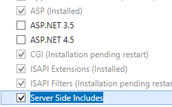
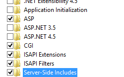
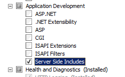
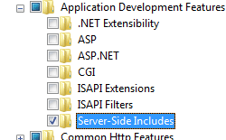

Server Side Include &lt;serverSideInclude&gt;
====================

## Overview

The `<serverSideInclude>` element specifies whether server-side includes (SSI) #exec directives are disabled for Internet Information Services (IIS) 7.

Specifically, the `<serverSideInclude>` element contains a single attribute: **ssiExecDisable**. Setting the **ssiExecDisable** attribute to **true** will disable the SSI #exec directive for IIS 7, thereby preventing SSI files from executing programs, scripts, or shell commands on the server.

## Compatibility

| Version | Notes |
| --- | --- |
| IIS 10.0 | The `<serverSideInclude>` element was not modified in IIS 10.0. |
| IIS 8.5 | The `<serverSideInclude>` element was not modified in IIS 8.5. |
| IIS 8.0 | The `<serverSideInclude>` element was not modified in IIS 8.0. |
| IIS 7.5 | The `<serverSideInclude>` element was not modified in IIS 7.5. |
| IIS 7.0 | The `<serverSideInclude>` element was introduced in IIS 7.0. |
| IIS 6.0 | The `<serverSideInclude>` element replaces the IIS 6.0 **SSIExecDisable** metabase property. |

> [!NOTE]
> The **cmd** directive for #exec is disabled for SSI files in IIS 7; you can only use the **cgi** directive. For example, you can use the following command with a **cgi** directive:

[!code-xml[Main](serverSideInclude/samples/sample1.xml)]

But you can no longer use the use the following command with a **cmd** directive:

[!code-xml[Main](serverSideInclude/samples/sample2.xml)]

If you attempt to use the **cmd** directive in SSI files on IIS 7, you will receive the following error message:

**The CMD option is not enabled for #EXEC calls**

## Setup

The `<serverSideInclude>` element is not available on the default installation of IIS 7 and later. To install it, use the following steps.

### Windows Server 2012 or Windows Server 2012 R2

1. On the taskbar, click **Server Manager**.
2. In **Server Manager**, click the **Manage** menu, and then click **Add Roles and Features**.
3. In the **Add Roles and Features** wizard, click **Next**. Select the installation type and click **Next**. Select the destination server and click **Next**.
4. On the **Server Roles** page, expand **Web Server (IIS)**, expand **Web Server**, expand **Application Development**, and then select **Server Side Includes**. Click **Next**.  
     .
5. On the **Select Features** page, click **Next**.
6. On the **Confirm installation selections** page, click **Install**.
7. On the **Results** page, click **Close**.

### Windows 8 or Windows 8.1

1. On the **Start** screen, move the pointer all the way to the lower left corner, right-click the **Start** button, and then click **Control Panel**.
2. In **Control Panel**, click **Programs and Features**, and then click **Turn Windows features on or off**.
3. Expand **Internet Information Services**, expand **World Wide Web Services**, expand **Application Development Features**, and then select **Server-Side Includes**.  
    
4. Click **OK**.
5. Click **Close**.

### Windows Server 2008 or Windows Server 2008 R2

1. On the taskbar, click **Start**, point to **Administrative Tools**, and then click **Server Manager**.
2. In the **Server Manager** hierarchy pane, expand **Roles**, and then click **Web Server (IIS)**.
3. In the **Web Server (IIS)** pane, scroll to the **Role Services** section, and then click **Add Role Services**.
4. On the **Select Role Services** page of the **Add Role Services Wizard**, select **Server Side Includes**, and then click **Next**.  
    
5. On the **Confirm Installation Selections** page, click **Install**.
6. On the **Results** page, click **Close**.

### Windows Vista or Windows 7

1. On the taskbar, click **Start**, and then click **Control Panel**.
2. In **Control Panel**, click **Programs and Features**, and then click **Turn Windows Features on or off**.
3. Expand **Internet Information Services**, then select **Server Side Includes**, and then click **OK**.  
    

## How To

There is no user interface for configuring the `<serverSideInclude>` element for IIS 7. For examples of how to configure the `<serverSideInclude>` element programmatically, see the [Code Samples](#006) section of this document.

## Configuration

### Attributes

| Attribute | Description |
| --- | --- |
| `ssiExecDisable` | Optional Boolean attribute. Specifies whether the SSI #exec directive is enabled (**false**) or disabled (**true**). When disabled, the directive cannot execute a program, script, or shell command on the server. The default value is `false`. |

### Child Elements

None.

### Configuration Sample

The following configuration sample disables the #exec command for SSI files in the Default Web Site.

[!code-xml[Main](serverSideInclude/samples/sample3.xml)]

## Sample Code

The following code samples disable the #exec command for SSI files in the Default Web Site.

### AppCmd.exe

[!code-console[Main](serverSideInclude/samples/sample4.cmd)]

> [!NOTE]
> You must be sure to set the **commit** parameter to `apphost` when you use AppCmd.exe to configure these settings. This commits the configuration settings to the appropriate location section in the ApplicationHost.config file.

### C#

[!code-csharp[Main](serverSideInclude/samples/sample5.cs)]

### VB.NET

[!code-vb[Main](serverSideInclude/samples/sample6.vb)]

### JavaScript

[!code-javascript[Main](serverSideInclude/samples/sample7.js)]

### VBScript

[!code-vb[Main](serverSideInclude/samples/sample8.vb)]