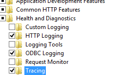
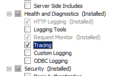
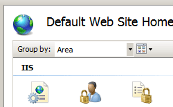
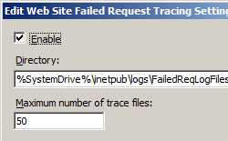
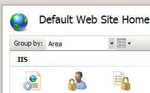
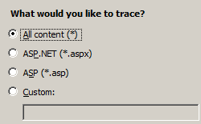
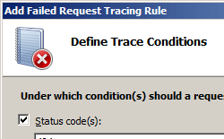
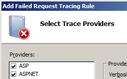

Adding Trace Failed Requests &lt;add&gt;
====================

## Overview

Each `<add>` element in the `<traceFailedRequests>` collection can include a `<traceAreas>` element that defines the tracing providers and the provider-specific areas that will generate tracing events for the current tracing rule. It can also contain a `<failureDefinition>` element, which you can use to configure the failure conditions for a request, including the amount of time it takes for the server to respond, the HTTP status code, and the amount of information included in the trace.

## Compatibility

| Version | Notes |
| --- | --- |
| IIS 10.0 | The `<add>` element was not modified in IIS 10.0. |
| IIS 8.5 | The `<add>` element was not modified in IIS 8.5. |
| IIS 8.0 | The `<add>` element was not modified in IIS 8.0. |
| IIS 7.5 | The `<add>` element was not modified in IIS 7.5. |
| IIS 7.0 | The `<add>` element of the `<traceFailedRequests>` collection was introduced in IIS 7.0. |
| IIS 6.0 | N/A |

## Setup

After you finish the default installation of IIS 7 and later, you must install the tracing role service to use failed request tracing. After you install the role service, you still must enable failed request tracing at the site level, application level, or directory level.

### Windows Server 2012 or Windows Server 2012 R2

1. On the taskbar, click **Server Manager**.
2. In **Server Manager**, click the **Manage** menu, and then click **Add Roles and Features**.
3. In the **Add Roles and Features** wizard, click **Next**. Select the installation type and click **Next**. Select the destination server and click **Next**.
4. On the **Server Roles** page, expand **Web Server (IIS)**, expand **Web Server**, expand **Health and Diagnostics**, and then select **Tracing**. Click **Next**.  
     .
5. On the **Select features** page, click **Next**.
6. On the **Confirm installation selections** page, click **Install**.
7. On the **Results** page, click **Close**.

### Windows 8 or Windows 8.1

1. On the **Start** screen, move the pointer all the way to the lower left corner, right-click the **Start** button, and then click **Control Panel**.
2. In **Control Panel**, click **Programs and Features**, and then click **Turn Windows features on or off**.
3. Expand **Internet Information Services**, expand **World Wide Web Services**, expand **Health and Diagnostics**, and then select **Tracing**.  
    - Click **OK**.
- Click **Close**.

### Windows Server 2008 or Windows Server 2008 R2

1. On the taskbar, click **Start**, point to **Administrative Tools**, and then click **Server Manager**.
2. In the **Server Manager** hierarchy pane, expand **Roles**, and then click **Web Server (IIS)**.
3. In the **Web Server (IIS)** pane, scroll to the **Role Services** section, and then click **Add Role Services**.
4. On the **Select Role Services** page of the **Add Role Services Wizard**, select **Tracing**, and then click **Next**.  
    
5. On the **Confirm Installation Selections** page, click **Install**.
6. On the **Results** page, click **Close**.

### Windows Vista or Windows 7

1. On the taskbar, click **Start**, and then click **Control Panel**.
2. In **Control Panel**, click **Programs and Features**, and then click **Turn Windows Features on or off**.
3. Expand **Internet Information Services**, then **World Wide Web Services**, then **Health and Diagnostics**.
4. Select **Tracing**, and then click **OK**.  
    
 

## How To

### How to enable tracing

1. Open **Internet Information Services (IIS) Manager**: 

    - If you are using Windows Server 2012 or Windows Server 2012 R2: 

        - On the taskbar, click **Server Manager**, click **Tools**, and then click **Internet Information Services (IIS) Manager**.
    - If you are using Windows 8 or Windows 8.1: 

        - Hold down the **Windows** key, press the letter **X**, and then click **Control Panel**.
        - Click **Administrative Tools**, and then double-click **Internet Information Services (IIS) Manager**.
    - If you are using Windows Server 2008 or Windows Server 2008 R2: 

        - On the taskbar, click **Start**, point to **Administrative Tools**, and then click **Internet Information Services (IIS) Manager**.
    - If you are using Windows Vista or Windows 7: 

        - On the taskbar, click **Start**, and then click **Control Panel**.
        - Double-click **Administrative Tools**, and then double-click **Internet Information Services (IIS) Manager**.
2. In the **Connections** pane, select the server connection, site, application, or directory for which you want to configure failed request tracing.
3. In the **Actions** pane, click **Failed Request Tracing...**  
    
4. In the **Edit Web Site Failed Request Tracing Settings** dialog box, select the **Enable** check box to enable tracing, leave the default value or type a new directory where you want to store failed request log files in the **Directory** box, type the number of failed request trace files you want to store in the **Maximum number of trace files** box, and then click **OK**.  
    

### How to configure failure definitions

1. Open **Internet Information Services (IIS) Manager**: 

    - If you are using Windows Server 2012 or Windows Server 2012 R2: 

        - On the taskbar, click **Server Manager**, click **Tools**, and then click **Internet Information Services (IIS) Manager**.
    - If you are using Windows 8 or Windows 8.1: 

        - Hold down the **Windows** key, press the letter **X**, and then click **Control Panel**.
        - Click **Administrative Tools**, and then double-click **Internet Information Services (IIS) Manager**.
    - If you are using Windows Server 2008 or Windows Server 2008 R2: 

        - On the taskbar, click **Start**, point to **Administrative Tools**, and then click **Internet Information Services (IIS) Manager**.
    - If you are using Windows Vista or Windows 7: 

        - On the taskbar, click **Start**, and then click **Control Panel**.
        - Double-click **Administrative Tools**, and then double-click **Internet Information Services (IIS) Manager**.
2. In the **Connections** pane, go to the connection, site, application, or directory for which you want to configure failed request tracing.
3. In the **Home** pane, double-click **Failed Request Tracing Rules**.  
    
4. In the **Actions** pane, click **Add...**
5. On the **Specify Content to Trace** page of the **Add Failed Request Tracing Rule** Wizard, select the content type you want to trace, and then click **Next**.  
    
6. On the **Define Trace Conditions** page, select the conditions you want to trace, and then click **Next**. Trace conditions can include any combination of status codes, a time limit that a request should take, or the event severity. If you specify all conditions, the first condition that is met generates the failed request trace log file.  
    
7. On the **Select Trace Providers** page, select one or more of the trace providers under **Providers**.  
    
8. On the **Select Trace Providers** page, select one or more of the verbosity levels under **Verbosity**.  
    
9. If you selected the **ASPNET** or **WWW Server** trace provider in step 8, select one or more functional areas for the provider to trace under **Areas** of the **Select Trace Providers** page.
10. Click **Finish**.

## Configuration

### Attributes

| Attribute | Description |
| --- | --- |
| `customActionExe` | Optional string attribute. Specifies an executable file to run when a failure condition is reached (for example, to run a VBScript file, specify "Cscript.exe"). All command-line variables will be expanded. For example, "%*windir*%" will be expanded to the path of the Windows directory. |
| `customActionParams` | Optional string attribute. Contains parameters to pass to the executable file specified in the customActionExe attribute. Command-line variables such as "%*windir*%" will be expanded. You may also use parameter variables such as "%1" and "%2" in the string that you specify (for example, "MyScript.vbs %1 %2"). |
| `customActionTriggerLimit` | Optional uint attribute. Specifies the maximum number of times the program specified by the customActionExe attribute will execute during the lifetime of the worker process for the failed-request definition. This value resets every time that the worker process recycles. Permissible values are from 0 through 10000. This feature can be used, for example, to create a memory dump after the next failure but not after subsequent failures.   **Note:** If the CustomActionTriggerLimit value that you specify is reached during the run time of the worker process, subsequent failed requests will be logged, but the program specified in CustomActionExe will not run. The entries in the failed-requests log will indicate that the CustomActionTriggerLimit value has been reached. The default is `1`. |
| `path` | Required string attribute. Specifies the path for which you want to log trace events. The path is relative to the URL (virtual directory/directory). Sub paths cannot be used. In addition, the path must be local to the directory where the definition is set. Wildcard values can be used, for example, "\*.aspx". For tracing the default document, use "/" as the path value. |

### Child Elements

| Element | Description |
| --- | --- |
| [`traceAreas`](traceareas/index.md) | Required element. Configures what to trace for a given path. |
| [`failureDefinitions`](failuredefinitions.md) | Required element. Defines the conditions in which to save traces for a request. |

### Configuration Sample

The following configuration example configures tracing at the server level in the ApplicationHost.config file. It sets tracing for all .aspx files, uses the `<traceAreas>` element to set the **ASPNET** provider and trace against all ASP.NET areas, which are **Infrastructure**, **Module**, **Page** and **AppServices**. The sample also uses the **verbosity** attribute to set the amount of information returned to the tracing file to **warning**. Lastly, the sample uses the `<failureDefinitions>` element to trace only requests that generate a HTTP 404 status code.

[!code-xml[Main](index/samples/sample1.xml)]

## Sample Code

The following examples enable verbose failed request tracing for HTTP 500 errors in ASP.NET content on all requests to \*.aspx pages.

### AppCmd.exe

[!code-console[Main](index/samples/sample2.cmd)]

### C#

[!code-csharp[Main](index/samples/sample3.cs)]

### VB.NET

[!code-vb[Main](index/samples/sample4.vb)]

### JavaScript

[!code-javascript[Main](index/samples/sample5.js)]

### VBScript

[!code-vb[Main](index/samples/sample6.vb)]